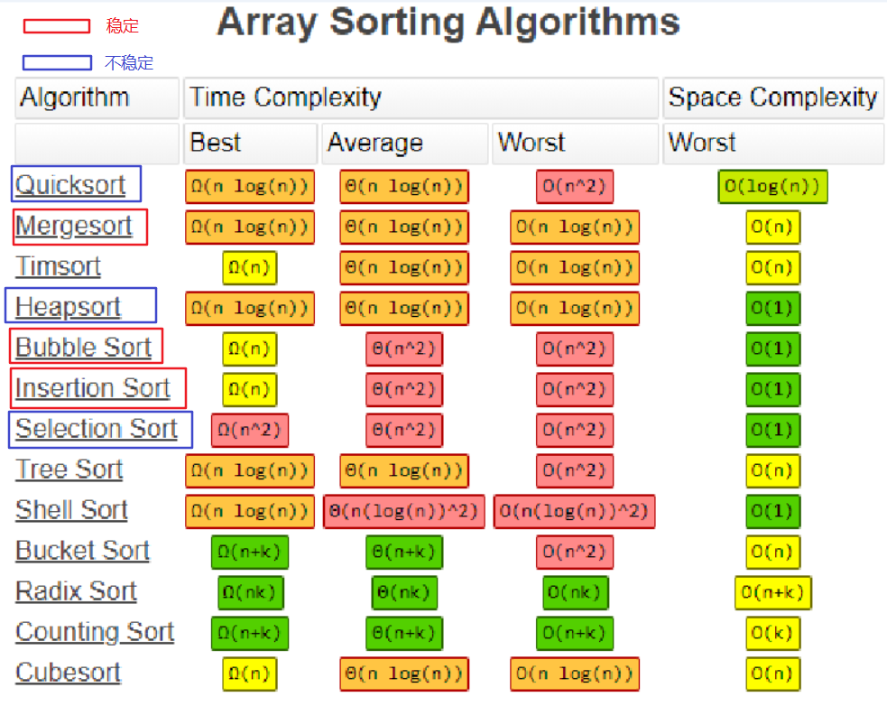

### 贪心算法

#### [lc605. 种花问题](https://leetcode-cn.com/problems/can-place-flowers/)

思路：贪心算法：从左向右遍历花坛，在可以种花的位置就种一朵，能种就种（因为在任一种花时候，不种都不会得到更优解），是一种贪心的思想。

```java
public boolean canPlaceFlowers(int[] flowerbed, int n) {
        int count = 0;
        for (int i = 0; i < flowerbed.length; i ++) {
            // 满足能种花的条件
            if (flowerbed[i] == 0 && (i == 0 || flowerbed[i-1] == 0) && (i == flowerbed.length-1 || flowerbed[i+1] == 0)) {
                count ++;
                flowerbed[i] = 1;
            }
        }
        return count >= n;
    }
```

#### [1029. 两地调度](https://leetcode-cn.com/problems/two-city-scheduling/)

思路：首先假设将所有人派往B市，在选出N个人让他们飞往A市，如何选呢？将costs 按照 cost[A] - cost[B] 升序排序，然后将前N个人派往A市。

```java
public int twoCitySchedCost(int[][] costs) {
    // 按照 price_A - price_B 从小到大排序；
    // 将前 N 个人飞往 A 市，其余人飞往 B 市，并计算出总费用。
    Arrays.sort(costs, (a, b) -> ((a[0]-a[1])-(b[0]-b[1])));

    int n = costs.length / 2;
    int res = 0;

    for (int i = 0; i < n; i ++) {
        res += costs[i][0] + costs[i+n][1];
    }
    return res;
}
```

#### 跳跃问题

##### [lc45. 跳跃游戏 II](https://leetcode-cn.com/problems/jump-game-ii/)

思路：每次在上次能跳到的范围（end）内选择一个能跳的最远的位置（也就是能跳到max_far位置的点）作为下次的起跳点 （即增加跳跃步数）

```java
public int jump(int[] nums) {
    int i = 0;
    int longest = 0;
    int end = 0;
    int step = 0;
    while (i < nums.length-1) {
        longest = Math.max(longest, nums[i] + i);
        // 每次在上次能跳到的范围（end）内选择一个能跳的最远的位置（也就是能跳到max_far位置的点）作为下次的起跳点 
        if (i == end) {
            end = longest;
            step ++;
        }
        i ++;
    }
    return step;
}
```

##### [lc55. 跳跃游戏](https://leetcode-cn.com/problems/jump-game/)

思路：当 i > longest时，直接返回false，说明到不了 i 作为起跳点

```java
public boolean canJump(int[] nums) {
    int longest = 0;
    int end = 0;
    for (int i = 0; i < nums.length; i ++) {
        if (longest < i) {
            return false;
        }
        longest = Math.max(longest, i + nums[i]);
        if (longest >= nums.length-1) {
            return true;
        }
    }
    return false;
}
```


### DFS&BFS

#### lc200 岛屿数量

思路：深度优先遍历，当遍历到某个位置grid\[i][j] 时，判断结果为1时，res ++，并标记该元素已访问过，然后进行深度优先遍历其周围的元素

注意终止条件

```java
/**
 * DFS
 * @param grid
 * @return
 */
public int numIslands(char[][] grid) {
    int res = 0;
    int rows = grid.length;
    int cols = grid[0].length;

    for (int i = 0; i < rows; i++) {
        for (int j = 0; j < cols; j++) {
            if (grid[i][j] == '1') {
                boundaryDFS(grid, i, j);
                res++;
            }
        }
    }
    return res;
}

private void boundaryDFS(char[][] grid, int i, int j) {
    // terminal condition
    if (i < 0 || i >= grid.length || j < 0 || j >= grid[0].length || grid[i][j] != '1') {
        return;
    }
    // 标记已访问过的元素
    grid[i][j] = '*';
    
    // 深度遍历未访问过的元素
    dfs(grid, i-1, j);        
    dfs(grid, i+1, j);
    dfs(grid, i, j-1);
    dfs(grid, i, j+1);
}
```

#### 岛屿问题

[岛屿类问题的通用解法、DFS 遍历框架](https://leetcode-cn.com/problems/number-of-islands/solution/dao-yu-lei-wen-ti-de-tong-yong-jie-fa-dfs-bian-li-/)

##### [L200. 岛屿数量](https://leetcode-cn.com/problems/number-of-islands/) （Easy）

##### [463. 岛屿的周长](https://leetcode-cn.com/problems/island-perimeter/) （Easy）

##### [695. 岛屿的最大面积](https://leetcode-cn.com/problems/max-area-of-island/) （Medium）

```java
public int maxAreaOfIsland(int[][] grid) {
    int maxArea = 0;
    int rows = grid.length;
    int cols = grid[0].length;

    for (int i = 0; i < rows; i ++) {
        for (int j = 0; j < cols; j++) {
            if (grid[i][j] == 1) {
                maxArea = Math.max(maxArea, dfs(grid, i, j));
            }
        }
    }
    return maxArea;
}

private int dfs(int[][] grid, int i, int j) {
    if (i < 0 || i >= grid.length || j < 0 || j >= grid[0].length || grid[i][j] != 1) {
        return 0;
    }
	// 将遍历过的元素记录下来
    grid[i][j] = 9;

    return 1 + dfs(grid, i-1, j) + dfs(grid, i+1, j) + dfs(grid, i, j-1) + dfs(grid, i, j+1);
}
```

- [827. 最大人工岛](https://leetcode-cn.com/problems/making-a-large-island/) （Hard）

#### [lc329. 矩阵中的最长递增路径](https://leetcode-cn.com/problems/longest-increasing-path-in-a-matrix/)

思路：==记忆化的DFS==，减少了时间复杂度

```java
public int longestIncreasingPath(int[][] matrix) {
    int longestPath = 0;
    // 记忆化的dfs
    int[][] cache = new int[matrix.length][matrix[0].length];
    for (int i = 0; i < matrix.length; i ++) {
        for (int j = 0; j < matrix[0].length; j ++) {
            // 因为每次访问的都是更大的元素，不可能会访问之前访问过的某个元素，所以不用vis数组
            // boolean[][] vis = new boolean[matrix.length][matrix[0].length];
            longestPath = Math.max(longestPath, dfs(matrix, i, j, cache, null));
        }
    }
    return longestPath;
}

private int dfs(int[][] matrix, int i, int j, int[][] cache, Integer pre) {
    if (i < 0 || i >= matrix.length || j < 0 || j >= matrix[0].length) {
        return 0;
    }

    if (pre != null && matrix[i][j] <= pre) {
        return 0;
    }

    if (cache[i][j] > 0) {
        return cache[i][j];
    }else {
        int cur = matrix[i][j];
        int left = 0;
        int right = 0;
        int up = 0;
        int down = 0;
        left = dfs(matrix, i, j-1, cache, cur);
        right = dfs(matrix, i, j+1, cache, cur);
        up = dfs(matrix, i-1, j, cache, cur);
        down = dfs(matrix, i+1, j, cache, cur);

        cache[i][j] = 1 + Math.max(Math.max(Math.max(left, right), up), down);
        return cache[i][j]; 
    }
}
```

#### [lc547. 省份数量](https://leetcode-cn.com/problems/number-of-provinces/)

思路：本题属于一类题，属于在无向图中计算连通域数量的题目

```java
public int findCircleNum(int[][] isConnected) {
    // int[][] isConnected 是无向图的邻接矩阵，n 为无向图的顶点数量
    int n = isConnected.length;
    // 定义 boolean 数组标识顶点是否被访问
    boolean[] visited = new boolean[n];
    // 定义 cnt 来累计遍历过的连通域的数量
    int cnt = 0;
    for (int i = 0; i < n; i++) {
        // 若当前顶点 i 未被访问，说明又是一个新的连通域，则遍历新的连通域且cnt+=1.
        if (!visited[i]) { 
            cnt++;
            dfs(i, isConnected, visited);
        }
    }
    return cnt;
}

private void dfs(int i, int[][] isConnected, boolean[] visited) {
    // 对当前顶点 i 进行访问标记
    visited[i] = true;

    // 继续遍历与顶点 i 相邻的顶点（使用 visited 数组防止重复访问）
    for (int j = 0; j < isConnected.length; j++) {
        if (isConnected[i][j] == 1 && !visited[j]) {
            dfs(j, isConnected, visited);
        }
    }
}
```


### 拓扑排序

>  拓扑排序问题
>
> 1. 根据依赖关系，构建邻接表、入度字典。
> 2. 选取入度为 0 的数据，根据邻接表，减小依赖它的数据的入度，如果减小入度之后的依赖数据的入度为0，也将其加入到队列之中。
> 3. 找出入度变为 0 的数据，重复第 2 步。
> 4. 直至所有数据的入度为 0，得到排序，如果还有数据的入度不为 0，说明图中存在环。

#### [lc207. 课程表](https://leetcode-cn.com/problems/course-schedule/)

思路：拓扑排序 + BFS

```java
public boolean canFinish(int numCourses, int[][] prerequisites) {
    // 课号和对应的入度
    Map<Integer, Integer> inDegree = new HashMap<>();
    // 这里要事先加入课程，不能在后面使用getOrDefault，因为后面要将入度为0的节点入队
    for (int i = 0; i < numCourses; i ++) {
        inDegree.put(i, 0);
    }
    // 依赖关系，当前课程和依赖当前课程的后续课程
    Map<Integer, List<Integer>> coursesAdj = new HashMap<>();

    for (int[] relate : prerequisites) {
        int cur = relate[1];
        int next = relate[0];

        // 更新入度
        inDegree.put(next, inDegree.get(next)+1);
        // 更新邻接表
        if (!coursesAdj.containsKey(cur)) {
            coursesAdj.put(cur, new ArrayList<>());
        }
        coursesAdj.get(cur).add(next);
    }

    // 将所有入度为0的节点放到队列中去
    Queue<Integer> queue = new LinkedList<>();
    for (int key : inDegree.keySet()) {
        if (inDegree.get(key) == 0) {
            queue.offer(key);
        }
    }

    // 取出一个入度为0的节点，更新其下一个节点的入度表，直到没有入度为0的节点
    while (!queue.isEmpty()) {
        int cur = queue.poll();
        // 注意这里还要判断非空
        if (coursesAdj.get(cur) != null) {
            for (int next : coursesAdj.get(cur)) {
                inDegree.put(next, inDegree.get(next)-1);
                // 注意这里的处理，如果减去入度之后为0的话，将该节点也加入到队列中，以便于后面处理
                if (inDegree.get(next) == 0) {
                    queue.offer(next);
                }
            }
        }
    }

    // 遍历入度字典，如果还有节点的入度不为0，说明存在环
    for (int cur : inDegree.keySet()) {
        if (inDegree.get(cur) != 0) {
            return false;
        }
    } 
    return true;
}
```

#### [lc210. 课程表 II](https://leetcode-cn.com/problems/course-schedule-ii/)

思路：和上一题类似，不过本题返回的是学完所有课程所安排的学习顺序（返回一种即可），只需要在将入度为0的课程弹出队列时，加入结果数组即可。

### 动态规划

#### lc121 买卖股票最佳时机

[url](https://leetcode-cn.com/problems/best-time-to-buy-and-sell-stock/)

思路：dp[i]：表示到第 i 天为止能获得的最大利润，所以 dp[i] 等于max\{今天的价格prices[i] - 从第 1 到第 i-1天之中股票最低价格minPrice，dp\[i-1]}，所以需要一个变量 minPrice 记录到第 i-1 天为止的股票最低价格。

```java
/**
 * 状态转移方程 dp[i] = max{dp[i-1], prices[i]-min_price[i]}
 * dp[i]：表示到ith天为止能获得的最大利润
 * @param prices
 * @return
 */
public int maxProfit(int[] prices) {
    if (prices.length < 1) {
        return 0;
    }
    int[] profit = new int[prices.length];
    int minPirces = prices[0];
    profit[0] = 0;

    for (int i = 1; i < profit.length; i++) {
        if (prices[i] < minPirces) {
            minPirces = prices[i];
        }
        profit[i] = Math.max(profit[i-1], prices[i]-minPirces);
    }
    return profit[profit.length-1];
}
```

#### lc122 买卖股票最佳时机II

思路：dp[i] 表示到第 i 天为止能获得的最大利润，dp[i] = 前一天的最大利润dp[i-1] + Math.max(prices[i]-prices[i-1], 0)， Math.max(prices[i]-prices[i-1], 0)表示当天卖出收益是否大于0，如果大于0，则卖出，如果小于0，则不卖出。

```java
/**
 * 状态转移方程 dp[i] = dp[i-1] + max{prices[i]-prices[i-1], 0}
 * dp[i]：表示到ith天为止能获得的最大利润
 * @param prices
 * @return
 */
public int maxProfit(int[] prices) {
    int len = prices.length;
    int[] dp = new int[len];
    dp[0] = 0;

    for (int i=1; i < len; i++) {
        dp[i] = dp[i-1] + Math.max(prices[i]-prices[i-1], 0);
    }

    return dp[len-1];
}
```

#### [lc123. 买卖股票的最佳时机 III](https://leetcode-cn.com/problems/best-time-to-buy-and-sell-stock-iii)

思路：

[参考](https://zhuanlan.zhihu.com/p/92908822)

根据手头是否持有股票，我们定义两个二维数组来定义状态：

dp0\[i][j]: 第i天结束，已有j次买卖，手头没有股票时的最大利润

dp1\[i][j]: 第i天结束，已有j次买卖，手头有股票时的最大利润

初始化：

dp0\[0][j]对于所有 j 都要初始化为0，而dp1\[0][j]对于所有j都要初始化为-prices[i]

返回结果：

dp0\[n-1][k]就是在最后一天结束时已进行k次交易且手头无股票时的最大收益，也即返回结果

状态转移方程：

dp0\[i][j] = max(dp0\[i-1][j], dp1\[i-1][j-1] + prices[i])

今天我没有持有股票，有两种可能：

* 昨天我也没有股票，今天选择保持，所以今天也没有股票
* 昨天我持有股票，今天选择卖出，所以我今天没有股票了

dp1\[i][j] = max(dp1\[i-1][j], dp0\[i-1][j] - prices[i])

今天我持有股票，有两种可能：

* 昨天我持有股票，今天选择保持，今天还有股票
* 昨天我没有股票，今天选择买入，今天持有股票

```java
public int maxProfit(int[] prices) {
    if (prices.length == 0) {
        return 0;
    }

    int[][] dp0 = new int[prices.length][3];
    int[][] dp1 = new int[prices.length][3];

    dp1[0][0] = -prices[0];
    dp1[0][1] = -prices[0];

    for (int i = 1; i < prices.length; i++) {
        // j=0
        // 持股，未卖出过，可能是今天买的，可能是之前买的
        dp1[i][0] = Math.max(dp1[i-1][0], -prices[i]);
        // j=1
        // 未持股，卖出过1次，可能是今天卖的，可能是之前卖的
        dp0[i][1] = Math.max(dp0[i-1][1], dp1[i-1][0] + prices[i]);
        // 持股，卖出过1次，可能是今天买的，可能是之前买的
        dp1[i][1] = Math.max(dp1[i-1][1], dp0[i-1][1] - prices[i]);

        // j=2
        // 未持股，卖出过2次，可能是今天卖的，可能是之前卖的
        dp0[i][2] = Math.max(dp0[i-1][2], dp1[i-1][1] + prices[i]);
    }
    // 返回最后一天状态为为持股，卖出过两次的最大利润
    return dp0[prices.length-1][2];
}
```

#### [lc188. 买卖股票的最佳时机 IV](https://leetcode-cn.com/problems/best-time-to-buy-and-sell-stock-iv)

与上一题类似	

```java
public int maxProfit(int k, int[] prices) {
    if (prices.length == 0 || k == 0) {
        return 0;
    }

    // 当k很大时相当于不限制次数
    if (k > prices.length / 2) {
        int max = 0;
        for (int i = 1; i < prices.length; i++) {
            max += Math.max(0, prices[i] - prices[i-1]);
        }
        return max;
    }

    int[][] dp0 = new int[prices.length][k+1];
    int[][] dp1 = new int[prices.length][k+1];

    for(int j = 0; j <= k; j++) {
        dp1[0][j] = -prices[0]; // i = 0
    }

    for (int i = 1; i < prices.length; i++) {
        // j=0
        dp1[i][0] = Math.max(dp1[i-1][0], -prices[i]);

        // j>0
        for (int j = 1; j <= k; j++) {
            // 保持或卖出
            dp0[i][j] = Math.max(dp0[i-1][j], dp1[i-1][j-1] + prices[i]);
            // 保持或卖出
            dp1[i][j] = Math.max(dp1[i-1][j], dp0[i-1][j] - prices[i]);
        }
    }
    return dp0[prices.length-1][k];
}
```


#### lc198 打家劫舍

思路：动态规划，这道题的本质相当于在一列数组中取出一个或多个不相邻数，使其和最大

经过一间房子，如果抢，则金额等于dp[i-2] + nums[i]，如果不抢，则金额等于dp[i-1]，两者取最大值	

```java
/**
 * 动态规划
 * 状态方程：dp[i] = max{nums[i] + dp[i-2], dp[i-1]}
 * 初始化：dp[0] = nums[0]; dp[1] = max{nums[0], nums[1]}
 * @param nums
 * @return
 */
public int rob(int[] nums) {

    if (nums.length <= 1) {
        return nums.length == 0 ? 0 : nums[0];
    }

    int[] dp = new int[nums.length];
    dp[0] = nums[0];
    // 注意此时的dp[1]
    dp[1] = Math.max(nums[0], nums[1]);
    for (int i = 2; i < nums.length; i++) {
        dp[i] = Math.max(dp[i-2] + nums[i], dp[i-1]);
    }
    return dp[nums.length-1];
}
```

#### [lc213. 打家劫舍 II](https://leetcode-cn.com/problems/house-robber-ii/)

思路：这里的 nums 是环形，所以可以将 nums 拆分成两个非环形数组，一个是从0~len-2的，一个是从1~len-1的，然后通过198题的解法求出两个非环形数组的最大收益，返回两者的较大值即可；

```java
public int rob(int[] nums) {

    int n = nums.length;
    // 边界条件
    if (n == 1) {
        return nums[0];
    }
    if (n == 2) {
        return Math.max(nums[0], nums[1]);
    }

    int[] nums1 = Arrays.copyOfRange(nums, 0, n-1);
    int[] nums2 = Arrays.copyOfRange(nums, 1, n);
    int[] dp1 = new int[n-1];
    int[] dp2 = new int[n-1];

    dp1[0] = nums1[0];
    dp1[1] = Math.max(nums1[0], nums1[1]);
    dp2[0] = nums2[0];
    dp2[1] = Math.max(nums2[0], nums2[1]);

    for (int i = 2; i < nums.length-1; i ++) {
        dp1[i] = Math.max(nums1[i] + dp1[i-2], dp1[i-1]);
        dp2[i] = Math.max(nums2[i] + dp2[i-2], dp2[i-1]);
    }

    return Math.max(dp1[dp1.length-1], dp2[dp2.length-1]);
}
```


#### lc322 零钱兑换 

思路：类似于爬楼梯那道题目

注意题目要求是使用最少数量的硬币来兑换该金额

```java
public int coinChange(int[] coins, int amount) {
    int res = 0;
    // dp[i]数组定义：当金额为i时，需要最少dp[i]枚硬币
    int[] dp = new int[amount+1];
    // 将dp初始化为amount+1：因为金额为i时，硬币数量最多的一种情况是都为一元硬币，数据量为amount，amount+1表示表示正无穷，
    // 以便后面取最小值
    Arrays.fill(dp, amount+1);
    dp[0] = 0;
    for (int i = 1; i < dp.length; i++) {
        for (int j = 0; j < coins.length; j++) {
            // 如果硬币面额小于金额，就尝试进行兑换
            if (coins[j] <= i) {
                dp[i] = Math.min(dp[i], dp[i - coins[j]] + 1);
            }
        }

    }
    return dp[amount] > amount ? -1 : dp[amount];
}
```

#### LC518 零钱兑换II

思路：

1. 类似于组合总和那道题的解法 -- 空间复杂度过大
2. 动态规划：完全背包问题

https://www.cnblogs.com/xym4869/p/13024462.html

```java
public int change(int amount, int[] coins) {
    int[] dp = new int[amount+1];
    dp[0] = 1;
    for (int coin : coins) {
        for (int i = coin; i <= amount; i++) {
            dp[i] += dp[i-coin];
        }
    }
    return dp[amount];
}
```

#### [lc300. 最长递增子序列](https://leetcode-cn.com/problems/longest-increasing-subsequence/)（高频）

[思路](https://blog.csdn.net/lxt_Lucia/article/details/81206439)：

使用动态规划思想，dp[i]表示到nums[i]为止的最长上升子序列长度，转移方程是 dp[i] = max(dp[i], dp[j]+1) if (dp[j] > dp[i] and i>j)

上面转移方程的意思是：要在nums[i]之前找到小于 nums[i]的元素，如果有，即存在元素nums[j]<nums[i]并且j<i的时候，说明nums[i]可以添加在nums[j]之后增加子序列长度；如果没有，那以nums[i]结尾的最长子序列就是nums[i]本身。

时间复杂度：O(N^2)

```java
// 动态规划 O(N^2)
// dp[i]：到nums[i]为止的最长上升子序列
// dp[i] = max(dp[i], dp[j]+1) if dp[j] > dp[i](j<i) 在前面找到一个小于nums[i]的数nums[j]，则最长上升子序列更新为max(dp[j]+1, dp[i])
public int lengthOfLIS(int[] nums) {
    int[] dp = new int[nums.length];
    int res = 1;

    for (int i = 0; i < dp.length; i++) {
        dp[i] = 1;
        for (int j = i-1; j >= 0; j--) {
            if (nums[i] > nums[j]){
                dp[i] = Math.max(dp[i], dp[j]+1);                    
            }
        }
        res = Math.max(res, dp[i]);
    }
    return res;
}
```

二分查找：O(NlogN)

```java
public int lengthOfLIS(int[] nums) {
    if (nums == null || nums.length == 0) {
        return 0;
    }

    int len = 0;
    int[] increasingSequence = new int[nums.length];
    increasingSequence[len++] = nums[0];

    for (int i = 1; i < nums.length; i ++) {
        // 如果nums[i]大于上升子序列的末尾，将nums[i]加到上升序列末尾
        if (nums[i] > increasingSequence[len-1]) {
            increasingSequence[len++] = nums[i];
        }else {
            // 找到上升子序列中第一个不小于nums[i]的元素来替换
            int pos = binarySearchPos(increasingSequence, len, nums[i]);
            increasingSequence[pos] = nums[i];
        }
    }
    return len;
}

private int binarySearchPos(int[] increasingSequence, int len, int x) {
    int low = 0;
    int high = len - 1;

    while (low <= high) {
        int mid = low + (high - low) / 2;

        if (increasingSequence[mid] == x) {
            return mid;
        }else if (increasingSequence[mid] > x) {
            high = mid - 1;
        }else {
            low = mid + 1;
        }
    }
    return low;
}
```

#### lc70 爬楼梯

思路：动态规划；

因为每次可以爬 1级或 2级，所以到转移方程：第 i 层楼梯的方式数 = 到第 i-1 层楼梯的方式数 + 到第 i-2 层楼梯的方式数

基本上就是斐波那契数列问题

扩展：不能爬到7及7的倍数——2021.3 字节跳动-教育-后端-一面：dp[7]

```java
public int climbStairs(int n) {
    if (n == 1) {
        return 1;
    }

    if (n == 2) {
        return 2;
    }
	// dp[i] 表示到第i层楼梯的方式数
    int[] dp = new int[n+1];
    dp[1] = 1;
    dp[2] = 2;
    for (int i = 3; i < dp.length; i++) {
        dp[i] = dp[i-1] + dp[i-2];
    }
    return dp[n];
}
```

#### [补充题2. 圆环回原点问题](https://mp.weixin.qq.com/s/VnGFEWHeD3nh1n9JSDkVUg)

圆环上有10个点，编号为0~9。从0点出发，每次可以逆时针和顺时针走一步，问走n步回到0点共有多少种走法。

```markdown
输入: 2
输出: 2
解释：有2种方案。分别是0->1->0和0->9->0
```

思路 ：和爬楼梯问题类似，走 i 步到 j 点的方式数 = 走 i-1 步到 (j - 1 + length) % length 的方案数 + 走 i-1 步到 (j + 1) % length 的方案数。

转移方程：
$$
dp[i][j] = dp[i-1][(j-1+length)\%length] + dp[i-1][(j+1)\%length]
$$

```java
public int backToOrigin(int length, int n) {
    int[][] dp = new int[n+1][length];
    
    for (int i = 0; i < dp.length; i++) {
        for (int j = 0; j < dp[0].length; j++) {
            dp[i][j] = 0;
        }
    }
    dp[0][0] = 1;
    for (int i = 1; i < dp.length; i++) {
        for (int j = 0; j < dp[0].length; j++) {
            dp[i][j] = dp[i-1][(j-1+length)%length] + dp[i-1][(j+1)%length];
        }
    }
    return dp[n][0];
}
```

#### lc64 最小路径和

思路：

1. dp\[0][0] = grid\[0][0]
2. 首先对于第一行各个位置的最小路径和只能是左边元素的累加和，所以先初始化 dp 数组的第一行；同理，第一列也只能是上方元素的累加和；
3. 转移方程：dp\[i][j] = min\{dp\[i-1][j], dp\[i][j-1]} + grid\[i][j]；

```java
public int minPathSum(int[][] grid) {
    int rows = grid.length;
    int cols = grid[0].length;
    int[][] dp = new int[rows][cols];
    dp[0][0] = grid[0][0];

    // 初始化首行和首列
    for (int j = 1; j < cols; j ++) {
        dp[0][j] = dp[0][j-1] + grid[0][j]; 
    }

    for (int i = 1; i < rows; i ++) {
        dp[i][0] = dp[i-1][0] + grid[i][0];
    } 

    // 动态规划：最小路径和
    for (int i = 1; i < rows; i ++) {
        for (int j = 1; j < cols; j ++) {
            dp[i][j] = Math.min(dp[i-1][j], dp[i][j-1]) + grid[i][j];
        } 
    }
    return dp[rows-1][cols-1];
}
```

#### lc5 最长回文子串

思路：中心扩散

由中心向外扩散，起始情况有两种：一种是中心是一个字符，另一种是中心是两个字符

```java
public String longestPalindrome(String s) {
        
    int start = 0;
    int end = 0;
    for (int i = 0; i < s.length(); i++) {
        int len1 = expandingFromCenter(s, i, i);
        int len2 = expandingFromCenter(s, i, i+1);
        int maxLen = Math.max(len1, len2);
        if (maxLen > end - start) {
            // 注意此处的strat和end的更新
            start = i - (maxLen-1)/2;
            end = i + (maxLen)/2; 
        }
    }
    return s.substring(start, end+1);
}

private int expandingFromCenter(String s, int left, int right) {
    while (left >= 0 && right < s.length() && s.charAt(left) == s.charAt(right)) {
        left --;
        right ++;
    }
    // 上面 while 循环结束时，left和right都往外扩了一个, 所以长度应为 right - left - 1
    return right - left - 1;
}
```

#### lc1143 最长公共子序列

思路：二维动态规划

```java
public int longestCommonSubsequence(String text1, String text2) {
    int[][] dp = new int[text1.length()+1][text2.length()+1];

    for (int i = 1; i < dp.length; i++) {
        for (int j = 1; j < dp[0].length; j++) {
            if (text1.charAt(i-1) == text2.charAt(j-1)) {
                dp[i][j] = dp[i-1][j-1] + 1;
            }else {
                dp[i][j] = Math.max(dp[i][j-1], dp[i-1][j]);
            }
        }
    }
    return dp[text1.length()][text2.length()];
}
```

#### lc62 不同路径

压缩成一维

#### [lc1155. 掷骰子的N种方法](https://leetcode-cn.com/problems/number-of-dice-rolls-with-target-sum/)(ms)

#### [lc91. 解码方法](https://leetcode-cn.com/problems/decode-ways/)

思路：动态规划

```java
public int numDecodings(String s) {
    if (s == null || s.length() == 0) {
        return 0;
    }

    // dp[i] 表示到第i个字符为止（不包括第i个字符）的解码方式
    int[] dp = new int[s.length()+1];
    dp[0] = 1;
    dp[1] = s.charAt(0) == '0' ? 0 : 1;

    for (int i = 2; i <= s.length(); i ++) {
        int oneDigit = Integer.parseInt(s.substring(i-1, i));
        int twoDigit = Integer.parseInt(s.substring(i-2, i));

        if (oneDigit >=1 && oneDigit <= 9) {
            dp[i] += dp[i-1];
        }
        if (twoDigit >= 10 && twoDigit <= 26) {
            dp[i] += dp[i-2];
        }
    }
    return dp[dp.length-1];
}
```

#### [lc139. 单词拆分](https://leetcode-cn.com/problems/word-break/)

思路：动态规划

dp[i] 表示字符串 s 前 i 个字符组成的字符串 s[0..i-1] 是否能被空格拆分成若干个字典中出现的单词，然后通过遍历 0 到 i 的所有分割点进行判断，如果存在合理分割点（能够使 s[0..i-1] 有效拆分），则dp[i]置为true

```java
public boolean wordBreak(String s, List<String> wordDict) {
    Set<String> wordSet = new HashSet<>(wordDict);
    // dp[i]表示字符串 s 前 i 个字符组成的字符串 s[0..i-1] 是否能被空格拆分成若干个字典中出现的单词
    boolean[] dp = new boolean[s.length()+1];
    dp[0] = true;
    // 枚举0 ~ i的所有分割点
    for (int i = 1; i < dp.length; i ++) {
        for (int j = 0; j < i; j ++) {
            if (dp[j] && wordSet.contains(s.substring(j, i))) {
                dp[i] = true;
                break;
            }
        }
    }
    return dp[dp.length-1];
}
```

#### [lc887. 鸡蛋掉落](https://leetcode-cn.com/problems/super-egg-drop/)(经典面试题)

#### [lc718. 最长重复子数组](https://leetcode-cn.com/problems/maximum-length-of-repeated-subarray/)

思路：动态规划

A 、B数组各抽出一个子数组，单看它们的末尾项，如果它们俩不一样，则公共子数组肯定不包括它们俩。

如果它们俩一样，则要考虑它们俩前面的子数组「能为它们俩提供多大的公共长度」。

* 如果它们俩的前缀数组的「末尾项」不相同，由于子数组的连续性，前缀数组不能为它们俩提供公共长度
* 如果它们俩的前缀数组的「末尾项」相同，则可以为它们俩提供公共长度：
  * 至于提供多长的公共长度？这又取决于前缀数组的末尾项是否相同……

```java
public int findLength(int[] nums1, int[] nums2) {
    int[][] dp = new int[nums1.length+1][nums2.length+1];
    int max = 0;

    for (int i = 1; i < dp.length; i ++) {
        for (int j = 1; j < dp[0].length; j ++) {
            if (nums1[i-1] == nums2[j-1]) {
                dp[i][j] = dp[i-1][j-1] + 1;
                max = Math.max(max, dp[i][j]);
            }
        }
    }
    return max;
}
```


### 队列

#### 用队列实现栈


#### 优先队列（堆）

#### 牛客题霸-算法-最小的k个数

1. Arrays.sort() 快排，直接取前k个元素，时间复杂度：O(NlogN)

2. 堆排序，时间复杂度：O(nlogk)

   最大堆，用最大堆保存这k个数，每次只和堆顶比，如果比堆顶小，删除堆顶，新数入堆。

```java
public class Solution {
    public ArrayList<Integer> GetLeastNumbers_Solution(int [] input, int k) {
        ArrayList<Integer> res = new ArrayList<>();
        
        if (input.length < k || k == 0) {
            return res;
        }
        
        // 优先队列实现最大堆，大小为k
        PriorityQueue<Integer> maxHeap = new PriorityQueue<Integer>(k, new Comparator<Integer>(){
            @Override
            public int compare(Integer o1, Integer o2) {
                return o2.compareTo(o1);
            }
        });
        for (int i = 0; i < input.length; i++) {
            // 如果最大堆的数量小于k，则将input[i]放进最大堆
            if (maxHeap.size() != k) {
                maxHeap.offer(input[i]);
            }else if (maxHeap.peek() > input[i]) { // 如果最大堆已满，而且input[i] < 堆顶元素，则用input[i]替换掉堆顶元素
                maxHeap.poll();
                maxHeap.offer(input[i]);
            }
        }
        // 经过上面的步骤得到的最大堆存储的就是最小的k个数
        for (Integer i: maxHeap) {
            res.add(i);
        }
        return res;
    }
}
```

#### [lc215 数组中的第K个大元素](https://leetcode-cn.com/problems/kth-largest-element-in-an-array/)

1. Arrays.sort() 快排，直接取前k个元素，时间复杂度：O(NlogN)

2. 堆排序，时间复杂度：O(nlogk)

   最大堆，用最大堆保存 N-k+1 个数，每次只和堆顶比，如果比堆顶小，删除堆顶，新数入堆。

   面试的时候会让你手动实现堆

```java
public class Solution {
    public int findKth(int[] a, int n, int K) {
        // write code here
        PriorityQueue<Integer> maxHeap = new PriorityQueue<Integer>(n-K+1, new Comparator<Integer>(){
            @Override
            public int compare(Integer o1, Integer o2) {
                return o2.compareTo(o1);
            }
        });
        for (int i = 0; i < n; i++) {
            if (maxHeap.size() < n-K+1) {
                maxHeap.offer(a[i]);
            }else if (maxHeap.peek() > a[i]) {
                maxHeap.poll();
                maxHeap.offer(a[i]);
            }
        }
        return maxHeap.peek();
    }
}
```

3. 快排思想，时间复杂度：O(N)

```java
public int findKthLargest(int[] nums, int k) {
    int left = 0;
    int right = nums.length - 1;
    int len = nums.length;

    while (left < right) {
        int pos = partion(nums, left, right);
        // 每次排序完后都能保证pos之前的元素都小于nums[pos]
        if (pos == len - k) {
            break;
        }else if (pos > len - k) {
            // 如果pos>len-k，那说明比pos小的元素个数大于len-k，缩小右边界
            right = pos - 1;
        }else {
            // 同上
            left = pos + 1;
        }
    }
    return nums[len - k];
}

private int partion(int[] nums, int left, int right) {
    int base = nums[left];

    while (left < right) {
        while (left < right && nums[right] >= base) {
            right --;
        }
        nums[left] = nums[right];
        while (left < right && nums[left] <= base) {
            left ++;
        } 
        nums[right] = nums[left];
    }
    nums[left] = base;
    return left;
}
```

#### 牛客题霸-算法-滑动窗口最大值

[url](https://www.nowcoder.com/practice/1624bc35a45c42c0bc17d17fa0cba788?tpId=190&&tqId=35991&rp=1&ru=/ta/job-code-high-rd&qru=/ta/job-code-high-rd/question-ranking)

1. 单调队列

```java
public int[] maxSlidingWindow(int[] nums, int k) {
    if (nums == null || k <= 0) {
        return new int[0];
    }

    int len = nums.length;
    int[] res = new int[len-k+1];
    int idx = 0;
    Deque<Integer> queue = new ArrayDeque<>();

    for (int i = 0; i < nums.length; i++) {
        // 如果队首元素是i-k的话，表示窗口向右移了一步，则移除队首元素
        if (!queue.isEmpty() && queue.peek() < i - k + 1) {
            queue.poll();
        }
        // 比较队尾元素和将要进来的值，如果小的话就都移除
        while (!queue.isEmpty() && nums[queue.peekLast()] <= nums[i]) {
            queue.pollLast();
        }

        queue.offer(i);
        // 若 i >= k-1，说明窗口大小正好是k，就需要将最大值(队尾元素)加入结果 res 中
        if (i >= k-1) {
            res[idx++] = nums[queue.peek()];
        }
    }
    return res;
}
```

2. 最大堆

```java
public class Solution {
    public ArrayList<Integer> maxInWindows(int [] num, int size)
    {
        PriorityQueue<Integer> maxHeap = new PriorityQueue<Integer>((o1, o2) -> o2 - o1);
        ArrayList<Integer> res = new ArrayList<>();
        
        if (size == 0 || num.length == 0 || size > num.length) {
            return res;
        }
        
        int count = 0;
        for (; count < size; count ++) {
            maxHeap.offer(num[count]);
        }
        
        while (count < num.length) {
            res.add(maxHeap.peek());
            maxHeap.remove(num[count-size]);
            maxHeap.offer(num[count]);
            count ++;
        }
        res.add(maxHeap.peek());
        return res;
    }
}
```

#### 牛客题霸-算法-随时找到数据流的中位数

[同leetcode](https://leetcode.com/submissions/detail/441062711/)


#### lc[239. 滑动窗口最大值（HARD）](https://leetcode-cn.com/problems/sliding-window-maximum/)

思路：单调队列 + 滑动窗口

```java
public int[] maxSlidingWindow(int[] nums, int k) {
    if (nums == null || nums.length < 2) {
        return nums;
    }
    int[] res = new int[nums.length-k+1];
    // 单调队列
    Deque<Integer> queue = new LinkedList<>();
    for (int i = 0; i < nums.length; i ++) {
        // 单调队列
        while (!queue.isEmpty() && nums[i] > nums[queue.peekLast()]) {
            queue.pollLast();
        }
        queue.offer(i);
        // 判断队首下标是否超出窗口，超出则移除
        if (queue.peekFirst() <= i-k) {
            queue.pollFirst();
        }
        // 队首元素即为窗口内最大值
        if (i >= k-1) {
            res[i-k+1] = nums[queue.peekFirst()];
        }
    }
    return res;
}
```


### 二分 & 分治

#### lc69 sqrt(x)

思路；二分查找（右边界），在 1-x 之间查找 sqrt(x)，注意边界

```java
public int mySqrt(int x) {
    if (x == 0) {
        return 0;
    }
    int low = 1;
    int high = x;

    while (low < high) {
        int mid = low + (high - low) / 2;
        if (x / mid == mid || ((x / mid > mid) && (x / (mid+1) < (mid+1)))) {
            return mid;
        }else if (x / mid > mid) {
            low = mid + 1;
        }else if (x / mid < mid){
            high = mid;
        }
    }
    return low;
}
```

#### lc33 搜索排序旋转数组

思路：二分查找

 * 先找到最小值的下标，然后根据最后一个元素与target的大小
 * 确定是在左半边找(target > nums[len-1])还是在右半边(target <= nums[len-1])找
 * 然后在有序的那一半利用二分查找找到 target

```java
/** 
 * O(logN)
 */
public int search(int[] nums, int target) {
    // 找到最小值的索引
    int left = 0;
    int right = nums.length - 1;
    while (left < right) {
        int mid = left + (right - left) / 2;
        if (nums[mid] > nums[right]) {
            left = mid + 1;
        }else {
            right = mid;                                
        }
    }

    int minValIndex = left;
    if (nums[minValIndex] == target) {
        return minValIndex;
    }

    left = target > nums[nums.length-1] ? 0 : minValIndex;
    right = target > nums[nums.length-1] ? minValIndex-1: nums.length-1;

    // 普通二分查找target
    while (left <= right) {
        int mid = left + (right - left) / 2;
        if (nums[mid] == target) {
            return mid;
        }else if (nums[mid] > target) {
            right = mid - 1;
        }else {
            left = mid + 1;                
        }
    }
    return -1;
}
```

#### [lc153. 寻找旋转排序数组中的最小值](https://leetcode-cn.com/problems/find-minimum-in-rotated-sorted-array/)

思路：二分，将中间指针指向的元素与最右边的元素比较，收缩左边界

```java
public int findMin(int[] nums) {
        int low = 0;
        int high = nums.length-1;

        while (low < high) {
            int mid = low + (high - low) / 2;
            if (nums[mid] > nums[high]) {
                // mid 在最小值的左侧，忽略mid左侧的元素
                low = mid + 1;
            }else {
                // mid 在最小值右侧，忽略mid右侧的元素
                high = mid;
            }
        }
        return nums[low];
    }
```

#### [lc154. 寻找旋转排序数组中的最小值 II](https://leetcode-cn.com/problems/find-minimum-in-rotated-sorted-array-ii/)

思路：有重复值的情况

```java
public int findMin(int[] nums) {
    int low = 0;
    int high = nums.length-1;

    while (low < high) {
        int mid = low + (high - low) / 2;
        if (nums[mid] > nums[high]) {
            low = mid + 1;
        }else if (nums[mid] < nums[high]){
            high = mid;
        }else {
            // 由于有重复值，由于重复元素的存在，我们并不能确定 mid 究竟在最小值的左侧还是右侧，因此我们不能莽撞地忽略某一部分的元素。我们唯一可以知道的是，由于它们的值相同，所以无论 nums[high] 是不是最小值，都有一个它的「替代品」，因此我们可以忽略二分查找区间的右端点。
            high --;
        }
    }
    return nums[low];
}
```


#### lc162 寻找峰值

```java
// O(logN)
// 思路1：使用二分查找，重点在于mid值的判断：判断nums[mid]和nums[mid+1]大小
public int findPeakElement(int[] nums) {
    int low = 0;
    int high = nums.length - 1;

    while (low < high) {
        int mid1 = low + (high - low) / 2;
        int mid2 = mid1 + 1;
        if (nums[mid1] < nums[mid2]) {
            low = mid2;
        }else {
            high = mid1;
        }
    }
    return low;
}

// O(N)
// 思路2：一次遍历
public int findPeakElement(int[] nums) {
    int peak = 0;
    int max = Integer.MIN_VALUE;

    for (int i = 0; i < nums.length; i++) {
        if (nums[i] > max) {
            max = nums[i];
            peak = i;
        }
    }
    return peak;
}
```

#### [lc1095. 山脉数组中查找目标值](https://leetcode-cn.com/problems/find-in-mountain-array/)

思路：先找出峰值下标，然后两边进行二分查找


#### [补充题7. 木头切割问题](https://mp.weixin.qq.com/s/o-1VJO2TQZjC5ROmV7CReA)


#### [lc560. 和为K的子数组](https://leetcode-cn.com/problems/subarray-sum-equals-k/)

思路：前缀和 + hashMap

```java
public int subarraySum(int[] nums, int k) {
    // 前缀和 + hashMap
    int res = 0;
    int preSum = 0;
    Map<Integer, Integer> map = new HashMap<>();
    // 注意添加一个前缀和为0的前缀和
    map.put(0, 1);

    for (int i = 0; i < nums.length; i ++) {
        preSum += nums[i];

        if (map.containsKey(preSum - k)) {
            res += map.get(preSum - k);
        }
        map.put(preSum, map.getOrDefault(preSum, 0)+1);
    }
    return res;
}
```

#### [lc34. 在排序数组中查找元素的第一个和最后一个位置](https://leetcode-cn.com/problems/find-first-and-last-position-of-element-in-sorted-array/)

思路：寻找左边界和右边界

```java
public int[] searchRange(int[] nums, int target) {
    int[] res = new int[2];

    int low = 0;
    int high = nums.length - 1;

    // 找左边界
    while (low <= high) {
        int mid = low + (high - low) / 2;

        if (nums[mid] < target) {
            low = mid + 1;
        }else {
            high = mid - 1;
        }
    }
    if (low >= nums.length || nums[low] != target) {
        res[0] = -1;
        res[1] = -1;
        return res;
    }else {
        res[0] = low;
    }

    high = nums.length - 1;

    // 右边界
    while (low <= high) {
        int mid = low + (high - low) / 2;

        if (nums[mid] > target) {
            high = mid - 1;
        }else {
            low = mid + 1;
        }
    }
    res[1] = high;
    return res;
}
```


### 哈希

#### 牛客题霸-算法-出现次数的 TopK 问题

使用桶排序

[url](https://www.nowcoder.com/practice/fd711bdfa0e840b381d7e1b82183b3ee?tpId=190&&tqId=36047&rp=1&ru=/ta/job-code-high-rd&qru=/ta/job-code-high-rd/question-ranking)

```java
public class Solution {
    /**
     * return topK string
     * @param strings string字符串一维数组 strings
     * @param k int整型 the k
     * @return string字符串二维数组
     */
    public String[][] topKstrings (String[] strings, int k) {
        // write code here
        ArrayList<String>[] bucket = new ArrayList[strings.length + 1];
        
        // 统计频率
        Map<String, Integer> stringFreq = new HashMap<>();
        for (String str : strings) {
            stringFreq.put(str, stringFreq.getOrDefault(str, 0) + 1);
        }
        
        // bucket sort
        for (String key : stringFreq.keySet()) {
            int freq = stringFreq.get(key);
            if (bucket[freq] == null) {
                bucket[freq] = new ArrayList<String>();
            }
            bucket[freq].add(key);
        }
        
        String[][] res = new String[k][2];
        int idx = 0;
        for (int i = bucket.length-1; i >= 0; i --) {
            if (bucket[i] != null) {
                // 注意这里需要将bucket[i]进行排序
                Collections.sort(bucket[i]);
                ArrayList<String> stringList = bucket[i];
                while (!stringList.isEmpty() && idx < k) {
                    res[idx][0] = stringList.get(0);
                    res[idx][1] = String.valueOf(i);
                    stringList.remove(0);
                    idx ++;
                }
            }
        }
        return res;
    }
}
```

 

#### 牛客题霸-算法-数组中出现次数超过一半的数字

[url](https://www.nowcoder.com/practice/e8a1b01a2df14cb2b228b30ee6a92163?tpId=190&&tqId=35371&rp=1&ru=/ta/job-code-high-rd&qru=/ta/job-code-high-rd/question-ranking)

1. HashMap

   时间复杂度：O(N)

   空间复杂度：O(N)

2. 候选法

   算法思想：如果两个数不相等，就消去这两个数，最坏情况下，每次消去一个众数和一个非众数，那么如果存在众数，最后留下的数肯定是众数。

```java
public class Solution {
    public int MoreThanHalfNum_Solution(int [] array) {
        if (array.length <= 0) {
            return 0;
        }
        
        int cond = -1;
        int count = 0;
        for (int i = 0; i < array.length; i++) {
            if (count == 0) {
                cond = array[i];
                count ++;
            }
            else {
                if (cond == array[i]) {
                    count ++;
                }else {
                    count --;
                }
            }
        }
        // 验证 cond 是否是次数超过一半的数字
        count = 0;
        for (int i = 0; i < array.length; i ++) {
            if (cond == array[i]) {
                count ++;
            }
        }
        if (count > array.length / 2) {
            return cond;
        }
        return 0;
    }
}
```

#### 牛客题霸-算法-未排序正数数组中累加和为给定值的最长子数组长度

使用hashMap

时间复杂度：O(N)

```java
public class Solution {
    /**
     * max length of the subarray sum = k
     * @param arr int整型一维数组 the array
     * @param k int整型 target
     * @return int整型
     */
    public int maxlenEqualK (int[] arr, int k) {
        // write code here
        if (arr == null || arr.length == 0) {
            return 0;
        }
        
        Map <Integer, Integer> map = new HashMap<>();
        map.put(0, -1);
        int len = 0;
        int sum = 0;
        for (int i = 0; i < arr.length; i ++) {
            sum += arr[i];
            if (map.containsKey(sum - k)) {
                // i-map.get(sum-k) 表示当前 sum 的 idx 到上一个 sum-k 的 idx 之间的长度
                len = Math.max(len, i-map.get(sum-k));
            }
            if (!map.containsKey(sum)) {
                // 如果 map 不存在 key=sum 的记录，则记录当前的 sum 值以及 idx
                map.put(sum, i);
            }
        }
        return len;
    }
}
```

#### lc1 两数之和

```java
public int[] twoSum(int[] nums, int target) {
    Map<Integer, Integer> numsMap = new HashMap();
    int[] res = new int[2];

    for (int i = 0; i < nums.length; i++) {
        int complement = target - nums[i];
        if (numsMap.get(complement) != null) {
            res[0] = numsMap.get(complement);
            res[1] = i;
            return res;
        }
        numsMap.put(nums[i], i);
    }
    return res;
}
```

#### lc560 和为K的子数组

思路：

* 暴力解法 O(N^2)
* 前缀和 + 哈希表

```java
// 暴力解法
public int subarraySum(int[] nums, int k) {
    int res = 0;
    for (int i = 0; i < nums.length; i++) {
        int sum = 0;
        for (int j = i; j < nums.length; j ++) {
            sum += nums[j];
            // 不用担心sum>k的情况，后面可能存在抵消
            if (sum == k) {
                res ++;
            }
        }
    }
    return res;
}

// 前缀和 + 哈希表
public int subarraySum(int[] nums, int k) {
    // key：前缀和，value：key 对应的前缀和的个数
    Map<Integer, Integer> preSumFreq = new HashMap<>();
    // 对于下标为 0 的元素，前缀和为 0，个数为 1
    preSumFreq.put(0, 1);

    int preSum = 0;
    int count = 0;
    for (int num : nums) {
        preSum += num;

        // 先获得前缀和为 preSum - k 的个数，加到计数变量里
        // 因为满足 preSum - (preSum - k) == k 的区间的个数是我们所关心的。
        if (preSumFreq.containsKey(preSum - k)) {
            count += preSumFreq.get(preSum - k);
        }

        // 然后维护 preSumFreq 的定义
        preSumFreq.put(preSum, preSumFreq.getOrDefault(preSum, 0) + 1);
    }
    return count;
}
```

[【前缀和】秒杀七道题](https://leetcode-cn.com/problems/subarray-sum-equals-k/solution/de-liao-yi-wen-jiang-qian-zhui-he-an-pai-yhyf/)

#### [lc128. 最长连续序列](https://leetcode-cn.com/problems/longest-consecutive-sequence/)

思路：看到这种题目，要求时间复杂度是O(N)，很难想出方法，就考虑使用hash数据结构

```java
public int longestConsecutive(int[] nums) {
    // 首先使用set对nums进行去重
    Set<Integer> numSet = new HashSet<>();

    for (int num : nums) {
        numSet.add(num);
    }
    int longestLen = 0;

    for (int num : numSet) {
        // 注意这个条件！！！
        if (!numSet.contains(num-1)) {
            int curNum = num;
            int len = 1;

            while (numSet.contains(curNum+1)) {
                curNum ++;
                len ++;
            }
            longestLen = Math.max(len, longestLen);
        }
    }
    return longestLen;
}
```


### 回溯法

#### [lc78. 子集](https://leetcode-cn.com/problems/subsets/)

[url](https://www.nowcoder.com/practice/c333d551eb6243e0b4d92e37a06fbfc9?tpId=117&&tqId=34948&rp=1&ru=/ta/job-code-high&qru=/ta/job-code-high/question-ranking)

```java
public List<List<Integer>> subsets(int[] nums) {
    List<List<Integer>> track = new LinkedList<>();
    Arrays.sort(nums);
    backtrack(track, new ArrayList<Integer>(), nums, 0);
    return track;
}

private void backtrack(List<List<Integer>> track, ArrayList<Integer> tempList, int[] nums, int start) {
    // 没有结束条件
    track.add(new ArrayList<>(tempList));

    for (int i = start; i < nums.length; i++) {
        tempList.add(nums[i]);
        backtrack(track, tempList, nums, i+1);
        tempList.remove(tempList.size() - 1);
    }
}
```

#### lc[46. 全排列](https://leetcode-cn.com/problems/permutations/)

```java
public List<List<Integer>> permute(int[] nums) {
    List<List<Integer>> track = new ArrayList<>();

    backtrack(nums, track, new ArrayList<Integer>());
    return track;
}

private void backtrack(int[] nums, List<List<Integer>> track, ArrayList<Integer> tempList) {
    // 结束条件
    if (tempList.size() == nums.length) {
        track.add(new ArrayList<>(tempList));
    }else {
        for (int i = 0; i < nums.length; i++) {
            // 不合法选项
            if (tempList.contains(nums[i])) {
                continue;
            }
            tempList.add(nums[i]);
            // 递归
            backtrack(nums, track, tempList);
            // 回溯
            tempList.remove(tempList.size()-1);
        }
    }
}
```

[A general approach to backtracking questions in Java (Subsets, Permutations, Combination Sum, Palindrome Partioning)](https://leetcode.com/problems/permutations/discuss/18239/A-general-approach-to-backtracking-questions-in-Java-(Subsets-Permutations-Combination-Sum-Palindrome-Partioning))

#### [47. 全排列 II](https://leetcode-cn.com/problems/permutations-ii/)

思路：遇上一题类似，**注意不合法选项**

```java
public List<List<Integer>> permuteUnique(int[] nums) {
        Arrays.sort(nums);

        List<List<Integer>> res = new ArrayList<>();
        List<Integer> temp = new ArrayList<>();

        backtrack(res, temp, nums, new boolean[nums.length]);
        return res;
    }

    private void backtrack(List<List<Integer>> res, List<Integer> temp, int[] nums, boolean[] used) {
        if (temp.size() == nums.length) {
            res.add(new ArrayList(temp));
        }

        for (int i = 0; i < nums.length; i++) {
            // 不合法选项 nums[i]已使用或nums[i]是重复元素
            if (used[i] || i > 0 && nums[i] == nums[i-1] && !used[i - 1]) {
                continue;
            }
            temp.add(nums[i]);
            used[i] = true;
            // 递归
            backtrack(res, temp, nums, used);
            // 回溯
            used[i] = false;
            temp.remove(temp.size()-1);
        }
    }
```


#### lc39 组合总和

思路：回溯法

1，首先对数组进行排序，方便操作并且节省开支；

2，数组[2,3,6,7],target = 7,定义一个存放临时结果的list，每次需要从start元素开始，比如，先将2存入list，然后target就变成7-2=5，再将2放入list，target就变成5-2=3，再将2放入list，target就是3-2=1，然后再拿start位置元素还是2，但是2比1大，所以不行，那么就将list最后一个元素2去掉，然后将下一个元素也就是3存入list，这时候target变成了0，满足条件，将这个list存入结果集res里面；

3，按照第二步所描述的过程，递归迭代这个数组，将符合条件的元素组合全部拿到即可！

```java
public List<List<Integer>> combinationSum(int[] candidates, int target) {
	// 先进行排序
    Arrays.sort(candidates);
    List<List<Integer>> track = new ArrayList<>();
    backtrack(candidates, track, new ArrayList<Integer>(), target, 0);
    return track;
}

private void backtrack(int[] candidates, List<List<Integer>> track, ArrayList<Integer> tempList, int remain, int start) {
    if (remain < 0) {
        return;
    }
    if(remain == 0) {
        track.add(new ArrayList<>(tempList));
    }
    
    for (int i = start; i < candidates.length; i++) {
        tempList.add(candidates[i]);
        // 注意这里的start，因为元素可以重复使用，所以递归到下一层起始元素还是candidates[i]
        backtrack(candidates, track, tempList, remain-candidates[i], i);
        tempList.remove(tempList.size()-1);
    }
}
```

#### [lc40. 组合总和 II](https://leetcode-cn.com/problems/combination-sum-ii/)

思路：和上一题类似，主要注意的是重复元素的跳过和递归条件的变化

```java
public List<List<Integer>> combinationSum2(int[] candidates, int target) {
    Arrays.sort(candidates);
    List<List<Integer>> res = new ArrayList<>();
    List<Integer> tmp = new ArrayList<>();

    backtrack(candidates, target, res, tmp, 0);
    return res;
}

private void backtrack(int[] candidates, int remain, List<List<Integer>> res, List<Integer> tmp, int start) {
    
    if (remain == 0) {
        res.add(new ArrayList(tmp));
    }

    if (remain < 0) {
        return;
    }

    for (int i = start; i < candidates.length; i ++) {
        // 跳过重复元素
        if (i > start && candidates[i] == candidates[i-1]) {
            continue;
        }
        tmp.add(candidates[i]);
        backtrack(candidates, remain-candidates[i], res, tmp, i+1);
        tmp.remove(tmp.size()-1);
    }
}
```


#### lc79. 单词搜索

```java
public boolean exist(char[][] board, String word) {
    char[] wordCharArray = word.toCharArray();
    for (int i = 0; i < board.length; i++) {
        for (int j = 0; j < board[0].length; j++) {
            if (backtrack(board, wordCharArray, 0, i, j)) {
                return true;
            }
        }
    }
    return false;
}

private boolean backtrack(char[][] board, char[] wordCharArray, int idx, int row, int col) {
    // 结束条件
    if (idx == wordCharArray.length) {
        return true;
    }

    if (row < 0 || row >= board.length || col < 0 || col >= board[0].length || board[row][col] != wordCharArray[idx]) {
        return false;
    }
    if (board[row][col] != wordCharArray[idx]) {
        return false;
    }

    board[row][col] = '*';
    boolean exist = backtrack(board, wordCharArray, idx+1, row-1, col) || backtrack(board, wordCharArray,
                                                                                    idx+1, row+1, col) || backtrack(board, wordCharArray, idx+1, row, col-1) || backtrack(board, wordCharArray, idx+1, row, col+1);
    // 递归退出时需要将字符还原
    board[row][col] = wordCharArray[idx];
    return exist;
}
```

#### lc113 路径总和

思路：每当DFS搜索到新结点时，保存该节点，每当找到一条路径时，保存该路径，如果 搜索到叶子节点，发现不是路径时，返回上一节点

```java
public List<List<Integer>> pathSum(TreeNode root, int sum) {
    List<List<Integer>> res = new ArrayList<>();
    List<Integer> temp = new ArrayList<>();
    pathSum(root, sum, temp, res);
    return res;
}

private void pathSum(TreeNode root, int sum, List<Integer> temp, List<List<Integer>> res) {
    // 终止条件1: 节点是叶子结点
    if (root == null) {
        return;
    }

    temp.add(new Integer(root.val));
    // 终止条件2
    if (root.left == null && root.right == null && sum-root.val==0) {
        // 添加的是引用
        // res.add(temp);
        res.add(new ArrayList<>(temp));
    }
    pathSum(root.left, sum-root.val, temp, res);
    pathSum(root.right, sum-root.val, temp, res);

    temp.remove(temp.size()-1);
}
```

#### lc129 求根节点到叶子结点数字之和

思路：

```java

```


#### lc22 括号生成

```java
/**
 * 当 "(" 的数量小于n时，添加 "("；当 "(" 的数量大于 ")" 时，添加")"
 * @param n
 * @return
 */
public List<String> generateParenthesis(int n) {

    List<String> res = new ArrayList<String>();
    backtrack(res, "", 0, 0, n);
    return res;
}

public void backtrack(List<String> res, String cur, int open, int close, int max) {
    // 结束条件
    if (cur.length() == max*2) {
        res.add(cur);
    }

    if (open < max) {
        backtrack(res, cur+"(", open+1, close, max);
    }
    if (open > close) {
        backtrack(res, cur+")", open, close+1, max);
    }
}
```

#### [lc93 复原 IP 地址](https://leetcode-cn.com/problems/restore-ip-addresses/)

思路：有点难，直接背代码

```java
public List<String> restoreIpAddresses(String s) {
    List<String> ans = new ArrayList<>();
    if (s == null || s.length() == 0) {
        return ans;
    }
    backtrack(s, ans, 0, new ArrayList<>());
    return ans;
}

// pos-当前遍历到 s 字符串中的位置，tmp-当前存放已经确定好的 ip 段的数量
private void backtrack(String s, List<String> ans, int pos, List<String> tmp) {
    if (tmp.size() == 4) {
        // 如果此时tmp的数量等于4，pos 也刚好遍历完整个 s
        if (pos == s.length()) {
            // join 用法：例如 [[255],[255],[111],[35]] -> 255.255.111.35
            ans.add(String.join(".", tmp));
        }
        // 否则直接返回
        return;
    }

    // ip 地址每段最多有三个数字
    for (int i = 1; i <= 3; i++) {
        // 如果当前位置距离 s 末尾小于 3 就不用再分段了，直接跳出循环即可。
        if (pos + i > s.length()) {
            break;
        }

        // 将 s 的子串开始分段
        String segment = s.substring(pos, pos + i);
        int val = Integer.valueOf(segment);
        // 剪枝条件：段的起始位置不能为 0，段拆箱成 int 类型的长度不能大于 255
        if (segment.startsWith("0") && segment.length() > 1 || (i == 3 && val > 255)) {
            continue;
        }

        // 符合要求就加入到 tmp 中
        tmp.add(segment);
        // 继续递归遍历下一个位置
        backtrack(s, ans, pos + i, tmp);
        // 回退到上一个元素，即回溯
        tmp.remove(tmp.size() - 1);
    }
}
```


### 链表

#### [lc25 K 个一组翻转链表（字节高频）](https://leetcode.com/problems/reverse-nodes-in-k-group/)

思路：

1. 递归
2. 迭代

```java
// 递归
public ListNode reverseKGroup(ListNode head, int k) {

    ListNode cur = head;
    int count = 0;
    // 找到第k+1个结点
    while (count < k) {
        if (cur == null) {
            return head;
        }
        cur = cur.next;
        count ++;
    }

    ListNode prev = reverseKGroup(cur, k);
    // reverse
    while (count > 0) {
        ListNode tmp = head.next;
        head.next = prev;
        prev = head;
        head = tmp;
        count --;
    }
    return prev;
}
```

```java
// 迭代
public ListNode reverseKGroup(ListNode head, int k) {
    if (head == null || head.next == null){
        return head;
    }
    ListNode dummy=new ListNode(0);
    dummy.next=head;
    //初始化pre和end都指向dummy。pre指每次要翻转的链表的头结点的上一个节点。end指每次要翻转的链表的尾节点
    ListNode pre=dummy;
    ListNode end=dummy;

    while(end.next!=null){
        //循环k次，找到需要翻转的链表的结尾,这里每次循环要判断end是否等于空,因为如果为空，end.next会报空指针异常。
        //dummy->1->2->3->4->5 若k为2，循环2次，end指向2
        for(int i=0;i<k&&end != null;i++){
            end=end.next;
        }
        //如果end==null，即需要翻转的链表的节点数小于k，不执行翻转。
        if(end==null){
            break;
        }
        //先记录下end.next,方便后面链接链表
        ListNode next=end.next;
        //然后断开链表，以便调用翻转链表方法
        end.next=null;
        ListNode start=pre.next;
        //翻转链表,pre.next指向翻转后的链表。1->2 变成2->1。 dummy->2->1
        pre.next=reverse(start);
        //翻转后头节点变到最后。通过.next把断开的链表重新链接。
        start.next=next;
        //将pre换成下次要翻转的链表的头结点的上一个节点。即start
        pre=start;
        //翻转结束，将end置为下次要翻转的链表的头结点的上一个节点。即start
        end=start;
    }
    return dummy.next;


}
//链表翻转
// 例子：   head： 1->2->3->4
public ListNode reverse(ListNode head) {
    ListNode prev = null;
        while (node != null) {
            ListNode next = node.next;
            node.next = prev;
            prev = node;
            node = next; 
        }
        return prev;
}
```


#### [lc206 翻转链表](https://leetcode.com/problems/reverse-linked-list/)（高频）

思路：迭代方法简单，递归方法还需记忆

```java
// 迭代
public ListNode reverseList2(ListNode head) {
    if (head == null || head.next == null) {
        return head;
    }

    ListNode prev = null;
    ListNode cur = head;
    while (cur != null) {
        ListNode next = cur.next;
        cur.next = prev;
        prev = cur;
        cur = next;
    }
    return prev;
}

/**
 * 递归
 * @param head
 * @return
 */
// ref:https://zhuanlan.zhihu.com/p/86745433
public ListNode reverseList(ListNode head) {
    if (head == null || head.next == null) {
        return head;
    }

    ListNode p = reverseList(head.next);
    head.next.next = head;
    head.next = null;
    return p;
}
```

#### lc92 翻转链表II

思路：找到待翻转链表的前一个节点prev，开始节点start，结束节点end，结束节点的后续节点next，然后进行翻转，代码很类似 lc25的迭代方法代码

```java
public ListNode reverseBetween(ListNode head, int left, int right) {
    ListNode dmy = new ListNode(-1);
    dmy.next = head;
    ListNode cur = dmy;
    ListNode prev = null;
    ListNode start = null;
    ListNode end = null;
    ListNode next = null;
    int count = 0;
    while (cur != null) {
        if (count == left - 1) {
            prev = cur;
            start = cur.next;
        }
        if (count == right) {
            end = cur;
            next = cur.next;
        }
        cur = cur.next;
        count ++;
    }
    end.next = null;
    prev.next = reverse(start);
    start.next = next;
    return dmy.next;
}

private ListNode reverse(ListNode start) {
    ListNode prev = null;
    while (start != null) {
        ListNode next = start.next;
        start.next = prev;
        prev = start;
        start = next;
    }
    return prev;
}
```


#### lc146 LRU 缓存机制(常考)


```java
/**
 * @author: huhao
 * @time: 2020/9/21 14:56
 * @desc: https://leetcode.com/problems/lru-cache/
 * 本题出的是一种缓存淘汰策略，LRU 缓存淘汰算法就是一种常用策略。LRU 的全称是 Least Recently Used，
 * 也就是说我们认为最近使用过的数据应该是是「有用的」，很久都没用过的数据应该是无用的，内存满了就优先删那些很久没用过的数据。
 *
 * LRU 缓存算法的核心数据结构就是哈希链表，双向链表和哈希表的结合体。
 */
public class M146_LRUCache {
    
    private HashMap<Integer, DLinkedNode> cache = new HashMap<>();
    private int capacity;
    private DLinkedNode head;
    private DLinkedNode tail;

    public M146_LRUCache(int capacity) {
        this.capacity = capacity;
        head = new DLinkedNode();
        head.pre = null;

        tail = new DLinkedNode();
        tail.post = null;

        head.post = tail;
        tail.pre = head;
    }

    public int get(int key) {
        // 首先通过hash map先获取节点
        DLinkedNode res = cache.get(key);
        if (res == null) {
            return -1;
        }

        // 如果获取了该节点，就将该节点放到head后面（表示最近使用过），保持tail表示的是最久没有使用过的
        this.moveToHead(res);

        return res.value;
    }

    public void put(int key, int value) {
        // 首先通过hash map先获取节点
        DLinkedNode node = cache.get(key);

        if (node == null) {
            DLinkedNode newNode = new DLinkedNode();
            newNode.key = key;
            newNode.value = value;

            // 这里的 put 方法是 HashMap 自带的
            this.cache.put(key, newNode);
            // 将新节点添加到双向链表中去
            this.addNode(newNode);
			// 判断容量是否超出，如果超出，弹出最后一个双向节点（非尾节点）
            if (cache.size() > capacity) {
                DLinkedNode tail = this.popTail();
                // 别忘了删除cache中的结点数据
                this.cache.remove(tail.key);
            }
        } else {
            // 更新节点
            node.value = value;
            this.moveToHead(node);
        }
    }
    
    class DLinkedNode {
        int key;
        int value;
        DLinkedNode pre;
        DLinkedNode post;
    }

    /**
     * 把结点添加在head的后面
     * @param node
     */
    private void addNode(DLinkedNode node) {
        node.pre = head;
        node.post = head.post;

        head.post.pre = node;
        head.post = node;
    }

    /**
     * 从链表中移除一个结点
     * @param node
     */
    private void removeNode(DLinkedNode node) {
        DLinkedNode pre = node.pre;
        DLinkedNode post = node.post;

        pre.post = post;
        post.pre = pre;
    }

    /**
     * 将中间的某个结点移动到头部
     * @param node
     */
    private void moveToHead(DLinkedNode node) {
        this.removeNode(node);
        this.addNode(node);
    }

    /**
     * 弹出最后一个双向节点（非尾节点）
     * @return
     */
    private DLinkedNode popTail() {
        DLinkedNode res = tail.pre;
        this.removeNode(res);
        return res;
    }
}
```

#### lc160 两链表相交

```java
/**
     * 利用环的思想
     * 参考: https://www.cnblogs.com/grandyang/p/4128461.html
     * @param headA
     * @param headB
     * @return
     */
    public ListNode getIntersectionNode2(ListNode headA, ListNode headB) {
        if(headA == null || headB == null){
            return null;
        }
        ListNode curA = headA;
        ListNode curB = headB;
        while (curA != curB) {
            curA = curA == null ? headB : curA.next;
            curB = curB == null ? headA : curB.next;
        }
        return curA;
    }
```

#### [lc21 合并两有序链表](https://leetcode-cn.com/problems/merge-two-sorted-lists/submissions/)

思路：使用两个指针分别遍历两个链表，当两个指针都不为空时，比较两个指针指向的元素，选择一个较小元素添加到结果链表中并移动该指针，接下去继续比较两个指针指向的元素直到一个指针为空，结果链表连接剩余元素。

```java
public ListNode mergeTwoLists(ListNode l1, ListNode l2) {
    ListNode dmy = new ListNode(-1);
    ListNode cur = dmy;

    while (l1 != null && l2 != null) {
        if (l1.val < l2.val) {
            cur.next = new ListNode(l1.val);
            l1 = l1.next;
        }else {
            cur.next = new ListNode(l2.val);
            l2 = l2.next;
        }
        cur = cur.next;
    }

    cur.next = l1 == null ? l2 : l1;
    return dmy.next;
}
```

#### [lc23 合并 k 个已排序的链表](https://www.nowcoder.com/practice/65cfde9e5b9b4cf2b6bafa5f3ef33fa6?tpId=190&&tqId=35193&rp=1&ru=/ta/job-code-high-rd&qru=/ta/job-code-high-rd/question-ranking)

1. 归并排序 O(KN * logK)

```java
public ListNode mergeKLists(ListNode[] lists) {
    return partion(lists, 0, lists.length-1);
}

private ListNode partion(ListNode[] lists, int start, int end) {
    // 终止条件
    if (start == end) {
        return lists[start];
    }

    if (start < end) {
        int mid = start + (end - start) / 2;
        //合并start->mid的链表
        ListNode l1 = partion(lists, start, mid);
        //合并mid+1到end的链表
        ListNode l2 = partion(lists, mid+1, end);
        //partition最终递归到最后还是两个链表的合并
        return mergeTwoLists(l1, l2);
    }

    return null;    
}

private ListNode mergeTwoLists(ListNode list1, ListNode list2) {
    ListNode cur1 = list1;
    ListNode cur2 = list2;
    ListNode dmy = new ListNode(-1);
    ListNode cur = dmy;

    while (cur1 != null && cur2 != null) {
        if (cur1.val < cur2.val) {
            cur.next = new ListNode(cur1.val);
            cur1 = cur1.next;
        }else {
            cur.next = new ListNode(cur2.val);
            cur2 = cur2.next;
        }

        cur = cur.next;
    }

    cur.next = cur1 == null ? cur2 : cur1;
    return dmy.next;
}
```

2. 最小堆方法 	时间复杂度：O(Nklogk)

```java
/**
 * 最小堆
 * 建立一个大小为 lists.size() 的最小堆，首先先将所有链表的的首节点加入到最小堆中，然后从最小堆中获取最小首节点（堆顶元素）minListNode
 * 加入到结果链表中，如果 minListNode 有后继节点，将后继节点加入到最小堆中，自动排序，重复上述过程
 * @param lists
 * @return
 */
public ListNode mergeKLists2(ListNode[] lists) {
    int len = lists.length;

    ListNode res = new ListNode(-1);
    ListNode cur = res;

    if (len == 0 || lists == null) {
        return null;
    }

    PriorityQueue<ListNode> minHeap = new PriorityQueue<ListNode>(len, new Comparator<ListNode>(){
        @Override
        public int compare(ListNode o1, ListNode o2) {
            return o1.val - o2.val;
        }
    });

    for (int i = 0; i < len; i++) {
        if (lists[i] != null) {
            minHeap.offer(lists[i]);
        }
    }

    while (!minHeap.isEmpty()) {
        ListNode minListNode = minHeap.poll();
        cur.next = minListNode;
        cur = cur.next;

        if (minListNode.next != null) {
            minHeap.offer(minListNode.next);
        }
    }
    return res.next;
}
```

3. 逐个合并

```java
/**
 * 逐个合并 O(KN)
 * @param lists
 * @return
 */
public ListNode mergeKLists(ListNode[] lists) {
    if (lists==null||lists.length==0) {
        return null;
    }

    ListNode res = lists[0];
    for (int i = 1; i < lists.length; i++) {
        res = mergeTwoList(res, lists[i]);
    }
    return res;
}

public ListNode mergeTwoList(ListNode l1, ListNode l2) {
    ListNode res = new ListNode(-1);
    ListNode cur = res;

    while (l1 != null && l2 != null) {
        if (l1.val <= l2.val) {
            cur.next = new ListNode(l1.val);
            l1 = l1.next;
            cur = cur.next;
        } else {
            cur.next = new ListNode(l2.val);
            l2 = l2.next;
            cur = cur.next;
        }
    }

    cur.next = (l1 == null) ? l2 : l1;
    return res.next;
}
```

3. 

#### 字节跳动高频题——排序奇升偶降链表

https://mp.weixin.qq.com/s/377FfqvpY8NwMInhpoDgsw

给定一个奇数位升序，偶数位降序的链表，将其重新排序。

要求时间O(n)空间O(1)

> ```
> 输入: 1->8->3->6->5->4->7->2->NULL
> 输出: 1->2->3->4->5->6->7->8->NULL
> ```

```java
public ListNode solution(ListNode head) {
    if (head == null || head.next == null) {
        return head;
    }

    ListNode oddList = new ListNode(-1);
    ListNode evenList = new ListNode(-1);
    ListNode oddCur = oddList;
    ListNode evenCur = evenList;

    // 分割链表
    int count = 1;
    while (head != null) {
        if (count % 2 == 1) {
            oddCur.next = new ListNode(head.val);
            oddCur = oddCur.next;
        }else {
            evenCur.next = new ListNode(head.val);
            evenCur = evenCur.next;
        }

        head = head.next;
        count ++;
    }

    // 逆转偶数链表
    evenCur = evenList.next;
    ListNode prev = null;
    while (evenCur != null) {
        ListNode next = evenCur.next;
        evenCur.next = prev;
        prev = evenCur;
        evenCur = next;
    }
    evenCur = prev;

    // 合并两个有序链表
    oddCur = oddList.next;
    ListNode res = new ListNode(-1);
    ListNode cur = res;
    while (oddCur != null && evenCur != null) {
        if (oddCur.val < evenCur.val) {
            cur.next = new ListNode(oddCur.val);
            oddCur = oddCur.next;
        }else {
            cur.next = new ListNode(evenCur.val);
            evenCur = evenCur.next;
        }
        cur = cur.next;
    }

    cur.next = oddCur == null ? evenCur : oddCur;

    return res.next;
}
```

#### lc2 两数相加

和lc415 字符串相加类似

```java
public ListNode addTwoNumbers(ListNode l1, ListNode l2) {
    ListNode dummy = new ListNode(-1);
    ListNode cur = dummy;
    int carry = 0;
	
    // 注意训话条件中 carry != 0 这个条件
    while (l1 != null || l2 != null || carry != 0) {
        if (l1 != null) {
            carry += l1.val;
            l1 = l1.next;
        }

        if (l2 != null) {
            carry += l2.val;
            l2 = l2.next;
        }

        cur.next = new ListNode(carry%10);
        carry = carry / 10;
        cur = cur.next;
    }
    return dummy.next;
}
```

#### lc415 字符串相加

思路：双指针从后往前，注意循环结束条件：idx1 >= 0 or idx2 >= 0 or ==carry != 0==，使用 StringBuilder.insert(0, (char)(tmp % 10 + '0')) 进行计算结果的累加

```JAVA
public String addStrings(String num1, String num2) {
    int idx1 = num1.length() - 1;
    int idx2 = num2.length() - 1;
    StringBuilder res = new StringBuilder();
    int carry = 0;

    while (idx1 >= 0 || idx2 >= 0 || carry != 0) {
        int tmp = carry;
        if (idx1 >= 0) {
            tmp += num1.charAt(idx1--) - '0';
        }

        if (idx2 >= 0) {
            tmp += num2.charAt(idx2--) - '0';
        }

        carry = tmp / 10;
        res.insert(0, (char)(tmp % 10 + '0'));
    }

    return res.toString();
}
```

#### lc143 重排列表

思路：获取中间节点，将链表分成两半 l1 和 l2 ，然后逆转 l2，然后将 l2 插入到 l1 中

```java
public void reorderList(ListNode head) {

    if (head == null || head.next == null) {
        return;
    }

    // find the middle of the list
    ListNode fast = head;
    ListNode slow = head;

    while (fast != null && fast.next != null) {
        fast = fast.next.next;
        slow = slow.next;
    }
	
    // cut the list
    ListNode second = slow.next;
    slow.next = null;
    
    // reverse the half after middle 1->2->3->4->5->6 to 1->2->3->4->null 6->5
    second = reverse(second);
    
    // insert the elements of the list2 into list1 one by one
    ListNode first = head;
    while (second != null) {
        ListNode next = first.next;
        first.next = second;
        second = second.next;
        first = first.next;
        first.next = next;
        first = first.next;
    }
}

private ListNode reverse(ListNode head) {
    ListNode prev = null;
    while (head != null) {
        ListNode next = head.next;
        head.next = prev;
        prev = head;
        head = next;
    }
    return prev;
}
```

#### [lc328. 奇偶链表](https://leetcode-cn.com/problems/odd-even-linked-list/)

思路：对于原始链表，每个节点都是奇数节点或偶数节点。头节点是奇数节点，头节点的后一个节点是偶数节点，相邻节点的奇偶性不同。因此可以将奇数节点和偶数节点分离成奇数链表和偶数链表，然后将偶数链表连接在奇数链表之后，合并后的链表即为结果链表。

```java
public ListNode oddEvenList(ListNode head) {
    if (head == null ||head.next == null) {
        return head;
    }

    // 提取出偶数节点组成的链表
    ListNode evenList = head.next;
    ListNode even = evenList;
    ListNode odd = head;

    // 针对链表个数的奇偶性，有两个结束条件，最终odd节点指向最后一个奇数节点
    while (even != null && even.next != null) {
        odd.next = even.next;
        odd = odd.next;
        even.next = odd.next;
        even = even.next;
    }
    odd.next = evenList;
    return head;

}
```


#### lc141 环形链表

思路：使用快慢指针判断是否存在环（注意循环结束条件）

```java
/**
 * 快慢指针
 * @param head
 * @return
 */
public boolean hasCycle(ListNode head) {
    ListNode slow = head;
    ListNode fast = head;

    while (fast != null && fast.next != null) {
        slow = slow.next;
        fast = fast.next.next;
        if (slow == fast) {
            return true;
        }
    }
    return false;
}
```

#### lc142 环形链表 II

类似 lc141

使用快慢指针，注意**循环结束条件**，如果存在环，将快指针指向头结点，快慢指针同时移动，两者相遇的地方就是环入口

```java
public ListNode detectCycle(ListNode head) {
    if (head == null || head.next == null) {
        return null;
    }
    ListNode slow = head;
    ListNode fast = head;
    // 结束条件：不存在环
    while (fast != null && fast.next != null) {
        slow = slow.next;
        fast = fast.next.next;
        // 存在环
        if (slow == fast) {
            ListNode slow2 = head;
            while (slow2 != slow){
                slow = slow.next;
                slow2 = slow2.next;
            }
            return slow;
        }
    }

    return null;
}
```

#### lc24 两两交换链表中的结点

方法一：遍历交换交换两节点

方法二：将链表拆分成奇链表和偶链表，然后合并

```java
/**
 * 迭代
 * @param head
 * @return
 */
public ListNode swapPairs(ListNode head) {
    if (head == null || head.next == null) {
        return head;
    }
    ListNode dmy = new ListNode(-1);
    dmy.next = head;
    ListNode prev = dmy;
    while (prev.next != null && prev.next.next != null) {
        ListNode swap1 = prev.next;
        ListNode swap2 = prev.next.next;
        swap1.next = swap2.next;
        swap2.next = prev.next;
        prev.next = swap2;
        prev = swap1;
    }
    return dmy.next;
}

public static ListNode swapPairs2(ListNode head) {
    if (head == null || head.next == null) {
        return head;
    }

    // 拆分链表
    ListNode oddList = new ListNode(-1);
    ListNode oddCur = oddList;
    ListNode evenList = new ListNode(-1);
    ListNode evenCur = evenList;
    ListNode cur = head;
    int count = 1;
    while (cur != null) {
        if (count % 2 == 1) {
            oddCur.next = new ListNode(cur.val);
            oddCur = oddCur.next;
        }else {
            evenCur.next = new ListNode(cur.val);
            evenCur = evenCur.next;
        }
        cur = cur.next;
        count ++;
    }

    // 合并链表
    ListNode dummy = new ListNode(-1);
    cur = dummy;
    oddCur = oddList.next;
    evenCur = evenList.next;

    while (oddCur != null && evenCur != null) {
        cur.next = new ListNode(evenCur.val);
        cur = cur.next;
        cur.next = new ListNode(oddCur.val);
        cur = cur.next;
        evenCur = evenCur.next;
        oddCur = oddCur.next;
    }

    if (oddCur != null) {
        cur.next = oddCur;
    }
    return dummy.next;
}


```

#### lc234 回文链表

思路：将链表分成前后两半，逆转后半部分，逐个比较前后两部分元素是否相同

注意奇数节点个数的情况

```java
public boolean isPalindrome(ListNode head) {

    // 找到中间节点
    ListNode slow = head;
    ListNode fast = head;

    while (fast != null && fast.next != null) {
        slow = slow.next;
        fast = fast.next.next;
    }

    // 如果是奇数个节点，将slow节点移动到下个节点
    if (fast != null) {
        slow = slow.next;
    }

    ListNode l1 = head;
    ListNode l2 = reverseList(slow);;
    while (l2 != null) {
        if (l2.val != l1.val) {
            return false;
        }
        l2 = l2.next;
        l1 = l1.next;
    }
    return true;
}

private ListNode reverse(ListNode head) {
    ListNode prev = null;

    while (head != null) {
        ListNode next = head.next;
        head.next = prev;
        prev = head;
        head = next;
    }
    return prev;
}
```

#### LC148 链表排序

思路：

递归：归并排序

归并排序：1. 终止条件；2. 分割对象成两个子对象，并对分割出来的子对象进行递归排序；3. 合并有序的子对象

```java
public ListNode sortList(ListNode head) {
    // terminal condition
    if (head == null || head.next == null) {
        return head;
    }
    // 找到中间节点
    ListNode fast = head;
    ListNode slow = head;
    ListNode prev = null;

    // 分割链表
    while (fast != null && fast.next != null) {
        prev = slow;
        fast = fast.next.next;
        slow = slow.next;
    }
    prev.next = null;
    // 左右部分链表进行排序
    ListNode left = sortList(head);
    ListNode right = sortList(slow);

    // 合并有序的左右部分
    return mergeLists(left, right);
}

private ListNode mergeLists(ListNode left, ListNode right) {
    ListNode dmy = new ListNode(-1);
    ListNode cur = dmy;

    while (left != null && right != null) {
        if (left.val < right.val) {
            cur.next = left;
            left = left.next;
        }else {
            cur.next = right;
            right = right.next;
        }
        cur = cur.next;
    }
    cur.next = left == null ? right : left;
    return dmy.next;
}
```

思路2：[快排实现链表排序](https://leetcode-cn.com/problems/sort-list/solution/gui-bing-pai-xu-he-kuai-su-pai-xu-by-a380922457/)


#### lc[83. 删除排序链表中的重复元素](https://leetcode-cn.com/problems/remove-duplicates-from-sorted-list/)

思路：遍历结点，判断cur.val ?= next.val，如果相等，cur连接到next的下一个节点，否则，cur向前移动

```java
public ListNode deleteDuplicates(ListNode head) {
    if (head == null || head.next == null) {
        return head;
    }

    ListNode cur = head;
    while (cur!= null && cur.next != null){
        ListNode next = cur.next;
        if (next.val == cur.val) {
            cur.next = next.next;
        }else {
            // 注意这里不是每次判断完之后都进行移动
            cur = cur.next;
        }
    }
    return head;
}
```

#### lc82 删除有序链表中的重复元素 II

同理还有[26. 删除有序数组中的重复项](https://leetcode-cn.com/problems/remove-duplicates-from-sorted-array/)、[80. 删除有序数组中的重复项 II](https://leetcode-cn.com/problems/remove-duplicates-from-sorted-array-ii/)

```java
/**
 * 使用fake head在原链表上修改（思想很有趣  *****）
 * @param head
 * @return
*/
public ListNode deleteDuplicates2(ListNode head) {
    if (head == null || head.next == null) {
        return head;
    }

    ListNode fakeHead = new ListNode(-1);
    fakeHead.next = head;
    ListNode prev = fakeHead;
    ListNode cur = head;
    while (cur != null) {
        // 找到等于cur.val的元素的最后一个
        while (cur.next != null && cur.val == cur.next.val) {
            cur = cur.next;
        }
        // 如果该元素只有一个
        if (prev.next == cur) {
            prev = cur;
        }else {// 该元素有多个
            prev.next = cur.next;
        }
        cur = cur.next;
    }
    return fakeHead.next;
}

/**
 * hashMap统计元素出现频率，找出频率为1的元素，新建链表 -- 可以用来删除无序链表的重复节点
 * @param head
 * @return
*/
public ListNode deleteDuplicates(ListNode head) {
    if (head == null || head.next == null) {
        return head;
    }

    Map<Integer, Integer> map = new HashMap<>();
    // count the frequency of the elements
    ListNode cur = head;
    while (cur != null) {
        map.put(cur.val, map.getOrDefault(cur.val,0)+1);
        cur = cur.next;
    }

    cur = head;
    ListNode dummy = new ListNode(-1);
    ListNode newCur = dummy;
    while (cur != null) {
        if (map.get(cur.val) == 1) {
            newCur.next = new ListNode(cur.val);
            newCur = newCur.next;
        }
        cur = cur.next;
    }
    return dummy.next;
}
```

#### 剑指offer22 链表中倒数第k个节点

思路：快慢指针，快的先走k步

```java
public ListNode getKthFromEnd(ListNode head, int k) {
    ListNode fast = head;
    ListNode slow = head;

    while (k > 0) {
        fast = fast.next;
        k--;
    }

    while (fast != null) {
        fast = fast.next;
        slow = slow.next;
    }
    return slow;
}
```

#### lc19 [删除链表的倒数第 N 个结点](https://leetcode-cn.com/problems/remove-nth-node-from-end-of-list/)

```java
public ListNode removeNthFromEnd(ListNode head, int n) {
    ListNode dmy = new ListNode(-1);
    dmy.next = head;
    ListNode slow = dmy;
    ListNode fast = dmy;
    int i = 0; 
    while (i <= n) {
        fast = fast.next;
        i ++;
    }

    while (fast != null) {
        slow = slow.next;
        fast = fast.next;
    }

    slow.next = slow.next.next;
    return dmy.next;
}
```

#### [lc138. 复制带随机指针的链表](https://leetcode-cn.com/problems/copy-list-with-random-pointer/)

思路：

第一轮迭代，复制每一个节点并连接在该节点后面

第二轮循环：为每个copy节点安排随机节点

第三轮: 提取复制节点同时保持原始的链表顺序不变

```java
public Node copyRandomList(Node head) {
    Node iter = head;

    // 第一轮迭代，复制每一个节点并连接在该节点后面
    while (iter != null) {
        Node next = iter.next;
        Node newIter = new Node(iter.val);
        iter.next = newIter;
        newIter.next = next;
        iter = next;
    }

    // 第二轮循环：为每个copy节点安排随机节点
    iter = head;
    while (iter != null) {
        Node random = iter.random;
        Node copy = iter.next;
        // 处理 random 指向 null 的情况
        if (random == null) {
            copy.random = null;
        }else {
            copy.random = random.next;
        }

        iter = copy.next;
    }

    // 第三轮: 提取复制节点
    Node dmy = new Node(-1);
    Node cur = dmy;
    iter = head;

    while (iter != null) {
        // 提取copy节点
        Node copy = iter.next;
        Node next = copy.next;
        cur.next = copy;
        cur = cur.next;

        // 存储原始节点（注意这里，容易忘记）
        iter.next = next;
        iter = next;
    }

    return dummy.next;
}
```

#### [lc61. 旋转链表](https://leetcode-cn.com/problems/rotate-list/)

### 树

#### 二叉树路径问题汇总

##### [112. 路径总和](https://leetcode-cn.com/problems/path-sum/)

思路：从根节点遍历每一个节点，如果是叶子结点，判断 remain 是否等于 root.val，如果相等，则表示存在这样一条路径；如果不是叶子结点，则继续遍历左右子树。

```java
public boolean hasPathSum(TreeNode root, int targetSum) {
    return dfs(root, targetSum);
}

private boolean dfs(TreeNode root, int remain) {
    if (root == null) {
        return false;
    }
    if (root.left == null && root.right == null && remain == root.val) {
        return true;
    }

    return dfs(root.left, remain-root.val) || dfs(root.right, remain-root.val);
}
```

##### [lc113. 路径总和 II](https://leetcode-cn.com/problems/path-sum-ii/)

思路：回溯法，思路和112题一样

```java
public List<List<Integer>> pathSum(TreeNode root, int targetSum) {
    List<List<Integer>> res = new ArrayList<>();
    List<Integer> tmp = new ArrayList<>();

    dfs(root, res, tmp, targetSum);
    return res;
}

private void dfs(TreeNode root, List<List<Integer>> res, List<Integer> tmp, int remain) {
    if (root == null) {
        return;
    }
    tmp.add(root.val);
    // 当前节点是叶子结点时，并且remain值等于节点值，则路径符合条件；否则继续遍历
    if (root.left == null && root.right == null && remain == root.val) {
        res.add(new ArrayList(tmp));
    }else {
        dfs(root.left, res, tmp, remain-root.val);
        dfs(root.right, res, tmp, remain-root.val);
    }
    tmp.remove(tmp.size()-1);        
}
```

##### [lc437. 路径总和 III](https://leetcode-cn.com/problems/path-sum-iii/)


##### [lc129. 求根节点到叶节点数字之和](https://leetcode-cn.com/problems/sum-root-to-leaf-numbers/)

思路：

* dfs：从根节点遍历每一个节点，每遇到叶子结点，则将叶子节点对应的数字加到数字之和。如果当前节点不是叶子节点，则计算其子树对应的数字，然后对子树递归遍历。
* BFS：使用两个队列，一个记录当前树节点，一个记录当前树节点对应的值

```java
public int sumNumbers(TreeNode root) {
        return dfs(root, 0);
    }

    private int dfs(TreeNode root, int prevSum) {
        // 结束条件
        if (root == null) {
            return 0;
        }

        if (root.left == null && root.right == null) {
            // 到达一个叶子结点
            return preSum * 10 + root.val;
        }
        // 计算左右子树
        return dfs(root.left, preSum * 10 + root.val) + dfs(root.right, preSum * 10 + root.val);
    }
```

```java
public int sumNumbers(TreeNode root) {
    // BFS 
    if (root == null) {
        return 0;
    }
    int res = 0;
    // 使用两个队列，一个记录当前树节点，一个记录当前树节点对应的值
    Queue<TreeNode> nodeQueue = new LinkedList<>();
    Queue<Integer> numQueue = new LinkedList<>();
    nodeQueue.offer(root);
    numQueue.offer(root.val);
    while (!nodeQueue.isEmpty()) {
        int size = nodeQueue.size();
        for (int i = 0; i < size; i ++) {
            // 每次同时输出节点及numQueue中对应的结点值
            TreeNode cur = nodeQueue.poll();
            int curVal = numQueue.poll();
            // 如果当前节点是叶子结点，将该数字加到结果中
            if (cur.left == null && cur.right == null) {
                res += curVal;
            }
            // 如果不是，则将该节点的左右子结点进行入栈，同时更新对应的numQueue中的值
            if (cur.left != null) {
                nodeQueue.offer(cur.left);
                numQueue.offer(curVal * 10 + cur.left.val);
            }
            if (cur.right != null) {
                nodeQueue.offer(cur.right);
                numQueue.offer(curVal * 10 + cur.right.val);
            }
        }
    }
    return res;
}
```

##### [lc124 二叉树中的最大路径和](https://leetcode-cn.com/problems/binary-tree-maximum-path-sum/)

思路：递归找左子树的最大路径和，还有右子树的最大路径和，然后左右子树的最大路径和加上根节点的值，就是经过根节点的最大路径和，然后和一个临时变量比较，取最大的；这个临时变量记录每次递归时都产生的当前最大路径和，每次都更新

```java
int maxValue = Integer.MIN_VALUE;
public int maxPathSum(TreeNode root) {
    if (root == null) {
        return 0;
    }

    dfs(root);
    return maxValue;
}

/**
     * 计算过当前结点的最大路径和
     * @param root
     * @return
     */
private int dfs(TreeNode root) {
    // 如果节点为空的话，返回0
    if (root == null) {
        return 0;
    }

    // 当前结点左子树的最大路径和
    int left = Math.max(dfs(root.left), 0);
    // 当前结点右子树的最大路径和
    int right = Math.max(dfs(root.right), 0);

    //更新最大值
    maxValue = Math.max(maxValue, root.val + left + right);

    //返回过当前结点的最大路径和，只能选择左右子树中的一条
    return Math.max(left, right) + root.val;
}
```


#### 实现二叉树先序，中序和后序遍历

递归方法

```java
// 先序
private void preOrder(List<Integer> res, TreeNode root) {
    if (root == null) {
        return;
    }
    res.add(root.val);
    if (root.left != null) {
        preOrder(res, root.left);
    }
    if (root.right != null) {
        preOrder(res, root.right);
    }
}

// 中序
public void inorder(TreeNode root, List<Integer> list) {
    if (root == null) {
        return;
    }
    if (root.left != null) {
    	inorder(root.left, list);
    }
    list.add(root.val);
    if (root.right != null) {
    	inorder(root.right, list);
    }
}

// 后序
private void postOrder(List<Integer> res, TreeNode root) {
    if (root == null) {
        return;
    }

    if (root.left != null) {
        postOrder(res, root.left);
    }
    if (root.right != null) {
        postOrder(res, root.right);
    }
    res.add(root.val);
}
```

非递归方法

```java
// 先序遍历
public List<Integer> preorderTraversal(TreeNode root) {
    List<Integer> res = new ArrayList<>();
    Stack<TreeNode> stack = new Stack<>();

    if (root == null) {
        return res;
    }
    stack.push(root);
    while (!stack.empty()) {
        TreeNode cur = stack.pop();
        if (cur != null) {
            res.add(cur.val);
            stack.push(cur.right);
            stack.push(cur.left);
        }
    }
    return res;
}

// 中序遍历
public List<Integer> inorderTraversal(TreeNode root) {
    List<Integer> res = new ArrayList<>();
    if (root == null) {
        return res;
    }
    Stack<TreeNode> stack = new Stack<>();
    pushAllLeft(root, stack);
    while (!stack.empty()) {
        TreeNode cur = stack.pop();
        res.add(cur.val);
        pushAllLeft(cur.right, stack);
    }
    return res;
} 

private void pushAllLeft(TreeNode root, Stack stack) {
    while (root != null) {
        stack.push(root);
        root = root.left;
    }
}

// 后序遍历
public List<Integer> postorderTraversal(TreeNode root) {
    List<Integer> res = new ArrayList<>();
    Stack<TreeNode> stack = new Stack<>();

    if (root == null) {
        return res;
    }

    stack.push(root);
    while (!stack.empty()) {
        TreeNode cur = stack.pop();
        if (cur != null) {
            res.add(cur.val);
            stack.push(cur.left);
            stack.push(cur.right);
        }
    }

    Collections.reverse(res);
    return res;
}
```


#### lc105 从前序和中序遍历序列构造二叉树

[url](https://leetcode.com/problems/construct-binary-tree-from-preorder-and-inorder-traversal/)

思路：确定前序遍历的起始节点是根节点，根据根节点值找到其在中序遍历的下标idx（需要建立inMap），idx 左边的节点组成左子树，右边的节点祖组成右子树，剩下的递归进行

类似 [106. 从中序与后序遍历序列构造二叉树](https://leetcode-cn.com/problems/construct-binary-tree-from-inorder-and-postorder-traversal/)只要把根节点换成postorder[postEnd]，numsLeft 换成 numsRight 即可。

```java
public TreeNode buildTree(int[] preorder, int[] inorder) {
    Map<Integer, Integer> inMap = new HashMap<>();
    for (int i = 0; i < inorder.length; i++) {
        inMap.put(inorder[i], i);
    }
    TreeNode root = buildTree(preorder, 0, preorder.length - 1, inorder, 0, inorder.length - 1, inMap);
    return root;
}

private TreeNode buildTree(int[] preorder, int preStart, int preEnd, int[] inorder, int inStart, int inEnd, Map<Integer, Integer> inMap) {
    // 递归一定要记住终止条件 ！！！
    if (preStart > preEnd || inStart > inEnd) {
        return null;
    }

    TreeNode root = new TreeNode(preorder[preStart]);
    int inRoot = inMap.get(root.val);
    int numsLeft = inRoot - inStart;

    // 注意起点和终点位置
    root.left = buildTree(preorder, preStart + 1, preStart + numsLeft, inorder, inStart, inRoot - 1, inMap);
    root.right = buildTree(preorder, preStart + numsLeft + 1, preEnd, inorder, inRoot + 1, inEnd, inMap);
    return root;
}
```


#### [lc102. 二叉树的层序遍历](https://leetcode-cn.com/problems/binary-tree-level-order-traversal/)

思路：队列 + bfs

```java
public class Solution {
    /**
     * 
     * @param root TreeNode类 
     * @return int整型ArrayList<ArrayList<>>
     */
    public ArrayList<ArrayList<Integer>> levelOrder (TreeNode root) {
        // write code here
        Queue<TreeNode> queue = new LinkedList<>();
        ArrayList<ArrayList<Integer>> res = new ArrayList<>();
        
        if (root == null) {
            return res;
        }
        
        queue.offer(root);
        
        while (!queue.isEmpty()) {
            int size = queue.size();
            ArrayList<Integer> temp = new ArrayList<>();
            for (int i = 0; i < size; i++) {
                TreeNode cur = queue.poll();
                temp.add(cur.val);
                if (cur.left != null) {
                    queue.offer(cur.left);
                }
                if (cur.right != null) {
                    queue.offer(cur.right);
                }
            }
            res.add(new ArrayList(temp));
        }
        return res;
    }
}
```

#### [lc429. N 叉树的层序遍历](https://leetcode-cn.com/problems/n-ary-tree-level-order-traversal/)

思路：将上题中内部遍历子节点的代码改成for循环遍历children节点

```java
// 前后代码省略
List<Node> children = cur.children;
if (children != null) {
    for (int j = 0; j < children.size(); j ++) {
        if (children.get(j) != null) {
            queue.offer(children.get(j));
        }
    }
}
```


#### lc103 二叉树之字形层级遍历

思路：类似于 lc102，只不过增加了一个是否逆转的 flag，在遍历每一层并添加元素时，要进行判断

```java
public List<List<Integer>> zigzagLevelOrder(TreeNode root) {
    Queue<TreeNode> queue = new LinkedList<>();
    boolean isReverse = false;
    List<List<Integer>> res = new ArrayList<>();
    if (root == null) {
        return res;
    }

    queue.offer(root);
    while (!queue.isEmpty()) {
        int size = queue.size();
        List<Integer> temp = new ArrayList<>();
        for (int i = 0; i < size; i++) {
            TreeNode cur = queue.poll();
            // 判断
            if (!isReverse) {
                temp.add(cur.val);
            }else {
                temp.add(0, cur.val);
            }

            if (cur.left != null) {
                queue.offer(cur.left);
            }
            if (cur.right != null) {
                queue.offer(cur.right);
            }
        }
        res.add(temp);
        isReverse = !isReverse;
    }
    return res;
}
```

#### lc236 在二叉树中找到两个节点的最近公共祖先

递归遍历整棵二叉树,判断左右子树中对于p、q的包含情况；有以下两种情况

1. 左右子树中各包含p、q中的一个，那么最近公共祖先就是根节点；
2. 如果根节点就是p或者q，那么必须p和q中的另一个在左或者右子树里面，那么该根节点就是所求结果

```java
public TreeNode lowestCommonAncestor(TreeNode root, TreeNode p, TreeNode q) {

    if (root == null || root == p || root == q) {
        return root;
    }
    TreeNode left = lowestCommonAncestor(root.left, p, q);
    TreeNode right = lowestCommonAncestor(root.right, p, q);
	
    // 表示p、q分别在左右子树上
    if (left != null && right != null) {
        return root;
    }
	// 如果左子树空，表示p，q同在右子树；反之亦然
    return left == null ? right : left;
}
```

#### lc199 二叉树右视图

递归算法，思想太强了！！！！！

```java
public List<Integer> rightSideView(TreeNode root) {
    // 1. 每一层只选择一个结点
    // 2. 深度是当前结果集的大小
    List<Integer> res = new ArrayList<>();

    if (root == null) {
        return res;
    }

    rightView(root, res, 0);
    return res;
}

private void rightView(TreeNode root, List res, int curDepth) {
    if (root == null) {
        return;
    }

    if (res.size() == curDepth) {
        res.add(root.val);
    }

    // 注意访问顺序，如果是先左后右访问，得到的就是二叉树的左视图
    rightView(root.right, res, curDepth+1);
    rightView(root.left, res, curDepth+1);
}
```

思路：层级遍历，只输出最右边的结点

```java
public List<Integer> rightSideView(TreeNode root) {
    // 层级遍历，每次添加最后一个结点
    List<Integer> res = new ArrayList<>();

    if (root == null) {
        return res;
    }

    Queue<TreeNode> queue = new LinkedList<>();
    queue.offer(root);
    while (!queue.isEmpty()) {
        int size = queue.size();
        for (int i = 0; i < size; i++) {
            TreeNode cur = queue.poll();
            if (i == size-1) {
                res.add(cur.val);
            }

            if (cur.left != null) {
                queue.offer(cur.left);
            }

            if (cur.right != null) {
                queue.offer(cur.right);
            }
        }
    }
    return res;
}
```

#### lc98 有效二叉搜索树

思路：

1. 递归
2. 迭代：中序遍历 + 判断是否是递增

```java
/**
 * 递归方法
 * @param root
 * @return
 */
public boolean isValidBST(TreeNode root) {
    return isValidBST(root, Long.MIN_VALUE, Long.MAX_VALUE);
}

private boolean isValidBST(TreeNode root, long minValue, long maxValue) {

    if (root == null) {
        return true;
    }

    if (root.val <= minValue || root.val >= maxValue) {
        return false;
    }
    return isValidBST(root.left, minValue, root.val) && isValidBST(root.right, root.val, maxValue);
}

/**
 * 中序遍历 + 判断
 * @param root
 * @return
 */
public boolean isValidBST2(TreeNode root) {
    ArrayList<Integer> res = new ArrayList<>();
    inorderTraverse(root, res);

    for (int i = 0; i < res.size() - 1; i++) {
        if (res.get(i) >= res.get(i+1)) {
            return false;
        }
    }
    return true;
}

private void inorderTraverse(TreeNode root, List<Integer> inorder) {

    if (root == null) {
        return;
    }

    if (root.left != null) {
        inorderTraverse(root.left, inorder);
    }
    inorder.add(root.val);
    if (root.right != null) {
        inorderTraverse(root.right, inorder);
    }
}
```

#### lc543 二叉树直径

本题有点类似lc124 二叉树中的最大路径和

```java
/**
 * 对于每个结点，最长路径 = 左子树的最大深度 + 右子树的最大深度 - 1
 * 一条路径的长度为该路径经过的节点数减一，所以求直径（即求路径长度的最大值）等效于求路径经过节点数的最大值减一。
 * @param root
 * @return
*/
int maxLen = 0;

public int diameterOfBinaryTree(TreeNode root) {
    maxDepth(root);
    return maxLen - 1;
}

private int maxDepth(TreeNode root) {
    if (root == null) {
        return 0;
    }
    int left = maxDepth(root.left);
    int right = maxDepth(root.right);

    maxLen = Math.max(maxLen, left + right + 1);

    return Math.max(left, right) + 1;
}
```

#### lc958 二叉树的完全性检验

思路：

1. BFS

   **对于完全二叉树来说，空节点之后不会有任何节点**

   直到我们遇到第一个空节点之前，我们将孩子节点添加进队列

2. DFS

   判断节点个数和下标的关系

```java
// BFS 
public boolean isCompleteTree(TreeNode root) {
    
    Queue<TreeNode> queue = new LinkedList<>();
    queue.offer(root);
    while (queue.peek()!= null) {
        TreeNode cur = queue.poll();
        queue.offer(cur.left);
        queue.offer(cur.right);
    }

    // 弹出第一个空节点
    while (!queue.isEmpty() && queue.peek() == null) {
        queue.poll();
    }

    return queue.isEmpty();
}
```

```java
// DFS
public boolean isCompleteTree(TreeNode root) {
        
    int total = countNodes(root);
    return helper(root, 1, total);
}

private int countNodes(TreeNode root) {
    if (root == null) {
        return 0;
    }

    return 1 + countNodes(root.left) + countNodes(root.right);
}

private boolean helper(TreeNode root, int idx, int total) {
    if (root == null) {
        return true;
    }
    // 如果下标大于节点数量，表示不是完全二叉树
    if (idx > total) {
        return false;
    }

    return helper(root.left, idx*2, total) && helper(root.right, idx*2+1, total);
}
```

#### lc101 对称二叉树

思路：

1. 递归：

   如果一个树的左右子树是镜像对称的，那么这棵树就是对称的

   左右子树对称要满足以下几个条件：

   * 两子树的根节点值相等
   * 其中一个子树的左子树要和另一子树的右子树镜像对称，其右子树要和另一子树的左子树对称

2. 迭代：栈z


```java
// 递归
public boolean isSymmetric(TreeNode root) {
    if (root == null) {
        return true;
    }

    return isMirror(root, root);
}

private boolean isMirror(TreeNode p, TreeNode q) {
    if (p == null && q == null) {
        return true;
    }

    if (p == null || q == null) {
        return false;
    }


    return p.val == q.val && isMirror(p.left, q.right) && isMirror(p.right, q.left);
}
```

```java
public boolean isSymmetric(TreeNode root) {
    Stack<TreeNode> stack = new Stack<>();
    stack.push(root.right);
    stack.push(root.left);

    while (!stack.empty()) {
        TreeNode left = stack.pop();
        TreeNode right = stack.pop();

        // 当栈输出的左右子树都是空时，如果栈非空，继续进行下一轮循环
        if (left == null && right == null) {
            continue;
        }

        // 不对称条件
        if (left == null || right == null || left.val != right.val) {
            return false;
        }
        // 继续下一轮入栈
        stack.push(right.left);
        stack.push(left.right);
        stack.push(right.right);
        stack.push(left.left);
    }
    return true;
}
```

#### lc662 二叉树最大宽度

思路：BFS，每一个节点的值改为二叉树节点的序号，使用每一层的最后一个节点的id减去第一个节点的id（注意加一）；

```java
public int widthOfBinaryTree(TreeNode root) {
    if (root == null) {
        return 0;
    }

    Deque<TreeNode> queue = new LinkedList<>();
    root.val = 0;
    queue.offer(root);
    int ans = 0; 

    while (!queue.isEmpty()) {
        int size = queue.size();
        ans = Math.max(ans, queue.getLast().val - queue.getFirst().val + 1);

        for (int i = 0; i < size; i ++) {
            TreeNode cur = queue.poll();
            if (cur.left != null) {
                cur.left.val = cur.val * 2 + 1;
                queue.offer(cur.left);
            }

            if (cur.right != null) {
                cur.right.val = cur.val * 2 + 2;
                queue.offer(cur.right);
            }
        }
    }
    return ans;
}
```

#### lc[110. 平衡二叉树](https://leetcode-cn.com/problems/balanced-binary-tree/) 

思路：

1. 递归方法：针对每个结点，左右子树的高度差小于等于1并且该节点的左右子树都是平衡二叉树

   因为需要重复判断左右子树，所以时间复杂度：O(N^2)

2. 自底向上递归方法：

   时间复杂度：O(N)

```java
public boolean isBalanced(TreeNode root) {
    if (root == null) {
        return true;
    }
    return Math.abs(height(root.left)-height(root.right)) <= 1 && isBalanced(root.left) && isBalanced(root.right);
}

private int height(TreeNode node) {
    if (node == null) {
        return 0;
    }
    return 1 + Math.max(height(node.left), height(node.right));
}
```

```java
public boolean isBalanced(TreeNode root) {
    return height(root) >= 0;
}

public int height(TreeNode root) {
    if (root == null) {
        return 0;
    }
    int leftHeight = height(root.left);
    int rightHeight = height(root.right);
    // -1 表示以该子节点为根的树已经不是平衡二叉树了
    if (leftHeight == -1 || rightHeight == -1 || Math.abs(leftHeight - rightHeight) > 1) {
        return -1;
    } else {
        return Math.max(leftHeight, rightHeight) + 1;
    }
}
```

#### lc114 二叉树展开为链表

思路：递归+后序遍历

```java
TreeNode prev = null;

public void flatten(TreeNode root) {
    if  (root == null) {
        return;
    }

    flatten(root.right);
    flatten(root.left);
    root.right = prev;
    root.left = null;
    prev = root;
}
```

#### [剑指 Offer 54. 二叉搜索树的第k大节点](https://leetcode-cn.com/problems/er-cha-sou-suo-shu-de-di-kda-jie-dian-lcof/)

思路：

1. 中序遍历得到排序链表，输出倒数第k个节点

```java
public int kthLargest(TreeNode root, int k) {
    // 中序排列，选中倒数第k个节点
    List<Integer> list = new ArrayList<>();
    inorderTraversal(root, list);
    return list.get(list.size()-k);

}

private void inorderTraversal(TreeNode root, List list) {
    if (root == null) {
        return;
    }

    inorderTraversal(root.left, list);
    list.add(root.val);
    inorderTraversal(root.right, list);
}
```

#### [lc108. 将有序数组转换为二叉搜索树](https://leetcode-cn.com/problems/convert-sorted-array-to-binary-search-tree/)

思路：有序数组转换为二叉搜索树，使用 DFS，找到中间元素 nums[mid] 作为根节点，mid 左边的元素作为左子树，mid 右边的元素作为右子树，DFS

```java
public TreeNode sortedArrayToBST(int[] nums) {
    return toBST(nums, 0, nums.length-1);
}

private TreeNode toBST(int[] nums, int left, int right) {
    // terminal condition
    if (left > right) {
        return null;
    }
    int mid = left + (right - left) / 2;
    TreeNode root = new TreeNode(nums[mid]);
    root.left = toBST(nums, left, mid-1);
    root.right = toBST(nums, mid+1, right);
    return root;
}
```

#### [lc109. 有序链表转换二叉搜索树](https://leetcode-cn.com/problems/convert-sorted-list-to-binary-search-tree/)

思路：和108 类似，要注意的是链表求解中间节点

```java
public TreeNode sortedListToBST(ListNode head) {
    return toBST(head, null);
}

private TreeNode toBST(ListNode left, ListNode right) {
    if (left == right) {
        return null;
    }
    ListNode mid = getMidNode(left, right);
    TreeNode root = new TreeNode(mid.val);
    root.left = toBST(left, mid);
    root.right = toBST(mid.next, right);
    return root;

}

private ListNode getMidNode(ListNode left, ListNode right) {
    ListNode slow = left;
    ListNode fast = left;

    while (fast != right && fast.next != right) {
        fast = fast.next.next;
        slow = slow.next;
    }
    return slow;
}
```

#### [lc226. 翻转二叉树](https://leetcode-cn.com/problems/invert-binary-tree/)

思路：

* 递归交换每一个节点的左右子树，没啥可想的
* BFS，非递归实现

```java
public TreeNode invertTree(TreeNode root) {
    if (root == null) {
        return null;
    }

    TreeNode left = root.left;
    TreeNode right = root.right;
    root.left = right;
    root.right = left;

    invertTree(root.left);
    invertTree(root.right);
    return root;
}

// BFS
public TreeNode invertTree(TreeNode root) {
    if (root == null) {
        return null;
    }

    Queue<TreeNode> queue = new LinkedList<>();
    queue.offer(root);
    while (!queue.isEmpty()) {
        // 交换当前节点的左右子树
        TreeNode cur = queue.poll();
        TreeNode tmp = cur.left;
        cur.left = cur.right;
        cur.right = tmp;
        if (cur.left != null) {
            queue.offer(cur.left);
        }
        if (cur.right != null) {
            queue.offer(cur.right);
        }
    }
    return root;
}
```

#### [lc968. 监控二叉树](https://leetcode-cn.com/problems/binary-tree-cameras/)(华为笔试题)

#### [二叉树的下一个节点](https://mp.weixin.qq.com/s?__biz=MzkxNDI1MTA1MA==&mid=2247484416&idx=1&sn=027876aa5ada092d1647e7cbe888708f&source=41#wechat_redirect)

#### [440. 字典序的第K小数字](https://leetcode-cn.com/problems/k-th-smallest-in-lexicographical-order/)

思路：字典序

### 数组

#### 牛客题霸-算法篇-两数之和

[url](https://www.nowcoder.com/practice/20ef0972485e41019e39543e8e895b7f?tpId=117&&tqId=34983&rp=1&ru=/ta/job-code-high&qru=/ta/job-code-high/question-ranking)

哈希，一次遍历

```java
public class Solution {
    /**
     * 
     * @param numbers int整型一维数组 
     * @param target int整型 
     * @return int整型一维数组
     */
    public int[] twoSum (int[] numbers, int target) {
        // write code here
        Map<Integer, Integer> numIndex = new HashMap<>();
        int[] res = new int[2];
        for (int i = 0; i < numbers.length; i ++) {
            int complement = target - numbers[i];
            if (numIndex.containsKey(complement)) {
                res[0] = numIndex.get(complement) + 1;
                res[1] = i + 1;
            }
            numIndex.put(numbers[i], i);
        }
        return res;
    }
}
```

#### 牛客题霸-算法篇-合并两个有序数组

[url](https://www.nowcoder.com/practice/89865d4375634fc484f3a24b7fe65665?tpId=117&&tqId=34943&rp=1&ru=/ta/job-code-high&qru=/ta/job-code-high/question-ranking)

同 leetcode 88

双指针，

```java
public class Solution {
    public void merge(int A[], int m, int B[], int n) {
        int pos = m + n - 1;
        int pos1 = m - 1;
        int pos2 = n - 1;
        
        while (pos1 >= 0 && pos2 >= 0 && pos >= 0) {
            if (A[pos1] >= B[pos2]) {
                A[pos--] = A[pos1];
                pos1 -- ;
            }else {
                A[pos--] = B[pos2];
                pos2 --;
            }
        }
        while (pos >= 0 && pos2 >= 0) {
            A[pos--] = B[pos2--];
        }
    }
}
```

#### lc54 螺旋矩阵

同leetcode54

此题注意避免重复输出的判断条件

```java
public List<Integer> spiralOrder(int[][] matrix) {
    List<Integer> res = new ArrayList<>();
    int top = 0;
    int bottom = matrix.length-1;
    int left = 0;
    int right = matrix[0].length-1;

    while (top <= bottom && left <= right) {
        // right
        if (left <= right) {
            for (int j = left; j <= right; j++) {
                res.add(matrix[top][j]);
            }
            top ++;
        }

        // down
        if (top <= bottom) {
            for (int i = top; i <= bottom; i++) {
                res.add(matrix[i][right]);
            }
            right --;
        }
            

        // Traverse left
        // 注意这里的判断条件：避免重复输出
        if (top <= bottom) {
            for (int j = right; j >= left; j--) {
                res.add(matrix[bottom][j]);
            }
            bottom --;
        }

        // Traverse up
        // 注意这里的判断条件：避免重复输出
        if (left <= right) {
            for (int i = bottom; i >= top; i--) {
                res.add(matrix[i][left]);
            }
            left ++;
        }
    }
    return res;
}
```

#### [lc59. 螺旋矩阵 II](https://leetcode-cn.com/problems/spiral-matrix-ii/)

思路：和上一题类似

```java
public int[][] generateMatrix(int n) {
    int left = 0;
    int right = n-1;
    int top = 0;
    int bottom = n-1;
    int[][] matrix = new int[n][n];
    int num = 1;

    while (left <= right && top <= bottom) {
        // 向右
        for (int j = left; j <= right; j ++) {
            matrix[top][j] = num;
            num ++;
        }
        top ++;

        // 向下
        for (int i = top; i <= bottom; i ++) {
            matrix[i][right] = num;
            num ++;
        }
        right --;

        // 向左
        if (top <= bottom) {
            for (int j = right; j >= left; j --) {
                matrix[bottom][j] = num;
                num ++;
            }
            bottom --;
        }

        // 向上
        if (left <= right) {
            for (int i = bottom; i >= top; i --) {
                matrix[i][left] = num;
                num ++;
            }
        }
        left ++;
    }
    return matrix;
}
```


#### 牛客题霸-算法篇-数组中相加和为0的三元组

[url](https://www.nowcoder.com/practice/345e2ed5f81d4017bbb8cc6055b0b711?tpId=117&&tqId=34975&rp=1&ru=/ta/job-code-high&qru=/ta/job-code-high/question-ranking)

时间复杂度：O(NlogN)

同 leetcode

```java
public List<List<Integer>> threeSum(int[] nums) {
    // 排序
    Arrays.sort(nums);
    List<List<Integer>> res = new LinkedList<>();
    for (int i = 0; i < nums.length - 2; i ++) {

        if (i == 0 || (i > 0 && nums[i] != nums[i-1])) {
            int low = i + 1;
            int high = nums.length - 1;

            while(low < high) {
                if (nums[low] + nums[high] == -nums[i]) {
                    res.add(Arrays.asList(nums[i], nums[low], nums[high]));
                    while (low < high && nums[low] == nums[low + 1]) {
                        low ++;
                    }

                    while (low < high && nums[high] == nums[high - 1]) {
                        high --;
                    }
                    low ++;
                    high --;
                } else if (nums[low] + nums[high] > -nums[i]) {
                    while (low < high && nums[high] == nums[high-1]) {
                        high --;
                    }
                    high --;
                } else {
                    while (low < high && nums[low] == nums[low+1]) {
                        low ++;
                    }
                    low ++;
                }
            }
        }
    }
    return res;
}
```

#### 牛客题霸-算法篇-在转动过的有序数组中寻找目标值

[url](https://www.nowcoder.com/practice/7cd13986c79d4d3a8d928d490db5d707?tpId=117&&tqId=34969&rp=1&ru=/ta/job-code-high&qru=/ta/job-code-high/question-ranking)

同 leetcode 33

关键点在于中间值和右边界的判断

```java
public class Solution {
    /**
     * @param A int整型一维数组 
     * @param target int整型 
     * @return int整型
     */
    public int search (int[] A, int target) {
        // write code here
        int low = 0; 
        int high = A.length - 1;
        while (low <= high) {
            int mid = low + (high - low) / 2;
            if (A[mid] == target) {
                return mid;
            }
            // 右半边有序
            if (A[mid] < A[high]) {
                // 在有序半边首尾元素判断
                if (A[mid] < target && target <= A[high]) {
                    low = mid + 1;
                }else {
                    high = mid - 1;
                }
            }else { // 左半边有序
                if (target >= A[low] && A[mid] > target) {
                    high = mid - 1;
                }else {
                    low = mid + 1;
                }
            }
        }
        return -1;
    }
}
```

#### 牛客题霸-算法篇-矩阵最小路径和

[url]()

同 leetcode 

动态规划，找到子问题，到矩阵每一个点的最小路径和

```java
public class Solution {
    /**
     * 
     * @param matrix int整型二维数组 the matrix
     * @return int整型
     */
    public int minPathSum (int[][] matrix) {
        // write code here
        int rows = matrix.length;
        int cols = matrix[0].length;
        int[][] dp = new int[rows][cols];
        dp[0][0] = matrix[0][0];
        
        // 最上面一行只能一直往右得到
        for (int j = 1; j < cols; j++) {
            dp[0][j] = dp[0][j-1] + matrix[0][j];
        }
        
        // 同理，最左边一行只能一直向下得到
        for (int i = 1; i < rows; i++) {
            dp[i][0] = dp[i-1][0] + matrix[i][0];
        }
        
        // 遍历
        for (int i = 1; i < rows; i ++) {
            for (int j = 1; j < cols; j ++) {
                // 每个元素选择左边和上边最小的元素得到最小路径和
                dp[i][j] = Math.min(dp[i-1][j], dp[i][j-1]) + matrix[i][j];
            }
        }
        return dp[rows-1][cols-1];
    }
}
```

#### 牛客题霸-算法篇-在两个长度相等的排序数组中找上中位数

[url](https://www.nowcoder.com/practice/6fbe70f3a51d44fa9395cfc49694404f?tpId=190&&tqId=35216&rp=1&ru=/ta/job-code-high-rd&qru=/ta/job-code-high-rd/question-ranking)

双指针分别指向两个数组，按大小顺序移动，移动次数为数组长度（题目中说的偶数奇数情况根本没用，因为两个数组长度相等，
不可能得到奇数个数字，中位数必然是第 arr1.size() 个），指针移完了就取两个数组中小的。

```java
public class Solution {
    /**
     * find median in two sorted array
     * @param arr1 int整型一维数组 the array1
     * @param arr2 int整型一维数组 the array2
     * @return int整型
     */
    public int findMedianinTwoSortedAray (int[] arr1, int[] arr2) {
        // write code here
        int index1 = 0;
        int index2 = 0;
        for (int i=arr1.length; i>1; i--){
            if (arr1[index1] <= arr2[index2]) {
                index1 ++;
            }else {
                index2 ++;
            }
        }
        return Math.min(arr1[index1], arr2[index2]);
    }
}
```

#### 牛客题霸-算法篇-数组中未出现的最小正整数

[url](https://www.nowcoder.com/practice/8cc4f31432724b1f88201f7b721aa391?tpId=190&&tqId=35388&rp=1&ru=/ta/job-code-high-rd&qru=/ta/job-code-high-rd/question-ranking)

要求: 时间复杂度为O(n)，空间复杂度为O(1)

先获得数组中正数元素的个数count以及它们的和，然后获得1到（count+1）元素之和，两者之差就是最小的正整数

```java
public class Solution {
    /**
     * return the min number
     * @param arr int整型一维数组 the array
     * @return int整型
     */
    public int minNumberdisappered (int[] arr) {
        // write code here
        int count = 0;
        int sum = 0;
        for (int i = 0; i < arr.length; i++) {
            if (arr[i] > 0) {
                sum += arr[i];
                count ++;
            }
        }
        
        int sum2 = (count + 1)*(count + 2) / 2;
        return sum2 - sum;
    }
}
```

#### 牛客题霸-算法篇-顺时针旋转矩阵

[url](https://www.nowcoder.com/practice/2e95333fbdd4451395066957e24909cc?tpId=190&&tqId=35208&rp=1&ru=/ta/job-code-high-rd&qru=/ta/job-code-high-rd/question-ranking)

先沿水平中线翻转，再沿主对角线翻转

```java
public class Solution {
    public int[][] rotateMatrix(int[][] mat, int n) {
        // write code here
        if (n == 0 || n == 1) {
            return mat;
        }
        
        // top dowm switch
        for (int i = 0; i < n/2; i++) {
            for (int j = 0; j < n; j++) {
                swap(mat, i, j, n-i-1, j);
            }
        }
        
        // main diagonal switch
        for (int i = 0; i < n; i ++) {
            for (int j = 0; j < i; j ++) {
                swap(mat, i, j, j, i);
            }
        }
        return mat;
    }
    
    private void swap(int[][] mat, int i1, int j1, int i2, int j2) {
        int temp = mat[i1][j1];
        mat[i1][j1] = mat[i2][j2];
        mat[i2][j2] = temp;
    }
}
```

#### 牛客题霸-算法篇-旋转数组

[url](https://www.nowcoder.com/practice/e19927a8fd5d477794dac67096862042?tpId=190&&tqId=36253&rp=1&ru=/ta/job-code-high-rd&qru=/ta/job-code-high-rd/question-ranking)

先整体逆向数组，然后以M为分割点分别逆向两个部分

```java
public class Solution {
    /**
     * 旋转数组
     * @param n int整型 数组长度
     * @param m int整型 右移距离
     * @param a int整型一维数组 给定数组
     * @return int整型一维数组
     */
    public int[] solve (int n, int m, int[] a) {
        // when m greater than n
        m = m % n;
        // reverse the whole array
        reverse(a, 0, n-1);
        //reverse left part
        reverse(a, 0, m-1);
        // reverse right part
        reverse(a, m, n-1);
        return a;
    }
    
    private void reverse(int[] a, int start, int end) {
        while (start < end) {
            int temp = a[start];
            a[start] = a[end];
            a[end] = temp;
            start ++;
            end --;
        }
    }
}
```

#### 牛客题霸-算法篇-数组中的逆序对(undone)

[url](https://www.nowcoder.com/practice/96bd6684e04a44eb80e6a68efc0ec6c5?tpId=190&&tqId=35588&rp=1&ru=/ta/job-code-high-rd&qru=/ta/job-code-high-rd/question-ranking)

1. 暴力解法（双重遍历）O(N^2)
2. 分治思想，采用归并排序的思路处理

https://cuijiahua.com/blog/2018/01/basis_35.html

```c++
class Solution {
public:
    int InversePairs(vector<int> data) {
        if(data.size() == 0){
            return 0;
        }
        // 排序的辅助数组
        vector<int> copy;
        for(int i = 0; i < data.size(); ++i){
            copy.push_back(data[i]);
        }
        return InversePairsCore(data, copy, 0, data.size() - 1) % 1000000007;
    }
    long InversePairsCore(vector<int> &data, vector<int> &copy, int begin, int end){
        // 如果指向相同位置，则没有逆序对。
        if(begin == end){
            copy[begin] = data[end];
            return 0;
        }
        // 求中点
        int mid = (end + begin) >> 1;
        // 使data左半段有序，并返回左半段逆序对的数目
        long leftCount = InversePairsCore(copy, data, begin, mid);
        // 使data右半段有序，并返回右半段逆序对的数目
        long rightCount = InversePairsCore(copy, data, mid + 1, end);
        
        int i = mid; // i初始化为前半段最后一个数字的下标
        int j = end; // j初始化为后半段最后一个数字的下标
        int indexcopy = end; // 辅助数组复制的数组的最后一个数字的下标
        long count = 0; // 计数，逆序对的个数，注意类型
        
        while(i >= begin && j >= mid + 1){
            if(data[i] > data[j]){
                copy[indexcopy--] = data[i--];
                count += j - mid;
            }
            else{
                copy[indexcopy--] = data[j--];
            }
        }
        for(;i >= begin; --i){
            copy[indexcopy--] = data[i];
        }
        for(;j >= mid + 1; --j){
            copy[indexcopy--] = data[j];
        }
        return leftCount + rightCount + count;
    }
};
```

#### 牛客题霸-算法篇-寻找峰值

[url](https://www.nowcoder.com/practice/1af528f68adc4c20bf5d1456eddb080a?tpId=190&&tqId=35434&rp=1&ru=/ta/job-code-high-rd&qru=/ta/job-code-high-rd/question-ranking)

题目较简单，注意边界条件即可

```java
public class Solution {
    /**
     * 寻找最后的山峰
     * @param a int整型一维数组 
     * @return int整型
     */
    public int solve (int[] a) {
        int res = 0;
        for (int i = 0; i < a.length; i++) {
            if (i == 0) {
                if (a[i] > a[i+1]) {
                    res = i;
                }
            }else if (i == a.length-1) {
                if (a[i] > a[i-1]) {
                    res = i;
                }
            }else if (a[i] > a[i-1] && a[i] > a[i+1] && i > res) {
                res = i;
            }
        }
        return res;
    }
}
```

#### 牛客题霸-算法篇-调整数组顺序使奇数位于偶数前面

[url](https://www.nowcoder.com/practice/beb5aa231adc45b2a5dcc5b62c93f593?tpId=190&&tqId=35985&rp=1&ru=/ta/job-code-high-rd&qru=/ta/job-code-high-rd/question-ranking)

1. 使用辅助数组，一个存储奇数，一个存储偶数，然后两个数组合并即可

2. in-place算法

```java
public class Solution {
    public void reOrderArray(int [] array) {
        int len = array.length;
        int[] even = new int[len];
        int evenIdx = 0;
        int oddIdx = 0;
        for (int i = 0; i < len; i++) {
            if (array[i] % 2 == 1) {
                array[oddIdx++] = array[i];
            }else {
                even[evenIdx++] = array[i];
            }
        }
        for (int i = 0; i < evenIdx; i++) {
            array[oddIdx++] = even[i];
        }
    }
}
```

#### lc31 下一个排列

思路：

* 从右往左遍历，找到第一组前一个比后一个小的位置，将前一个标记为i
* 然后再从右往左遍历一次，找到第一个比 nums[i]大的数，位置标记为j
* 交换i和j位置上的数，然后将i后面的数全部反转（即reverse(i + 1))
* 本题与[556. 下一个更大元素 III](https://leetcode-cn.com/problems/next-greater-element-iii/)类似

```java
public void nextPermutation(int[] nums) {
    if (nums.length == 0 || nums.length == 1 || nums == null) {
        return;
    }

    int i = nums.length - 2;
    // 从右往左遍历，找到第一组前一个比后一个小的位置，标记为i
    while (i >= 0 && nums[i] >= nums[i+1]) {
        i --; 
    }
    if (i >= 0) {
        int j = nums.length - 1;
        // 然后再从右往左遍历一次，找到第一个比 nums[i]大的数，位置标记为j
        while (j > i && nums[j] <= nums[i]) {
            j--;
        }
        // 交换
        swap(nums, i, j);
    }
    // 翻转
    reverse(nums, i+1, nums.length-1);
}

private void reverse(int[] nums, int i, int j) {
    while (i < j) {
        swap(nums, i++, j--);
    }
}

private void swap(int[] nums, int i, int j) {
    int temp = nums[i];
    nums[i] = nums[j];
    nums[j] = temp;
}
```

#### [lc56 合并区间](https://leetcode-cn.com/problems/merge-intervals/)

* 先按首位进行排序
* 接下来,如何判断两个区间是否重叠呢?比如 a = [1,4],b = [2,3]
  当 a[1] >= b[0] 说明两个区间有重叠.
  但是如何把这个区间找出来呢?
  左边位置一定是确定，就是 a[0]，而右边位置是 max(a[1], b[1])
  所以,我们就能找出整个区间为:[1,4]

```java
public int[][] merge(int[][] intervals) {
    List<int[]> res = new ArrayList();
    if (intervals == null || intervals.length == 0) {
        return res.toArray(new int[0][]);
    } 

    // 根据首位排序
    Arrays.sort(intervals, (a, b)->(a[0]-b[0]));

    for (int i = 0; i < intervals.length; i++) {
        int left = intervals[i][0];
        int right = intervals[i][1];
		// 不断向右扩展，直到找到右边界
        while (i < intervals.length-1 && intervals[i+1][0] <= right) {
            i++;
            right = Math.max(right, intervals[i][1]);
        }
        res.add(new int[]{left, right});
    }
    return res.toArray(new int[0][]);
}
```

#### [lc57. 插入区间](https://leetcode-cn.com/problems/insert-interval/)

思路：对于左右与插入区间无重叠的区间，直接加入结果即可；对于有重叠的区间，记录下左右重叠的区间以便后续求解合并区间的边界

```java
public int[][] insert(int[][] intervals, int[] newInterval) {
    if (intervals.length == 0) {
        return new int[][]{newInterval};
    }

    int startInterval = -1;
    int endInterval = -1;
    List<int[]> asList = new ArrayList<>();

    for (int i = 0; i < intervals.length; i ++) {
        if (intervals[i][1] < newInterval[0] || intervals[i][0] > newInterval[1]) {
            asList.add(intervals[i]);
        }
        // 记录起始区间
        if (intervals[i][0] <= newInterval[0] && intervals[i][1] >= newInterval[0]) {
            startInterval = i;
        }
        // 记录结束区间
        if (intervals[i][0] <= newInterval[1] && intervals[i][1] >= newInterval[1]) {
            endInterval = i;
        }
    }
    // 如果等于-1，表示没有交集，则左边界等于newInterval[0]，否则等于起始区间的左边界；right类似
    int left = startInterval == -1 ? newInterval[0] : intervals[startInterval][0];
    int right = endInterval == -1 ? newInterval[1] : intervals[endInterval][1];
    asList.add(new int[]{left, right});
    int[][] res = asList.toArray(new int[0][]);
    Arrays.sort(res, (a, b)->(a[0]-b[0]));
    return res;
}
```

[秒懂力扣区间题目：重叠区间、合并区间、插入区间](https://mp.weixin.qq.com/s/ioUlNa4ZToCrun3qb4y4Ow)

#### lc41 缺失的第一个正数

思路：

1. 所有1....n之外的数都可以忽略，因为确实的第一个正整数一定是在1... n+1之间

2. 如何表示1... n之间的某个元素出现过：将 nums[idx-1] 变成负数用来表示该索引 idx 代表的数出现过
3. 找到第一个为正数的元素，该元素的下标代表的数就是缺失的第一个正数，如果没有找到，表示1... n的元素是满的

```java
public int firstMissingPositive(int[] nums) {
    int n = nums.length;

    // 将所有小于等于 0 或者是大于 n 的元素都标记成 n+1
    for (int i = 0; i < nums.length; i++) {
        if (nums[i] <= 0 || nums[i] > n) {
            nums[i] = n + 1;
        }
    }

    // 将nums[nums[i]-1]变成负数用来表示该索引代表的数出现过
    for (int i = 0; i < n; i++) {
        // 为了防止重复元素的出现，由于之前已经出现过，所以此时的nums[i]被标记成负数，等到再次出现时，需要进行绝对值处理
        int num = Math.abs(nums[i]);
        if (num > n) {
            continue;
        }
        num --;
        if (nums[num] > 0) {
            nums[num] = -1 * nums[num];
        }
    }
    // 找到第一个为正数的元素，该元素的下标代表的数就是缺失的第一个正数
    for (int i = 0; i < n; i++) {
        if (nums[i] >= 0) {
            return i + 1;
        }
    }

    // 如果没有找到正数索引，表示nums中包含1...n所有元素
    return n + 1;
}
```

#### lc48 旋转图像

思路：先交换行，然后对角线交换

```java
public void rotate(int[][] matrix) {
    int rows = matrix.length;
    int cols = matrix[0].length;

    // 交换行
    for(int i = 0 ; i < rows / 2; i++) {
        for (int j = 0; j < cols; j++) {
            swap(matrix, i, j, rows-i-1, j);
        }
    }

    // 对角线交换
    for(int i = 0; i < rows; i++) {
        for (int j = 0; j < i; j++) {
            swap(matrix, i, j, j ,i);
        }
    }

}

private void swap(int[][] matrix, int i1, int j1, int i2, int j2) {
    int temp = matrix[i1][j1];
    matrix[i1][j1] = matrix[i2][j2];
    matrix[i2][j2] = temp;
}
```

#### lc26 删除有序数组中的重复项

思路：定义一个慢指针指向第二个元素，遇到两个不相同的相邻元素，将后一个元素赋给慢指针所指的元素，并慢指针自增

```java
public int removeDuplicates(int[] nums) {
    int insert = 1;
    for (int i = 1; i < nums.length; i++) {
        if (nums[i] != nums[i-1]) {
            nums[insert++] = nums[i]; 
        }
    }
    return insert;
}
```

#### lc80 删除有序数组中的重复项 II

```java
public int removeDuplicates(int[] nums) {
    int n = nums.length;
    if (n <= 2) {
        return n;
    }
    int slow = 2, fast = 2;
    while (fast < n) {
        if (nums[slow - 2] != nums[fast]) {
            nums[slow] = nums[fast];
            ++slow;
        }
        ++fast;
    }
    return slow;
}
```

#### lc240 搜索二维矩阵 II

思路：从**右上角**开始搜索，如果matrix\[i][j] > target，左移；如果matrix\[i][j] < target，下移；如果相等，输出true

```java
public boolean searchMatrix(int[][] matrix, int target) {
    int row = 0;
    int col = matrix[0].length - 1;

    while (row < matrix.length && col >= 0) {
        if (matrix[row][col] == target) {
            return true;
        }else if (matrix[row][col] > target) {
            col --;
        }else {
            row ++;
        }
    }
    return false;
}
```

#### [lc169. 多数元素](https://leetcode-cn.com/problems/majority-element/)

思路：

1. 排序，nums[len/2] 即为多数元素

2. #### Boyer-Moore 投票算法

   我们维护一个候选众数 candidate 和它出现的次数 count。初始时 candidate 可以为任意值，count 为 0；

   我们遍历数组 nums 中的所有元素，对于每个元素 x，在判断 x 之前，如果 count 的值为 0，我们先将 x 的值赋予 candidate，随后我们判断 x：

   如果 x 与 candidate 相等，那么计数器 count 的值增加 1；

   如果 x 与 candidate 不等，那么计数器 count 的值减少 1。

   在遍历完成后，candidate 即为整个数组的众数。


```java
public int majorityElement(int[] nums) {
    int candidate = 0;
    int count = 0;

    for (int num : nums) {
        if (count == 0) {
            candidate = num;
        }

        if (candidate == num) {
            count ++;
        }else {
            count --;
        }
    }
    return candidate;
}
```

#### [lc53. 最大子序和](https://leetcode-cn.com/problems/maximum-subarray/)

思路：O(N)，遍历数组，每遍历一个元素 nums[i]时，curSum = max(curSum, 0) + nums[i]；同时更新 maxsubArraySum

```java
public int maxSubArray(int[] nums) {
    int curSum = nums[0];
    int maxSubArraySum = nums[0];

    for (int i = 1; i < nums.length; i ++) {
        curSum = Math.max(curSum, 0) + nums[i];
        maxSubArraySum = Math.max(curSum, maxSubArraySum);
    }
    return maxSubArraySum;
}
```

#### [lc189. 旋转数组](https://leetcode-cn.com/problems/rotate-array/)

思路：[解法](https://leetcode.com/problems/rotate-array/discuss/54250/Easy-to-read-Java-solution)很有意思

```java
public void rotate(int[] nums, int k) {
    int len = nums.length;
    int[] newNums = new int[len];
    k = k % len;
    reverse(nums, 0, len-1);
    reverse(nums, 0, k-1);
    reverse(nums, k, len-1);
}

private void reverse(int[] nums, int start, int end) {
    while (start < end) {
        int tmp = nums[start];
        nums[start] = nums[end];
        nums[end] = tmp;
        start ++;
        end --;
    }
}
```

#### [lc1314. 矩阵区域和](https://leetcode-cn.com/problems/matrix-block-sum/)

思路：二维前缀和，preSum\[i][j] 表示以 [0,0] 为左上角，[i, j] 为右下角的矩阵中的元素之和

```java
public int[][] matrixBlockSum(int[][] mat, int k) {

    int[][] areaSum = new int[mat.length][mat[0].length];
    int[][] preSum = new int[mat.length][mat[0].length];

    for (int i = 0; i < mat.length; i ++) {
        for (int j = 0; j < mat[0].length; j ++) {
            if (i == 0 && j == 0) {
                preSum[i][j] = mat[i][j];
            }else if (i == 0) {
                preSum[i][j] = preSum[i][j-1] + mat[i][j];
            }else if (j == 0) {
                preSum[i][j] = preSum[i-1][j] + mat[i][j];
            }else {
                preSum[i][j] = preSum[i-1][j] + preSum[i][j-1] - preSum[i-1][j-1] + mat[i][j];
            }
        }
    } 

    for (int i = 0; i < mat.length; i ++) {
        for (int j = 0; j < mat[0].length; j ++) {
            int top = i-k;
            int bottom = Math.min(mat.length-1, i+k);
            int left = j-k;
            int right = Math.min(mat[0].length-1, j+k);
			
            // 注意边界
            areaSum[i][j] = preSum[bottom][right] - ((top > 0) ? preSum[top-1][right] : 0)  - ((left > 0) ? preSum[bottom][left-1] : 0) + ((top > 0 && left > 0) ? preSum[top-1][left-1] : 0);
        }
    }
    return areaSum;
}
```

#### [lc670. 最大交换](https://leetcode-cn.com/problems/maximum-swap/)

### 双指针

#### [lc3 无重复字符的最长子串](https://leetcode.com/problems/longest-substring-without-repeating-characters/)（高频）

```java
public int lengthOfLongestSubstring(String s) {
    Set<Character> set = new HashSet<>();
    int ans = 0;
    int start = 0;
    int end = 0;

    while (end < s.length()) {
        if (set.add(s.charAt(end))) {
            end ++;
            ans = Math.max(ans, end - start);
        }else {
            // 存在相同字符，就把start向右移动，并删除 s[start]，直到不存在相同字符
            set.remove(s.charAt(start));
            start ++;
        }
    }
    return ans;
}
```

Follow-up：如果允许重复一次字符呢——微软-苏州-Lead面（2020.11.24）


[159. Longest Substring with At Most Two Distinct Characters 最多有2个不同字符的最长子串](https://www.cnblogs.com/grandyang/p/5185561.html)


#### [lc15 三数之和](https://leetcode.com/problems/3sum/)

思路：首先先确定第一个三个元素中的第一个元素，然后利用双指针遍历后面的元素得到剩余的两个元素，**注意去重条件**

```java
// 注意先进行排序，首先确定一个元素，再在后面的元素中找到另外两个符合要求的元素
public List<List<Integer>> threeSum(int[] nums) {

    List<List<Integer>> res = new ArrayList<>();

    // 首先对进行 nums 进行排序
    Arrays.sort(nums);

    for (int i = 0; i < nums.length-2; i++) {
        // 去重
        if (i == 0 || (i > 0 && nums[i] != nums[i-1])) {
            int num1 = nums[i];
            int start = i+1;
            int end = nums.length-1;
            while (start < end) {
                List<Integer> temp = new ArrayList<>();
                if (nums[start] + nums[end] == -num1) {
                    temp.add(num1);
                    temp.add(nums[start]);
                    temp.add(nums[end]);
                    res.add(new ArrayList<Integer>(temp));
                    // 去重
                    while (start < end && nums[start+1] == nums[start]) {
                        start ++;
                    }
                    start ++;
                    while (start < end && nums[end-1] == nums[end]) {
                        end --;
                    }
                    end --;
                }else if (nums[start] + nums[end] > -num1) {
                    while (start < end && nums[end-1] == nums[end]) {
                        end --;
                    }
                    end --;
                }else {
                    while (start < end && nums[start+1] == nums[start]) {
                        start ++;
                    }
                    start ++;
                }
            }

        }

    }
    return res;
}
```

#### lc42 接雨水

对撞指针

```java
public int trap(int[] height) {
    // 左右指针
    int left = 0;
    int right = height.length - 1;
    // 记录左右最大高度
    int maxLeft = 0;
    int maxRight = 0;
    int res = 0;

    while (left < right) {
        // 用于移动指针，if成立，移动左指针，否则，移动右指针
        if (height[left] <  height[right]) {
            // 更新最大值
            maxLeft = Math.max(height[left], maxLeft);
            // 获取雨水
            res += maxLeft - height[left];
            left ++;
        }else {
            maxRight = Math.max(height[right], maxRight);
            res += maxRight - height[right];
            right --;
        }
    }
    return res;
}
```

单调栈

建立一个单调递减的栈，如果出现一个元素比栈顶元素大的话，必然可以形成凹槽，此时我们只需要计算凹槽长度和边界的高度差那么必然可以计算出接水的面积。

```java

```

#### lc11 盛最多水的容器

思路：采用双指针，每次移动较矮的指针，因为移动较矮的指针才会改变盛水的容量

```java
public int maxArea(int[] height) {
    int maxVolume = 0;
    int left = 0;
    int right = height.length - 1;

    while (left < right) {
        if (height[left] < height[right]) {
            maxVolume = Math.max(height[left] * (right - left), maxVolume);
            left ++;
        }else {
            maxVolume = Math.max(height[right] * (right - left), maxVolume);
            right --;
        }
    }
    return maxVolume;
}
```


#### lc234 回文链表

```java
/**
     * 逆转一半，然后逐个比较
     * @param head
     * @return
     */
    public boolean isPalindrome2(ListNode head) {
        ListNode fast = head;
        ListNode slow = head;

        // find the middle node
        while (fast != null && fast.next != null) {
            fast = fast.next.next;
            slow = slow.next;
        }

        // 奇数节点，将slow节点移动到下个节点
        if (fast != null) {
            slow = slow.next;
        }

        // 逆转后半部分节点
        slow = reverse(slow);
        fast = head;

        while (slow != null && fast != null) {
            if (slow.val != fast.val) {
                return false;
            }
            slow = slow.next;
            fast = fast.next;
        }
        return true;
    }
```

#### lc76 最小覆盖子串

思路：使用左右指针作为窗口的边界，右指针一直向右滑动，直到窗口中包含字符串 t（使用 count 计数器），此时需要判断左边界是否多余：这时**需要记录此时的窗口长度，起始下标，**向右移动左指针直到窗口中不能够包含字符串 t。然后再去 扩大右边界直到窗口包含字符串 t，重复上述操作 ...

```java
public String minWindow(String s, String t) {
    int[] map = new int[128];
    for (char c : t.toCharArray()) {
        map[c] ++;
    }
    int left = 0;
    int right = 0;
    int start = 0;
    int minLen = Integer.MAX_VALUE;
    int count = t.length();


    while (right < s.length()) {
        char ch = s.charAt(right);
        // 如果碰到在t中且还未在窗口中出现过的字符，count 减一
        if (map[ch] > 0) {
            count --;
        }
        // 
        map[ch] --;
        right ++;
        // 如果t中的字符都在窗口中出现了，尝试右移左指针来缩小窗口范围
        while (count == 0) {
            // 记录最小长度和起始位置
            if (right - left < minLen) {
                minLen = right - left;
                start = left;
            }

            // 缩小范围
            char ch2 = s.charAt(left);
            map[ch2] ++;
            if (map[ch2] > 0) {
                count ++;
            }
            left ++;
        }
    }
    return minLen == Integer.MAX_VALUE ? "" : s.substring(start, start + minLen);

}
```

#### [lc209. 长度最小的子数组](https://leetcode-cn.com/problems/minimum-size-subarray-sum/)

思路：

1. 双指针，类似于lc76

```java
public int minSubArrayLen(int target, int[] nums) {
    int minLen = Integer.MAX_VALUE;
    int l = 0;
    int r = 0;
    int sum = 0;
    // 右指针向右移动
    while (r < nums.length) {
        sum += nums[r++];
        // 缩小边界
        while (sum >= target) {
            minLen = Math.min(minLen, r-l);
            sum -= nums[l++];
        }
    }
    return minLen == Integer.MAX_VALUE ? 0 : minLen;
}
```

#### [lc287 寻找重复数](https://leetcode-cn.com/problems/find-the-duplicate-number)

思路：

1. HashSet(不符合题目条件)
2. 二分法： 将中指针指向n/2，那小于n/2的元素的个数就为n/2-1，如果小于n/2的元素个数大于n/2-1，说明有重复，范围缩小到[0,n/2-1]；否则说明没有重复，范围缩小到[n/2+1, n]

```java
public int findDuplicate(int[] nums) {
    
    int low = 1;
    int high = nums.length - 1;
    int ans = -1;

    while (low <= high) {
        int mid = low + (high - low) / 2;
        int count = 0;
        for (int num : nums) {
            if (num < mid) {
                count ++;
            }
        }
        if (count >= mid) {
            high = mid - 1;
        }else {
            low = mid + 1;
            ans = mid;
        }
    }
    return ans;
}
```

#### [lc4. 寻找两个正序数组的中位数](https://leetcode-cn.com/problems/median-of-two-sorted-arrays/)

思路：双指针

```java
public double findMedianSortedArrays(int[] nums1, int[] nums2) {
    int idx1 = 0;
    int idx2 = 0;
    // med1记录上一个中位数，med2记录第二个中位数
    int med1 = 0;
    int med2 = 0;

    // 只需要遍历 (len1 + len2) / 2 + 1 次 （需要获取到下标为(len1 + len2) / 2 + 1的元素）
    for (int i = 0; i <= (nums1.length + nums2.length)/2; i ++) {
        // 记录上一次遍历的med
        med1 = med2;

        // 记录nums1[idx1]、nums2[idx2]两者的较小值，注意其中一个数组遍历完的情况
        if (idx1 == nums1.length) {
            med2 = nums2[idx2++];
        }else if (idx2 == nums2.length) {
            med2 = nums1[idx1++];
        }else if (nums1[idx1] < nums2[idx2]) {
            med2 = nums1[idx1++];
        }else {
            med2 = nums2[idx2++];
        }
    }

    // 注意len奇偶情况
    if ((nums1.length + nums2.length) % 2 == 0) {
        return (med1 + med2) * 1.0 / 2;
    } 
    return med2;
}
```

#### 

### 位运算

#### 牛客题霸-算法篇-进制转换

[url]( https://www.nowcoder.com/practice/2cc32b88fff94d7e8fd458b8c7b25ec1?tpId=117&&tqId=35037&rp=1&ru=/ta/job-code-high&qru=/ta/job-code-high/question-ranking)

```java
public class Solution {
    /**javascript:void(0);
     * 进制转换
     * @param M int整型 给定整数
     * @param N int整型 转换到的进制
     * @return string字符串
     */
    public String solve (int M, int N) {
        // write code here
        StringBuilder sb = new StringBuilder();
        int positive = Math.abs(M);
        while (positive > 0) {
            int digit = positive % N;
            if (digit >=0 && digit < 10) {
                sb.insert(0, (char)(digit+'0')); 
            }else {
                sb.insert(0, (char)(digit - 10 + 'A'));
            }
            
            positive = positive / N;
        }
        return M >=0 ? sb.toString() : sb.insert(0, '-').toString();
    }
}
```

#### 牛客题霸-算法篇-数组中只出现一次的数字

[url](https://www.nowcoder.com/practice/e02fdb54d7524710a7d664d082bb7811?tpId=117&&tqId=34997&rp=1&ru=/ta/job-code-high&qru=/ta/job-code-high/question-ranking)

思路：从头到尾依次异或数组中的每一个数字，那么最终得到的结果就是两个只出现一次的数字的异或结果。因为其他数字都出现了两次，在异或中全部抵消掉了。由于这两个数字肯定不一样，那么这个异或结果肯定不为0，也就是说在这个结果数字的二进制表示中至少就有一位为1。我们在结果数字中找到第一个为1的位的位置，记为第N位。现在我们以第N位是不是1为标准把原数组中的数字分成两个子数组，第一个子数组中每个数字的第N位都为1，而第二个子数组的每个数字的第N位都为0。

现在我们已经把原数组分成了两个子数组，每个子数组都包含一个只出现一次的数字，而其他数字都出现了两次。因此到此为止，所有的问题我们都已经解决。

```java
public class Solution {
    public void FindNumsAppearOnce(int [] array,int num1[] , int num2[]) {
        int bitRes = array[0];
        for (int i = 1; i < array.length; i++) {
            bitRes ^= array[i];
        }
        
        int firstOne = findFirstOne(bitRes);
        for (int i = 0; i < array.length; i++){
            if (isOne(array[i], firstOne)) {
                num1[0] ^= array[i];
            }else {
                num2[0] ^= array[i];
            }
        }
    }
    
    // 找到第一个1的索引
    private int findFirstOne(int bitRes) {
        int idx = 0;
        while (((bitRes & 1) == 0) && idx < 32) {
            bitRes >>= 1;
            idx ++;
        }
        return idx;
    }
    
    // 判断第index位置的元素是不是1
    private boolean isOne(int num, int index) {
        return ((num >> index) & 1) == 1;
    }
}
```

#### 牛客题霸-算法篇-缺失数字

[url](https://www.nowcoder.com/practice/9ce534c8132b4e189fd3130519420cde?tpId=117&&tqId=35026&rp=1&ru=/ta/job-code-high&qru=/ta/job-code-high/question-ranking)

1. 求和，然后逐个减去a[i]，时间复杂度O(N)
2. 二分查找O(logN)

```java
public class Solution {
    /**
     * 找缺失数字
     * @param a int整型一维数组 给定的数字串
     * @return int整型
     */
    public int solve (int[] a) {
        // write code here
        int len = a.length;
        int sum = len* (len + 1) / 2;
        
        for (int i = 0; i < a.length; i++) {
            sum -= a[i];
        }
        return sum;
    }
}

public class Solution {
    /**
     * 找缺失数字
     * @param a int整型一维数组 给定的数字串
     * @return int整型
     */
    public int solve (int[] a) {
        // write code here
        int low = 0;
        int high = a.length-1;
        while (low < high) {
            int mid = low + (high - low) / 2;
            if (a[mid] <= mid) {
                low = mid + 1;
            }else {
                high = mid;
            }
        }
        return low;
    }
}
```

### 栈

#### lc232 用两个栈实现队列

思路：

使用两个栈，一个栈负责入队列，一个栈负责出队列

```java
class MyQueue {
    Stack<Integer> pushStack;
    Stack<Integer> popStack;

    
    /** Initialize your data structure here. */
    public MyQueue() {
        pushStack = new Stack<>();
        popStack = new Stack<>();
    }
    
    /** Push element x to the back of queue. */
    public void push(int x) {
        pushStack.push(x);
    }
    
    /** Removes the element from in front of queue and returns that element. */
    public int pop() {
        // 注意此处，当popStack为空时，将pushStack 中的所有元素加到popStack 中，再进行输出
        if (popStack.empty()) {
            while (!pushStack.empty()) {
                popStack.push(pushStack.pop());
            }
        }
        return popStack.pop();
    }
    
    /** Get the front element. */
    public int peek() {
        // 同理pop()方法
        if (popStack.empty()) {
            while (!pushStack.empty()) {
                popStack.push(pushStack.pop());
            }
        }
        return popStack.peek();
    }
    
    /** Returns whether the queue is empty. */
    public boolean empty() {
        return pushStack.empty() && popStack.empty();
    }
}
```

#### [lc225. 用队列实现栈](https://leetcode-cn.com/problems/implement-stack-using-queues/)

思路：每次入队元素x之后，将队列中除了x之外的所有元素进行出队入队操作，这样x就变成了最先出栈的元素了

```java
class MyStack {
    Queue<Integer> queue;

    /** Initialize your data structure here. */
    public MyStack() {
        queue = new LinkedList<>();
    }
    
    /** Push element x onto stack. */
    public void push(int x) {
        queue.offer(x);
        // 重新排序，将队列中除了新添加的x之外的所有元素重新出队入队一次，这样x就变成了最先出去的元素了
        for (int i = 0; i < queue.size()-1; i ++) {
            queue.offer(queue.poll());
        }
    }
    
    /** Removes the element on top of the stack and returns that element. */
    public int pop() {
        return queue.poll();
    }
    
    /** Get the top element. */
    public int top() {
        return queue.peek();
    }
    
    /** Returns whether the stack is empty. */
    public boolean empty() {
        return queue.isEmpty();
    }
}
```


#### lc20 有效括号序列

[url](https://www.nowcoder.com/practice/37548e94a270412c8b9fb85643c8ccc2?tpId=190&&tqId=35194&rp=1&ru=/ta/job-code-high-rd&qru=/ta/job-code-high-rd/question-ranking)

```java
public class Solution {
    /**
     * 
     * @param s string字符串 
     * @return bool布尔型
     */
    public boolean isValid (String s) {
        Stack<Character> parenthesesStack = new Stack<>();
        for (int i = 0; i < s.length(); i++) {
            char ch = s.charAt(i);
            if (ch == '(' || ch == '[' || ch == '{') {
                parenthesesStack.push(ch);
            }else if (ch == ')') {
                if (!parenthesesStack.empty() && parenthesesStack.peek() == '(') {
                    parenthesesStack.pop();
                }else {
                    return false;
                }
            }else if (ch == ']') {
                if (!parenthesesStack.empty() && parenthesesStack.peek() == '[') {
                    parenthesesStack.pop();
                }else {
                    return false;
                }
            }else if (ch == '}') {
                if (!parenthesesStack.empty() && parenthesesStack.peek() == '{') {
                    parenthesesStack.pop();
                }else {
                    return false;
                }
            }
        }
        return parenthesesStack.empty();
    }
}
```

#### lc155 最小栈

最小栈的关键在于每次获取最小值的时间复杂度是O(1)，处理办法就是每次插入小于或等于最小值 min 的元素之前，先插入 preMin

```java
public class E155_MinStack {

    private Stack<Integer> stack;
    private Integer min;

    /** initialize your data structure here. */
    public E155_MinStack() {
        stack = new Stack<>();
        min = Integer.MAX_VALUE;
    }

    public void push(int x) {
        // 每次压入最小值之前，先压入次小值
        if (x <= min) {
            stack.push(min);
            min = x;
        }
        stack.push(x);
    }

    public void pop() {
        // 每次弹出最小值，后面跟着弹出次小值
        // 若判断出来是非最小值，也是弹出来了
        if (stack.pop().equals(min)) {
            minVal = minStack.pop();
        }
    }

    public int top() {
        return stack.peek();
    }

    public int getMin() {
       return min;
    }
}
```

####  牛客题霸-算法篇-表达式求值（HARD）

```java
public class UNKNOW772_BasicCalculatorIII {

    public int calculate(String s) {

        int res = 0;
        int curRes = 0;
        int number = 0;
        char sign = '+';

        for (int i = 0; i < s.length(); i++) {
            char ch = s.charAt(i);
            // 当字符是数字时
            if (Character.isDigit(ch)) {
                number = number * 10 + (int)(ch - '0');
            }else if (ch == '(') { // 当遇到左括号时，先递归计算括号内部结果，将结果返回给上一层
                int j = i;
                int count = 0;
                for (; i < s.length(); i++) {
                    if (s.charAt(i) == '(') {
                        count ++;
                    }else if (s.charAt(i) == ')') {
                        count --;
                    }
                    if (count == 0) {
                        break;
                    }
                }
                number = calculate(s.substring(j+1, i+1));
            }
            // 计算符
            if (ch == '+' || ch == '-' || ch == '*' || ch == '/' || i == s.length() - 1) {
                switch (sign) {
                    case '+': curRes += number; break;
                    case '-': curRes -= number; break;
                    case '*': curRes *= number; break;
                    case '/': curRes /= number; break;
                }
                if (ch == '+' || ch == '-' || i == s.length()-1) {
                    res += curRes;
                    curRes = 0;
                }
                sign = ch;
                number = 0;
            }
        }
        return res;
    }
}
```

#### lc32 最长有效括号

思路：没看懂，记住吧

```java
public int longestValidParentheses(String s) {
    if (s.isEmpty()) {
        return 0;
    }
    int result = 0;
    Stack<Integer> stack = new Stack<>();
    /**
         * 如下图：
         *   -1 0 1 2 3 4
         *   *  ( ) ( ( )
         *
         * 合法括号的长度为2，明显是下表为0、1的两个括号的组合
         * 要想计算出这个2，其实用它们的下标相减即可，但是1 - 0 = 1 不等于 2
         * 所以需要再往前减一位，即设置一个 -1
         */
    stack.push(-1);

    for (int i = 0; i < s.length(); i++) {
        if (s.charAt(i) == ')') {
            // 一旦遇到右括号就要开始计算长度，需要跳过一个进行相减才计算的出正确长度
            stack.pop();
            // 开始计算长度
            if (!stack.isEmpty()) {
                result = Math.max(result, i - stack.peek());
            } else {
                // 如果当前栈为空，说明存在不合法的子串，例如：)()
                // 需要重新设定当前找到的括号的下标为合法的起始下标，好用来准备计算
                stack.push(i);
            }
        } else {
            // 压入全部的左括号下标，等待使用右括号下标来计算长度
            stack.push(i);
        }
    }
    return result;
}
```

#### [剑指 Offer 31. 栈的压入、弹出序列](https://leetcode-cn.com/problems/zhan-de-ya-ru-dan-chu-xu-lie-lcof/)

思路：[用一个stack来模拟出入栈的情况](https://leetcode-cn.com/problems/zhan-de-ya-ru-dan-chu-xu-lie-lcof/solution/mian-shi-ti-31-zhan-de-ya-ru-dan-chu-xu-lie-mo-n-2/)

初始化： 辅助栈 stack ，弹出序列的索引 i ；

遍历压栈序列： 各元素记为 num ；元素 num 入栈；

循环出栈：若 stack 的栈顶元素 == 弹出序列元素 popped[i] ，则执行出栈与 i++；

返回值： 若 stackstack 为空，则此弹出序列合法。

注意：要先入栈，然后再判断栈顶元素和出栈序列的关系

```java
public boolean validateStackSequences(int[] pushed, int[] popped) {
    Stack<Integer> stack = new Stack<>();
    int popIdx = 0;
    for (int num : pushed) {
        stack.push(num);
        while (!stack.empty() && stack.peek() == popped[popIdx]) {
            stack.pop();
            popIdx ++;
        }
    }
    return stack.empty();
}
```

#### 根据入栈顺序输出所有可能的出栈顺序（常考）

```java
private void allPop(char[] push, Stack<Character> stack, int begin,String out) {
    if (stack.empty() && begin == push.length) {
        // 如果入栈完毕了，且也栈空了，就输出此出栈顺序
        // 这个是递归的结束条件
        System.out.println(out);
    }else {
        Stack<Character> s1 = (Stack<Character>) stack.clone();
        Stack<Character> s2 = (Stack<Character>) stack.clone();

        // 选择入栈
        if (begin < push.length) {
            // 元素未全部入栈
            s1.push(push[begin]);
            allPop(push, s1, begin+1, out + "");

        }
        // 选择出栈
        if (!s2.empty()) {
            //如果栈不空，并且，入栈元素不是最后一个
            // 记录出栈元素
            String tmp = out + s2.peek();
            s2.pop();
            allPop(push, s2, begin, tmp);
        }
    }
}

public static void main(String[] args) {
    Test test = new Test();
    char[] push = {'1', '2', '3'};
    test.allPop(push, new Stack<Character>(), 0, "");
}
```


### 单调栈

栈中只保存单调递增或单调递减的序列


#### [lc739每日温度](https://leetcode-cn.com/problems/daily-temperatures/)

思路：单调栈

```java
public int[] dailyTemperatures(int[] T) {
    Stack<Integer> stack = new Stack<>();
    int[] res = new int[T.length];

    for (int i = 0; i < T.length; i++) {
        while (!stack.empty() && T[i] > T[stack.peek()]) {
            int idx = stack.pop();
            res[idx] = i - idx;
        }
        stack.push(i);
    }
    return res;
}
```

#### [lc496. Next Greater Element I](https://leetcode.com/problems/next-greater-element-i/)

```java
public int[] nextGreaterElement(int[] nums1, int[] nums2) {
    Map<Integer, Integer> hashMap = new HashMap<>();
    Stack<Integer> stack = new Stack<>();
    int[] res = new int[nums1.length];

    for (int i = 0; i < nums2.length; i++) {
        while (!stack.empty() && nums2[i] > nums2[stack.peek()]) {
            hashMap.put(nums2[stack.pop()], nums2[i]);
        }
        stack.push(i);
    }

    for(int i = 0; i < nums1.length; i++) {
        res[i] = hashMap.getOrDefault(nums1[i], -1);
    }
    return res;
}
```

#### [lc503. 下一个更大元素 II](https://leetcode-cn.com/problems/next-greater-element-ii/)

#### [lc456. 132 模式](https://leetcode-cn.com/problems/132-pattern/)

思路：

```java
public boolean find132pattern(int[] nums) {
    int[] leftMin = new int[nums.length];
    Arrays.fill(leftMin, Integer.MAX_VALUE);
    // leftMin[i] 表示nums[i]之前的最小元素
    for (int i = 1; i < nums.length; i ++) {
        leftMin[i] = Math.min(leftMin[i-1], nums[i-1]);
    }

    Stack<Integer> stack = new Stack<>();
    //从后往前遍历，stack 中的数字表示的是从位置 i 到 n 中，大于 min[i] 且小于 nums[i] 的数
    for (int i = nums.length-1; i >= 0; i --) {
        if (nums[i] > leftMin[i]) {
            // 如果栈中元素小于或等于该位置之前的最小元素，不满足条件，弹出
            while (!stack.empty() && stack.peek() <= leftMin[i]) {
                stack.pop();
            }
            // 经过上面的遍历，栈顶元素大于该位置之前的最小值，如果满足小于nums[i]的条件，则输出true
            if (!stack.empty() && stack.peek() < nums[i]) {
                return true;
            }
            // 不管怎样都要push进来当前的数，因为当前的数满足了大于 min[i]
            stack.push(nums[i]);
        }
    }
    return false;
}
```

#### [lc84. 柱状图中最大的矩形](https://leetcode-cn.com/problems/largest-rectangle-in-histogram/)


### 字符串

#### lc415 两字符串相加

```java
public String addStrings(String num1, String num2) {
    int idx1 = num1.length() - 1;
    int idx2 = num2.length() - 1;
    StringBuilder res = new StringBuilder();
    int carry = 0;

    while (idx1 >= 0 || idx2 >= 0 || carry != 0) {
        int tmp = carry;
        if (idx1 >= 0) {
            tmp += num1.charAt(idx1--) - '0';
        }

        if (idx2 >= 0) {
            tmp += num2.charAt(idx2--) - '0';
        }

        carry = tmp / 10;
        res.insert(0, (char)(tmp % 10 + '0'));
    }

    return res.toString();
}
```

#### 字节高频题补充——36进制加法

思路：和上一题思路一样，区别主要在于10进制转换为36进制，涉及到 char 转 int 和 int 转 char

#### lc224 基本计算器

有点复杂啊。。。

```java
public int calculate(String s) {

    Stack<Integer> stack = new Stack<>();
    int result = 0;
    int sign = 1;
    int number = 0;

    for (int i = 0; i < s.length(); i++) {
        char c = s.charAt(i);
        if (Character.isDigit(c)) {
            number = 10 * number + (int)(c - '0');
        }else if (c == '+') {
            result += sign * number;
            number = 0;
            sign = 1;
        }else if (c == '-') {
            result += sign * number;
            number = 0;
            sign = -1;
        }else if (c == '(') {
            // 先将结果和sign压入栈
            stack.push(result);
            stack.push(sign);
            // 重置sign和result
            sign = 1;
            result = 0;
        } else if (c == ')') {
            // 此时的result是该对括号内部的result
            result += sign * number;
            number = 0;
            result *= stack.pop();
            result += stack.pop();
        }
    }
    if (number != 0) {
        result += sign * number;
    }
    return result;
}
```

#### [lc8. 字符串转换整数 (atoi)（高频）](https://leetcode-cn.com/problems/string-to-integer-atoi/)

思路：注意判断条件 1. 去空格  2. 判断sign  3. 计算res

```java
public int myAtoi(String s) {
    int i = 0;
    int sign = 1;
    int res = 0;

    if (s.length() == 0) {
        return 0;
    }

    // 去掉空格
    while (i < s.length() && s.charAt(i) == ' ') {
        i ++;
    }

    // 如果出现符号字符，仅第 1 个有效，并记录正负
    if (i < s.length() && (s.charAt(i) == '+' || s.charAt(i) == '-')) {
        sign = (s.charAt(i++) == '-') ? -1 : 1;
    }

    while (i < s.length() && s.charAt(i) >= '0' && s.charAt(i) <= '9') {
        // 必须先判断res和MAX_VALUE的大小然后再进行res更新，不然会造成res越界，从而造成res值发生错误
        if (res > Integer.MAX_VALUE / 10 || (res == Integer.MAX_VALUE / 10 && (s.charAt(i) - '0') > Integer
                                             .MAX_VALUE % 10)) {
            return (sign == 1) ? Integer.MAX_VALUE : Integer.MIN_VALUE;
        }
        res = res * 10 + (s.charAt(i++) - '0');
    }
    return res * sign;
}
```


#### lc135 分发糖果

思路：[参考](https://leetcode-cn.com/problems/candy/solution/candy-cong-zuo-zhi-you-cong-you-zhi-zuo-qu-zui-da-/)

规则可以分为两个部分：

* 左规则：当 ratings i > ratings i-1 时，i 的糖比 i-1 的糖数量多
* 右规则：当 ratings i < ratings i-1 时，i-1 的糖比 i 的糖数量多

算法流程：


```java
public int candy(int[] ratings) {
        int[] left = new int[ratings.length];
        int[] right = new int[ratings.length];
        int res = 0;

        for (int i = 0; i < ratings.length; i ++) {
            left[i] = 1;
            right[i] = 1;
        }

        for (int i = 1; i < left.length; i ++) {
            if (ratings[i] > ratings[i-1]) {
                left[i] = left[i-1] + 1;
            }
        }

        for (int i = right.length-1; i > 0; i --) {
            if (ratings[i] < ratings[i-1]) {
                right[i-1] = right[i] + 1;
            }
        }

        for (int i = 0; i < ratings.length; i ++) {
            res += Math.max(left[i], right[i]);
        }
        return res;
    }
```

#### [lc151. 翻转字符串里的单词](https://leetcode-cn.com/problems/reverse-words-in-a-string/)

思路：利用栈的先进后出的特性，进行句子逆转；其次就是去掉空格，每次 idx 遍历到非空格，start 赋值 idx，另取一个变量 end 向后遍历直到空格，利用substring(start, end) 获取单词并入栈，结束后将 end 赋值给 idx。

```java
public String reverseWords(String s) {
    String res = "";
    Stack<String> stack = new Stack<>();

    int idx = 0;
    int len = s.length();

    while (idx < len) {
        char ch = s.charAt(idx);
        if (ch != ' ') {
            int start = idx;
            int end = start;
            while (end < len && s.charAt(end) != ' ') {
                end ++;
            }
            stack.push(s.substring(start, end));
            idx = end;
        }
        idx ++;
    }

    while (!stack.empty()) {
        res += stack.pop();
        res += " ";
    }
    return res.substring(0, res.length()-1);
}
```

#### lc186 翻转字符串里的单词 II

给定一个字符串，逐个翻转字符串中的每个单词。

示例：

```
输入: ["t","h","e"," ","s","k","y"," ","i","s"," ","b","l","u","e"]
输出: ["b","l","u","e"," ","i","s"," ","s","k","y"," ","t","h","e"]
```

注意：

* 单词的定义是不包含空格的一系列字符
* 输入字符串中不会包含前置或尾随的空格
* 单词与单词之间永远是以单个空格隔开的

进阶：使用 O(1) 额外空间复杂度的原地解法。

思路：先找到每个单词翻转，在整个翻转

#### [lc1047. 删除字符串中的所有相邻重复项](https://leetcode-cn.com/problems/remove-all-adjacent-duplicates-in-string/)

思路：利用栈的思想，与栈头相同，则弹出栈头，否则入栈

```java
public String removeDuplicates(String S) {
    StringBuilder stack = new StringBuilder();
    // top用于指示“栈头”元素
    int top = -1;
    for (int i = 0; i < S.length(); i++) {
        char ch = S.charAt(i);
        if (top >= 0 && stack.charAt(top) == ch) {
            stack.deleteCharAt(top);
            top --;
        }else {
            stack.append(ch);
            top ++;
        }
    }
    return stack.toString();
}
```

#### [lc1371. 每个元音包含偶数次的最长子字符串](https://leetcode-cn.com/problems/find-the-longest-substring-containing-vowels-in-even-counts/)(招银网络笔试题)

#### [lc165. 比较版本号](https://leetcode-cn.com/problems/compare-version-numbers/)

```java
public int compareVersion(String version1, String version2) {
    // 注意这里的转义操作
    String[] version1Array = version1.split("\\.");
    String[] version2Array = version2.split("\\.");

    // 注意需要比较的长度是max(array1.len, array2.len)
    int len = Math.max(version1Array.length, version2Array.length);
    for (int i = 0; i < len;  i++) {
        // 如果版本号没有指定某个下标处的修订号，则该修订号视为 0 
        int v1 = i < version1Array.length ? Integer.parseInt(version1Array[i]) : 0;
        int v2 = i < version2Array.length ? Integer.parseInt(version2Array[i]) : 0;
        if (v1 != v2) {
            return v1 > v2 ? 1 : -1;
        }
    }
    return 0;
}
```

#### [lc394. 字符串解码](https://leetcode-cn.com/problems/decode-string/)

```java
public String decodeString(String s) {
        
    String res = "";
    Stack<String> resStack = new Stack<>();
    Stack<Integer> countStack = new Stack<>();
    int idx = 0;

    while(idx < s.length()) {
        if (s.charAt(idx) < '9' && s.charAt(idx) > '0') {
            // 当是数字时，获得重复次数，并加入countStack中
            int repeatTimes = 0;
            while (Character.isDigit(s.charAt(idx))) {
                repeatTimes = repeatTimes * 10 + (s.charAt(idx) - '0');
                idx ++;
            }
            countStack.push(repeatTimes);
        } else if (s.charAt(idx) == '[') {
            // 当是左括号时，先将原来的res入栈，记录括号中的字符串
            resStack.push(res);
            res = "";
            idx ++;
        } else if (s.charAt(idx) == ']') {
            // 当是右括号时，累加res
            StringBuilder temp = new StringBuilder (resStack.pop());
            int repeatTimes = countStack.pop();
            for (int i = 0; i < repeatTimes; i++) {
                temp.append(res);
            }
            res = temp.toString();
            idx++;
        } else {
            // 如果是普通字符，就累加到res中
            res += s.charAt(idx++);
        }
    }
    return res;

}
```

#### [lc726. 原子的数量](https://leetcode-cn.com/problems/number-of-atoms/)

思路：遇上一题类似

```java
public String countOfAtoms(String formula) {
    Map<String, Integer> map = new HashMap<>();
    Stack<Map<String, Integer>> stack = new Stack<>();
    int idx = 0;

    while (idx < formula.length()) {
        char ch = formula.charAt(idx);
        // 注意
        idx ++;

        if (ch == '(') {
            stack.push(map);
            map = new HashMap<>();
        }else if (ch == ')') {
            int val = 0;
            while (idx < formula.length() && Character.isDigit(formula.charAt(idx))) {
                val = val * 10 + formula.charAt(idx) - '0';
                idx ++;
            }
            if (val == 0) {
                val = 1;
            }
            if (!stack.empty()) {
                // 将目前的map 赋给一个临时变量
                Map<String, Integer> tmp = map;
                // 弹出结果map
                map = stack.pop();
                for (String key : tmp.keySet()) {
                    map.put(key, map.getOrDefault(key, 0) + tmp.get(key) * val);
                }
            }
        }else {
            int start = idx - 1;
            while (idx < formula.length() && Character.isLowerCase(formula.charAt(idx))) {
                idx ++;
            }
            String atom = formula.substring(start, idx);
            int val = 0;
            while (idx < formula.length() && Character.isDigit(formula.charAt(idx))) {
                val = val * 10 + formula.charAt(idx) - '0';
                idx ++;
            }
            if (val == 0) {
                val = 1;
            }
            map.put(atom, map.getOrDefault(atom, 0) + val);
        }
    }
    StringBuilder sb = new StringBuilder();
    List<String> list = new ArrayList(map.keySet());
    Collections.sort(list);
    for (String atom : list) {
        sb.append(atom);
        if (map.get(atom) > 1) {
            sb.append(map.get(atom));
        }
    }
    return sb.toString();

}
```

#### [647. 回文子串](https://leetcode-cn.com/problems/palindromic-substrings/)

思路：

1. 暴力方法：双重循环得到每一个子字符串，判断子字符串是否是回文字符串 O(N^3)
2. 动态规划

```java
public int countSubstrings(String s) {
    int res = 0;
    boolean[][] dp = new boolean[s.length()][s.length()];

    for (int j = 0; j <s.length(); j ++) {
        for (int i = 0; i <= j; i ++) {
            if (s.charAt(i) == s.charAt(j) && (j-i<2 || dp[i+1][j-1])) {
                dp[i][j] = true;
                res ++;
            }
        }
    }
    return res;
}
```

#### [71. 简化路径](https://leetcode-cn.com/problems/simplify-path/)

思路：

```java
public String simplifyPath(String path) {
    Stack<String> stack = new Stack();
    for(String cur: path.split("/")){
        // 如果是".."，并且stack非空，向上父路径
        if(cur.equals("..")) {
            if(!stack.empty()) stack.pop();
        }
        else if(cur.length()>0 && !cur.equals(".")) stack.push(cur);
    }
    // 如果stack为空，说明已经到了根路径
    return "/"+String.join("/",stack);
}
```

#### [lc28. 实现 strStr()](https://leetcode-cn.com/problems/implement-strstr/)（字符串匹配）

思路：1. 朴素算法（TLE） 2. KMP

```java
// 朴素算法
public int strStr(String haystack, String needle) {
    if (needle.length() == 0) {
        return 0;
    }

    int idx = 0;
    while (idx < haystack.length()) {
        int idx1 = idx;
        int idx2 = 0;
        while (idx1 < haystack.length() && idx2 < needle.length() && haystack.charAt(idx1) == needle.charAt(idx2)) { 
            idx1++;
            idx2 ++;
        }
        if (idx2 == needle.length()) {
            return idx;
        }
        idx ++;
    }
    return -1;
}

// KMP

```


### Random

#### lc470 用 rand7() 实现 rand10()

<<<<<<< HEAD

### 排序



#### 数组排序

##### 快排

```java
public int[] sortArray(int[] nums) {
    quickSort(nums, 0, nums.length-1);
    return nums;
}

private void quickSort(int[] nums, int start, int end) {
    if (start >= end) {
        return;
    }

    int left = start;
    int right = end;
    int key = nums[start];
    while (left < right) {
        while (left < right && nums[right] >= key) {
            right --;
        }
        nums[left] = nums[right];
        while (left < right && nums[left] <= key) {
            left ++;
        }
        nums[right] = nums[left];
    }
    nums[left] = key;
    quickSort(nums, start, left-1);
    quickSort(nums, left+1, end);
}
```

##### 归并排序

```java
int[] tmp;
public int[] sortArray(int[] nums) {
    tmp = new int[nums.length];
    mergeSort(nums, 0, nums.length-1);
    return nums;      
}

private void mergeSort(int[] nums, int left, int right) {
    if (left >= right) {
        return;
    }
    int mid = left + (right - left) / 2;
    mergeSort(nums, left, mid);
    mergeSort(nums, mid+1, right);

    // 合并
    int i = left, j = mid + 1;
    int cnt = 0;
    while (i <= mid && j <= right) {
        if (nums[i] <= nums[j]) {
            tmp[cnt++] = nums[i++];
        } else {
            tmp[cnt++] = nums[j++];
        }
    }
    while (i <= mid) {
        tmp[cnt++] = nums[i++];
    }
    while (j <= right) {
        tmp[cnt++] = nums[j++];
    }
    for (int k = 0; k < right - left + 1; ++k) {
        nums[k + left] = tmp[k];
    }
}
```

##### 选择排序

```java
public int[] sortArray(int[] nums) {

    for (int i = 0; i < nums.length-1; i++) {
        // 初始最小值小标设为i
        int min = i;
        for (int j = i+1; j < nums.length; j++) {
            // 在 i ~ nums.length-1之中寻找最小值
            if (nums[j] < nums[min]) {
                min = j;
            }
        }
        // 交换最小值和nums[i]
        swap(nums, i, min);
    }
    return nums;        
}
```

##### [堆排序（注意堆的shiftUP（增加元素）和 shiftDown（删除元素））](https://blog.csdn.net/qq_19782019/article/details/78301832)

```java
public int[] sortArray(int[] nums) {
    heapSort(nums);
    return nums;
}

private void heapSort(int[] nums) {
    // 1.构造大顶堆
    for (int i = nums.length/2-1; i >= 0; i --) {
        // 从第一个非叶子结点从下至上，从右至左调整结构
        adjustHeap(nums, i, nums.length);
    }

    // 2.调整堆结构+交换堆顶元素与末尾元素
    for(int j=nums.length-1;j>0;j--){
        swap(nums,0,j);//将堆顶元素与末尾元素进行交换
        adjustHeap(nums,0,j);//重新对堆进行调整
    }
}

private void adjustHeap(int[] nums, int i, int length) {
    int temp = nums[i];//先取出当前元素i
    for(int k=i*2+1; k<length; k=k*2+1){
        //从i结点的左子结点开始，也就是2i+1处开始
        if(k+1<length && nums[k]<nums[k+1]){
            //如果左子结点小于右子结点，k指向右子结点
            k++;
        }
        if(nums[k] >temp){
            //如果子节点大于父节点，将子节点值赋给父节点（不用进行交换）
            swap(nums, i, k);
            i = k;
        }else{
            break;
        }
    }
    // nums[i] = temp;//将temp值放到最终的位置
}

private void swap(int[] nums, int i, int j) {
    int tmp = nums[i];
    nums[i] = nums[j];
    nums[j] = tmp;
}
```

### 笔试真题

#### [华为-4.14-翻转括号内的字符串](https://blog.csdn.net/wjinjie/article/details/115979659)

思路：利用栈记录下'('的起始位置，每次遇到 ‘)’ 就弹出栈，进行一次reverse

```java
public String reverseStringInStack(String s) {
    Stack<Integer> stack = new Stack<>();
    // string 类型不好直接逆转，转换成数组格式容易逆转
    char[] chArray = s.toCharArray();

    for (int i = 0; i < chArray.length; i ++) {
        char ch = chArray[i];
        if (ch == '(') {
            // 将起始位置入栈
            stack.push(i);
        }else if (ch == ')') {
            // 起始位置出栈，完成reverse
            int start = stack.pop();
            reverse(chArray, start+1, i-1);
        }
    }
    StringBuilder sb = new StringBuilder();
    for (int i = 0; i < chArray.length; i ++) {
        if (chArray[i] == '(' || chArray[i] == ')') {
            continue;
        }
        sb.append(chArray[i]);
    }
    return sb.toString();
}

private void reverse(char[] charArray, int left, int right) {

    while (left < right) {
        char tmp = charArray[left];
        charArray[left] = charArray[right];
        charArray[right] = tmp;
        left ++;
        right --;
    }
}
```

#### [华为-4.14-无线设备传输](https://blog.csdn.net/wjinjie/article/details/115979659)

思路：lc45原题

```java
public int jump(int[] nums) {
    int i = 0;
    int longest = 0;
    int end = 0;
    int step = 0;
    while (i < nums.length-1) {
        longest = Math.max(longest, nums[i] + i);
        // 每次在上次能跳到的范围（end）内选择一个能跳的最远的位置（也就是能跳到max_far位置的点）作为下次的起跳点 
        if (i == end) {
            end = longest;
            step ++;
        }
        i ++;
    }
    return step;
}
```


### leetcode 周赛

#### [5726. 数组元素积的符号](https://leetcode-cn.com/problems/sign-of-the-product-of-an-array/)

```java
public int arraySign(int[] nums) {
    int oddCount = 0;

    for (int i = 0; i < nums.length; i++) {
        if (nums[i] == 0) {
            return 0;
        }if (nums[i] < 0) {
            oddCount ++;
        }
    }

    return oddCount % 2 == 0 ? 1 : -1;
}
```

#### [5727. 找出游戏的获胜者](https://leetcode-cn.com/problems/find-the-winner-of-the-circular-game/)

经典约瑟夫环问题

```java
public int findTheWinner(int n, int k) {
    ArrayList<Integer> list = new ArrayList<>();
    for (int i = 1; i <= n; i++) {
        list.add(i);
    }
    int start = 0;
    while (list.size() > 1) {
        //注意这里的获取id的方式，模size防止越界
        int id = (start + k - 1) % list.size();
        list.remove(id);
        start = id;
    }
    return list.get(0);
}
```

#### [5728. 最少侧跳次数](https://leetcode-cn.com/problems/minimum-sideway-jumps/)

动态规划

解题思路
一共3条跑道，n个点，如果跑道i当前位置k(0<=k<n)有石头，无论如何跳也到不了该处，dp\[k][i]=Integer.MAX_VALUE-1（避免加1后超出int范围）；

如果当前位置没有石头，则跳到该点的方法为:

* 同一跑道前一节点跳过来，dp\[k][i]=dp\[k-1][i]，

* 其他两条跑道中没有石头的节点 j 跳过来，前一节点次数加1(侧跳一次),dp\[k-1][j]+1。

取最小值dp\[k]][i]=Math.min(dp\[k-1][i],dp\[k-1][j]+1)。

```java
public int minSideJumps(int[] obstacles) {
    int n = obstacles.length;
    int[][] dp=new int[n][3];
    // 一开始就侧跳
    dp[0][0]=1;
    dp[0][2]=1;

    for(int i=1;i<n;++i){
        // 如果障碍在第一条道上的位置i
        if(obstacles[i]==1){   
            // 如果跑道i当前位置k(0<=k<n)有石头，无论如何跳也到不了该处，dp\[k][i]=Integer.MAX_VALUE-1（避免加1后超出int范围）；
            dp[i][0]=Integer.MAX_VALUE-1;
            // 两种情况，取最小值
            dp[i][1]=Math.min(dp[i-1][1],dp[i-1][2]+1);
            dp[i][2]=Math.min(dp[i-1][2],dp[i-1][1]+1);                
        }else if(obstacles[i]==2){
            dp[i][1]=Integer.MAX_VALUE-1;
            dp[i][0]=Math.min(dp[i-1][0],dp[i-1][2]+1);
            dp[i][2]=Math.min(dp[i-1][2],dp[i-1][0]+1);                
        }else if(obstacles[i]==3){
            dp[i][2]=Integer.MAX_VALUE-1;
            dp[i][0]=Math.min(dp[i-1][0],dp[i-1][1]+1);
            dp[i][1]=Math.min(dp[i-1][1],dp[i-1][0]+1);                
        }else{
            dp[i][0]=Math.min(dp[i-1][0],Math.min(dp[i-1][1],dp[i-1][2])+1);
            dp[i][1]=Math.min(dp[i-1][1],Math.min(dp[i-1][0],dp[i-1][2])+1);
            dp[i][2]=Math.min(dp[i-1][2],Math.min(dp[i-1][0],dp[i-1][1])+1);
        }            
    }

    return Math.min(dp[n-1][0],Math.min(dp[n-1][1],dp[n-1][2]));
}
```

#### [5729. 求出 MK 平均值](https://leetcode-cn.com/problems/finding-mk-average/)
#### [5738. K 进制表示下的各位数字总和](https://leetcode-cn.com/problems/sum-of-digits-in-base-k/)

```java
public int sumBase(int n, int k) {
    int res = 0;
    while (n > 0) {
        res += n % k;
        n = n / k;
    }
    return res;

}
```

#### [5739. 最高频元素的频数](https://leetcode-cn.com/problems/frequency-of-the-most-frequent-element/)

解题思路

首先很容易想到，先对数组进行排序。

接下来，我们只需要找到某一段区间内，每个值与该区间内最后一个值相差的总和，不超过目标k的最大值

[**参考**](https://leetcode-cn.com/problems/frequency-of-the-most-frequent-element/solution/jian-dan-yi-dong-zui-zi-ran-de-chu-li-lu-9i9a/)

```java
public int maxFrequency(int[] nums, int k) {
    Arrays.sort(nums);
    int ans = 1;
    int left = 0;
    long chaSum = 0;
    for (int i = 1; i < nums.length; i ++) {
        //计算区间内每个值，与区间内最后一个值相差的总和
        chaSum += (nums[i]-nums[i-1]) * (i-left);
        while (chaSum > k) {
            //那么就减去区间内最左侧的值与最后一个值的差距。
            //然后再让区间左侧向右移动一位，相等于整个区间缩小了一位距离，在缩小的区间内再判断是否满足要求
            chaSum -= nums[i] - nums[left];
            left++;
        }
        ans = Math.max(i - left + 1, ans);
    }
    return ans;
}
```

#### [5740. 所有元音按顺序排布的最长子字符串](https://leetcode-cn.com/problems/longest-substring-of-all-vowels-in-order/)

思路：判断字符种类和大小

这5个元音字符是升序的且字符串中仅包含这些元音字母，所以**当字符串满足整体升序的同时字符种类达到5,那么这个字符串就是美丽的**

```java
public int longestBeautifulSubstring(String word) {
    int types = 1;
    int len = 1;
    int ans = 0;
    for (int i = 1; i < word.length(); i ++) {
        if (word.charAt(i) >= word.charAt(i-1)) {
            //更新当前字符串长度
            len ++;
        }
        if (word.charAt(i) > word.charAt(i-1)) {
            //更新当前字符种类
            types ++;
        }
        if (word.charAt(i) < word.charAt(i-1)) {
            // 不美丽，从当前字符开始
            types = 1;
            len = 1;
        }
        if (types == 5) {
            //更新最大字符串
            ans = Math.max(ans, len);
        }
    }
    return ans;
}
```

#### [5741. 最高建筑高度](https://leetcode-cn.com/problems/maximum-building-height/)

#### [5746. 到目标元素的最小距离](https://leetcode-cn.com/problems/minimum-distance-to-the-target-element/)

思路：从 start 两侧开始逐个遍历，找到等于 target 且离 start 最近的元素

```java
public int getMinDistance(int[] nums, int target, int start) {
    int len = nums.length;
    int minDist = 0;
    while (start + minDist < len || start - minDist >= 0) {
        if (start + minDist < len && nums[start + minDist] == target) {
            return minDist; 
        }
        if (start - minDist >= 0 && nums[start - minDist] == target) {
            return minDist;
        }
        minDist ++;
    }
    return -1;

}
```

####   [5747. 将字符串拆分为递减的连续值](https://leetcode-cn.com/problems/splitting-a-string-into-descending-consecutive-values/)

#### [5749. 邻位交换的最小次数](https://leetcode-cn.com/problems/minimum-adjacent-swaps-to-reach-the-kth-smallest-number/)

#### [5748. 包含每个查询的最小区间](https://leetcode-cn.com/problems/minimum-interval-to-include-each-query/)

#### [LCS 01. 下载插件](https://leetcode-cn.com/problems/Ju9Xwi/)

```java
public int leastMinutes(int n) {
    // 优先扩大带宽，最后一下是进行下载
    int time = (int)Math.ceil(Math.log(n) / Math.log(2));
    return time + 1;
}
```

#### [LCS 02. 完成一半题目](https://leetcode-cn.com/problems/WqXACV/)

思路：

```java
public int halfQuestions(int[] questions) {
    Map<Integer, Integer> freq = new HashMap<>();

    for (int i = 0; i < questions.length; i ++) {
        freq.put(questions[i], freq.getOrDefault(questions[i], 0) + 1);
    }

    // List<Map.Entry<Integer, Integer>> list = new ArrayList<Map.Entry<Integer, Integer>>(freq.entrySet());

    // Collections.sort(list, new Comparator<Map.Entry<Integer, Integer>>() {
    //     //升序排序
    //     public int compare(Entry<Integer, Integer> o1, Entry<Integer, Integer> o2) {
    //         return o2.getValue().compareTo(o1.getValue());
    //     }
    // });
    // 这里只需要排序一下values即可
    Integer[] freqs = freq.values().toArray(new Integer[freq.size()]);
    Arrays.sort(freqs);
    int sum = 0;
    int count = 0;
    for (int i = freqs.length-1; i >= 0; i--) {
        sum += freqs[i];
        count ++;
        if (sum >= questions.length / 2) {
            break;
        }
    }
    return count;
}
```

#### [LCS 03. 主题空间](https://leetcode-cn.com/problems/YesdPw/)

```java
class Solution {
    boolean[][] vis;
    // 主题空间是否与走廊相邻
    boolean hasZeroNeighbor;
    int m;
    int n;
    // 主题空间的面积
    int cnt;

    public int largestArea(String[] grid) {
        m = grid.length;
        n = grid[0].length();
        vis = new boolean[m][n];

        int res = 0;
        for (int i = 0; i < m; i ++) {
            for (int j = 0; j < n; j ++) {
                hasZeroNeighbor = false;
                if (!vis[i][j]) {
                    cnt = 0;
                    dfs(grid, i, j, grid[i].charAt(j));
                    if (!hasZeroNeighbor) {
                        res = res > cnt ?res : cnt;
                    }
                }
            }
        }
        return res;        
    }

    private void dfs(String[] grid, int x, int y, char ch) {
        // 边界条件，因为grid四周默认都是0邻居，所以需要将hasZeroNeighbor置为true
        if (x < 0 || y < 0 || x >= m || y >= n) {
            hasZeroNeighbor = true;
            return;
        }
        char cur = grid[x].charAt(y);
        // 当前区域不等于上一个区域 或者 当前区域访问过
        if (cur != ch || vis[x][y]) {
            // 如果当前区域是'0'，说明上一层区域存在0邻居
            if (cur == '0') {
                hasZeroNeighbor = true;
            }
            return;
        }
        cnt ++;
        vis[x][y] = true;
        dfs(grid, x+1, y, ch);
        dfs(grid, x-1, y, ch);
        dfs(grid, x, y+1, ch);
        dfs(grid, x, y-1, ch);
    }
}
```

#### [1903. 字符串中的最大奇数](https://leetcode-cn.com/problems/largest-odd-number-in-string/)

思路：只要判断最后一位是不是奇数即可

```java
public String largestOddNumber(String num) {
    // char[] numArray = num.toCharArray();
    int idx = num.length() - 1;

    while (idx >= 0) {
        char ch = num.charAt(idx);
        if ((ch - '0') % 2 == 1) {
            return num.substring(0, idx+1);
        }
        idx --;
    }  
    return "";
}
```

#### [1904. 你完成的完整对局数](https://leetcode-cn.com/problems/the-number-of-full-rounds-you-have-played/)

思路：直接转换成分钟比较，这样直接省去了小时大小的比较

```java
public int numberOfRounds(String startTime, String finishTime) {
    int startMin = toMinutes(startTime);
    int finishMin = toMinutes(finishTime);

    // 通宵
    if (startMin > finishMin) {
        finishMin += 1440;
    }
    // 结束必须向下取整，因为只有到15的倍数时才算参加完一局，开始必须向上取整，因为只有到15的倍数时才算开始参加一局
    return (int)Math.floor(finishMin * 1.0 / 15) - (int)Math.ceil(startMin * 1.0 / 15);

}

private int toMinutes(String time) {
    int hour = Integer.parseInt(time.split(":")[0]);
    int min = Integer.parseInt(time.split(":")[1]);

    return hour * 60 + min;
}
```

#### [1905. 统计子岛屿](https://leetcode-cn.com/problems/count-sub-islands/)

思路：首先将grid2中的非子岛屿的区域置为0，在grid 2 中搜索某一个岛屿的过程中，我们需要判断岛屿包含的每一个格子是否都在 grid1中出现了。如果全部出现，那么将答案增加 1。

```java
public int countSubIslands(int[][] grid1, int[][] grid2) {
    int res = 0;
    for (int i = 0; i < grid2.length; i ++) {
        for (int j = 0; j < grid2[0].length; j ++) {
            // 先将所有非子岛屿置为0
            if (grid2[i][j]==1 && grid1[i][j] == 0) {
                dfs(grid1, grid2, i, j);
            }
        }
    }

    for (int i = 0; i < grid2.length; i ++) {
        for (int j = 0; j < grid2[0].length; j ++) {
            // 遍历获得子岛屿个数
            if (grid2[i][j]==1 && grid1[i][j] == 1) {
                dfs(grid1, grid2, i, j);
                res++;
            }
        }
    }
    return res;
}

private void dfs(int[][] grid1, int[][] grid2, int x, int y) {
    if (x < 0 || x >= grid2.length || y < 0 || y >= grid2[1].length || grid2[x][y] == 0) {
        return;
    }
    grid2[x][y] = 0;
    dfs(grid1, grid2, x-1, y);
    dfs(grid1, grid2, x+1, y);
    dfs(grid1, grid2, x, y-1);
    dfs(grid1, grid2, x, y+1);  
}
```

#### [1906. 查询差绝对值的最小值](https://leetcode-cn.com/problems/minimum-absolute-difference-queries/)（TLE）

思路：

