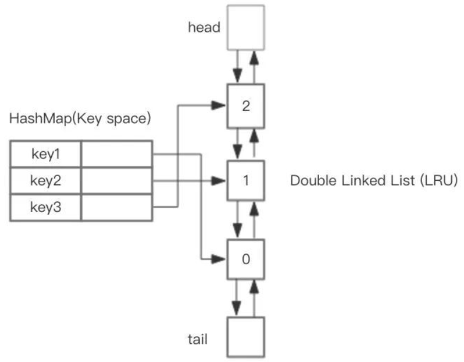

#### lc25 K 个一组翻转链表

[url](https://leetcode.com/problems/reverse-nodes-in-k-group/)

```java
// 递归
public ListNode reverseKGroup(ListNode head, int k) {

        ListNode cur = head;
        int count = 0;
        // 找到第k+1个结点
        while (count < k) {
            if (cur == null) {
                return head;
            }
            cur = cur.next;
            count ++;
        }

        ListNode prev = reverseKGroup(cur, k);
        // reverse
        while (count > 0) {
            ListNode tmp = head.next;
            head.next = prev;
            prev = head;
            head = tmp;
            count --;
        }
        return prev;
    }
```

#### lc206 翻转链表

[url](https://leetcode.com/problems/reverse-linked-list/)

```java
// 迭代
public ListNode reverseList2(ListNode head) {
    if (head == null || head.next == null) {
        return head;
    }

    ListNode prev = null;
    ListNode cur = head;
    while (cur != null) {
        ListNode next = cur.next;
        cur.next = prev;
        prev = cur;
        cur = next;
    }
    return prev;
}

/**
 * 递归
 * @param head
 * @return
 */
// ref:https://zhuanlan.zhihu.com/p/86745433
public ListNode reverseList(ListNode head) {
    if (head == null || head.next == null) {
        return head;
    }

    ListNode p = reverseList(head.next);
    head.next.next = head;
    head.next = null;
    return p;
}
```

#### lc92 翻转链表II

```java
public ListNode reverseBetween(ListNode head, int m, int n) {
    if (head == null || m >= n) {
        return head;
    }

    ListNode dummy = new ListNode(-1);
    dummy.next = head;
    ListNode prev = dummy;
    // prev指向第m-1个节点
    for (int i = 0; i < m - 1; i++) {
        prev = prev.next;
    }

    ListNode start = prev.next;
    ListNode then = start.next;

    for (int i = 0; i < n - m; i++) {
        start.next = then.next;
        then.next = prev.next;
        prev.next = then;
        then = start.next;
    }

    return dummy.next;

}
```

#### lc146 LRU 缓存机制



```java
/**
 * @author: huhao
 * @time: 2020/9/21 14:56
 * @desc: https://leetcode.com/problems/lru-cache/
 * 本题出的是一种缓存淘汰策略，LRU 缓存淘汰算法就是一种常用策略。LRU 的全称是 Least Recently Used，
 * 也就是说我们认为最近使用过的数据应该是是「有用的」，很久都没用过的数据应该是无用的，内存满了就优先删那些很久没用过的数据。
 *
 * LRU 缓存算法的核心数据结构就是哈希链表，双向链表和哈希表的结合体。
 */
public class M146_LRUCache {

    class DLinkedNode {
        int key;
        int value;
        DLinkedNode pre;
        DLinkedNode post;
    }

    /**
     * 把结点添加在head的后面
     * @param node
     */
    private void addNode(DLinkedNode node) {
        node.pre = head;
        node.post = head.post;

        head.post.pre = node;
        head.post = node;
    }

    /**
     * 从链表中移除一个结点
     * @param node
     */
    private void removeNode(DLinkedNode node) {
        DLinkedNode pre = node.pre;
        DLinkedNode post = node.post;

        pre.post = post;
        post.pre = pre;
    }

    /**
     * 将中间的某个结点移动到头部
     * @param node
     */
    private void moveToHead(DLinkedNode node) {
        this.removeNode(node);
        this.addNode(node);
    }

    /**
     * 弹出最后一个双向节点（非尾节点）
     * @return
     */
    private DLinkedNode popTail() {
        DLinkedNode res = tail.pre;
        this.removeNode(res);
        return res;
    }

    private HashMap<Integer, DLinkedNode> cache = new HashMap<>();
    private int capacity;
    private DLinkedNode head;
    private DLinkedNode tail;

    public M146_LRUCache(int capacity) {
        this.capacity = capacity;
        head = new DLinkedNode();
        head.pre = null;

        tail = new DLinkedNode();
        tail.post = null;

        head.post = tail;
        tail.pre = head;
    }

    public int get(int key) {
        // 首先通过hash map先获取节点
        DLinkedNode res = cache.get(key);
        if (res == null) {
            return -1;
        }

        // 如果获取了该节点，就将该节点放到head后面（表示最近使用过），保持tail表示的是最久没有使用过的
        this.moveToHead(res);

        return res.value;
    }

    public void put(int key, int value) {
        // 首先通过hash map先获取节点
        DLinkedNode node = cache.get(key);

        if (node == null) {
            DLinkedNode newNode = new DLinkedNode();
            newNode.key = key;
            newNode.value = value;

            // 这里的 put 方法是 HashMap 自带的
            this.cache.put(key, newNode);
            // 将新节点添加到双向链表中去
            this.addNode(newNode);
			// 判断容量是否超出，如果超出，弹出最后一个双向节点（非尾节点）
            if (cache.size() > capacity) {
                DLinkedNode tail = this.popTail();
                // 别忘了删除cache中的结点数据
                this.cache.remove(tail.key);
            }
        } else {
            // 更新节点
            node.value = value;
            this.moveToHead(node);
        }
    }
}
```

#### lc160两链表相交

```java
/**
     * 利用环的思想
     * 参考: https://www.cnblogs.com/grandyang/p/4128461.html
     * @param headA
     * @param headB
     * @return
     */
    public ListNode getIntersectionNode2(ListNode headA, ListNode headB) {
        if(headA == null || headB == null){
            return null;
        }
        ListNode curA = headA;
        ListNode curB = headB;
        while (curA != curB) {
            curA = curA == null ? headB : curA.next;
            curB = curB == null ? headA : curB.next;
        }
        return curA;
    }
```

#### lc21 合并两有序链表

思路：使用两个指针分别遍历两个链表，当两个指针都不为空时，比较两个指针指向的元素，选择一个较小元素添加到结果链表中并移动该指针，接下去继续比较两个指针指向的元素直到一个指针为空，结果链表连接剩余元素。

```java
public ListNode mergeTwoLists(ListNode l1, ListNode l2) {
    ListNode res = new ListNode(-1);
    ListNode cur = res;

    ListNode cur1 = l1;
    ListNode cur2 = l2;

    while (cur1 != null && cur2 != null) {
        if (cur1.val < cur2.val) {
            cur.next = new ListNode(cur1.val);
            cur1 = cur1.next;
        }else {
            cur.next = new ListNode(cur2.val);
            cur2 = cur2.next;
        }
        cur = cur.next;
    }

    cur.next = cur1 == null ? cur2 : cur1;
    return res.next;
}
```

#### lc23 合并 k 个已排序的链表

[url](https://www.nowcoder.com/practice/65cfde9e5b9b4cf2b6bafa5f3ef33fa6?tpId=190&&tqId=35193&rp=1&ru=/ta/job-code-high-rd&qru=/ta/job-code-high-rd/question-ranking)

1. 归并排序 O(KN * logK)

```java
public ListNode mergeKLists(ListNode[] lists) {
    return partion(lists, 0, lists.length-1);
}

private ListNode partion(ListNode[] lists, int start, int end) {
    // 终止条件
    if (start == end) {
        return lists[start];
    }

    if (start < end) {
        int mid = start + (end - start) / 2;
        //合并start->mid的链表
        ListNode l1 = partion(lists, start, mid);
        //合并mid+1到end的链表
        ListNode l2 = partion(lists, mid+1, end);
        //partition最终递归到最后还是两个链表的合并
        return mergeTwoLists(l1, l2);
    }

    return null;    
}

private ListNode mergeTwoLists(ListNode list1, ListNode list2) {
    ListNode cur1 = list1;
    ListNode cur2 = list2;
    ListNode dmy = new ListNode(-1);
    ListNode cur = dmy;

    while (cur1 != null && cur2 != null) {
        if (cur1.val < cur2.val) {
            cur.next = new ListNode(cur1.val);
            cur1 = cur1.next;
        }else {
            cur.next = new ListNode(cur2.val);
            cur2 = cur2.next;
        }

        cur = cur.next;
    }

    cur.next = cur1 == null ? cur2 : cur1;
    return dmy.next;
}
```

2. 最小堆方法 	时间复杂度：O(Nklogk)

```java
/**
 * 最小堆
 * 建立一个大小为 lists.size() 的最小堆，首先先将所有链表的的首节点加入到最小堆中，然后从最小堆中获取最小首节点（堆顶元素）minListNode
 * 加入到结果链表中，如果 minListNode 有后继节点，将后继节点加入到最小堆中，自动排序，重复上述过程
 * @param lists
 * @return
 */
public ListNode mergeKLists2(ListNode[] lists) {
    int len = lists.length;

    ListNode res = new ListNode(-1);
    ListNode cur = res;

    if (len == 0 || lists == null) {
        return null;
    }

    PriorityQueue<ListNode> minHeap = new PriorityQueue<ListNode>(len, new Comparator<ListNode>(){
        @Override
        public int compare(ListNode o1, ListNode o2) {
            return o1.val - o2.val;
        }
    });

    for (int i = 0; i < len; i++) {
        if (lists[i] != null) {
            minHeap.offer(lists[i]);
        }
    }

    while (!minHeap.isEmpty()) {
        ListNode minListNode = minHeap.poll();
        cur.next = minListNode;
        cur = cur.next;

        if (minListNode.next != null) {
            minHeap.offer(minListNode.next);
        }
    }
    return res.next;
}
```

3. 逐个合并

```java
/**
 * 逐个合并 O(KN)
 * @param lists
 * @return
 */
public ListNode mergeKLists(ListNode[] lists) {
    if (lists==null||lists.length==0) {
        return null;
    }

    ListNode res = lists[0];
    for (int i = 1; i < lists.length; i++) {
        res = mergeTwoList(res, lists[i]);
    }
    return res;
}

public ListNode mergeTwoList(ListNode l1, ListNode l2) {
    ListNode res = new ListNode(-1);
    ListNode cur = res;

    while (l1 != null && l2 != null) {
        if (l1.val <= l2.val) {
            cur.next = new ListNode(l1.val);
            l1 = l1.next;
            cur = cur.next;
        } else {
            cur.next = new ListNode(l2.val);
            l2 = l2.next;
            cur = cur.next;
        }
    }

    cur.next = (l1 == null) ? l2 : l1;
    return res.next;
}
```

3. 

#### 字节跳动高频题——排序奇升偶降链表

https://mp.weixin.qq.com/s/377FfqvpY8NwMInhpoDgsw

给定一个奇数位升序，偶数位降序的链表，将其重新排序。

要求时间O(n)空间O(1)

> ```
> 输入: 1->8->3->6->5->4->7->2->NULL
> 输出: 1->2->3->4->5->6->7->8->NULL
> ```

```java
public ListNode solution(ListNode head) {
    if (head == null || head.next == null) {
        return head;
    }

    ListNode oddList = new ListNode(-1);
    ListNode evenList = new ListNode(-1);
    ListNode oddCur = oddList;
    ListNode evenCur = evenList;

    // 分割链表
    int count = 1;
    while (head != null) {
        if (count % 2 == 1) {
            oddCur.next = new ListNode(head.val);
            oddCur = oddCur.next;
        }else {
            evenCur.next = new ListNode(head.val);
            evenCur = evenCur.next;
        }

        head = head.next;
        count ++;
    }

    // 逆转偶数链表
    evenCur = evenList.next;
    ListNode prev = null;
    while (evenCur != null) {
        ListNode next = evenCur.next;
        evenCur.next = prev;
        prev = evenCur;
        evenCur = next;
    }
    evenCur = prev;

    // 合并两个有序链表
    oddCur = oddList.next;
    ListNode res = new ListNode(-1);
    ListNode cur = res;
    while (oddCur != null && evenCur != null) {
        if (oddCur.val < evenCur.val) {
            cur.next = new ListNode(oddCur.val);
            oddCur = oddCur.next;
        }else {
            cur.next = new ListNode(evenCur.val);
            evenCur = evenCur.next;
        }
        cur = cur.next;
    }

    cur.next = oddCur == null ? evenCur : oddCur;

    return res.next;
}
```

#### lc2 两数相加

和lc415 字符串相加类似

```java
public ListNode addTwoNumbers(ListNode l1, ListNode l2) {
    ListNode dummy = new ListNode(-1);
    ListNode cur = dummy;
    int carry = 0;

    while (l1 != null || l2 != null || carry != 0) {
        if (l1 != null) {
            carry += l1.val;
            l1 = l1.next;
        }

        if (l2 != null) {
            carry += l2.val;
            l2 = l2.next;
        }

        cur.next = new ListNode(carry%10);
        carry = carry / 10;
        cur = cur.next;
    }
    return dummy.next;
}
```

#### lc143 重排列表

思路：获取中间节点，将链表分成两半 l1 和 l2 ，然后逆转 l2，然后将 l2 插入到 l1 中

```java
public void reorderList(ListNode head) {

    if (head == null || head.next == null) {
        return;
    }

    // find the middle of the list
    ListNode fast = head;
    ListNode slow = head;

    while (fast != null && fast.next != null) {
        fast = fast.next.next;
        slow = slow.next;
    }
	
    // cut the list
    ListNode second = slow.next;
    slow.next = null;
    
    // reverse the half after middle 1->2->3->4->5->6 to 1->2->3->4->null 6->5
    second = reverse(second);
    
    // insert the elements of the list2 into list1 one by one
    ListNode first = head;
    while (second != null) {
        ListNode next = first.next;
        first.next = second;
        second = second.next;
        first = first.next;
        first.next = next;
        first = first.next;
    }
}

private ListNode reverse(ListNode head) {
    ListNode prev = null;
    while (head != null) {
        ListNode next = head.next;
        head.next = prev;
        prev = head;
        head = next;
    }
    return prev;
}
```

#### lc142 环形链表 II

类似 lc141

使用快慢指针，注意**循环结束条件**，如果存在环，将快指针指向头结点，快慢指针同时移动，两者相遇的地方就是环入口

```java
public ListNode detectCycle(ListNode head) {
    if (head == null || head.next == null) {
        return null;
    }
    ListNode slow = head;
    ListNode fast = head;
    // 结束条件：不存在环
    while (fast != null && fast.next != null) {
        slow = slow.next;
        fast = fast.next.next;
        // 存在环
        if (slow == fast) {
            ListNode slow2 = head;
            while (slow2 != slow){
                slow = slow.next;
                slow2 = slow2.next;
            }
            return slow;
        }
    }

    return null;
}
```

#### lc24 两两交换链表中的结点

方法一：将链表拆分成奇链表和偶链表，然后合并

方法二：遍历交换交换两节点

```java
public static ListNode swapPairs2(ListNode head) {
    if (head == null || head.next == null) {
        return head;
    }

    // 拆分链表
    ListNode oddList = new ListNode(-1);
    ListNode oddCur = oddList;
    ListNode evenList = new ListNode(-1);
    ListNode evenCur = evenList;
    ListNode cur = head;
    int count = 1;
    while (cur != null) {
        if (count % 2 == 1) {
            oddCur.next = new ListNode(cur.val);
            oddCur = oddCur.next;
        }else {
            evenCur.next = new ListNode(cur.val);
            evenCur = evenCur.next;
        }
        cur = cur.next;
        count ++;
    }

    // 合并链表
    ListNode dummy = new ListNode(-1);
    cur = dummy;
    oddCur = oddList.next;
    evenCur = evenList.next;

    while (oddCur != null && evenCur != null) {
        cur.next = new ListNode(evenCur.val);
        cur = cur.next;
        cur.next = new ListNode(oddCur.val);
        cur = cur.next;
        evenCur = evenCur.next;
        oddCur = oddCur.next;
    }

    if (oddCur != null) {
        cur.next = oddCur;
    }
    return dummy.next;
}

/**
 * 迭代
 * @param head
 * @return
 */
public ListNode swapPairs(ListNode head) {
    if (head == null || head.next == null) {
        return head;
    }

    ListNode dummy = new ListNode(-1);
    dummy.next = head;
    ListNode prev = dummy;
    while (prev.next != null && prev.next.next != null) {
        ListNode swap1 = prev.next;
        ListNode swap2 = prev.next.next;
        swap1.next = swap2.next;
        prev.next = swap2;
        swap2.next = swap1;
        prev = swap1;
    }
    return dummy.next;
}
```

#### lc234 回文链表

思路：将链表分成前后两半，逆转后半部分，逐个比较前后两部分元素是否相同

```java
public boolean isPalindrome(ListNode head) {

    // 找到中间节点
    ListNode fast = head;
    ListNode slow = head;

    while (fast != null && fast.next != null) {
        fast  = fast.next.next;
        slow = slow.next;
    }

    // 如果是奇数个节点，将slow节点移动到下个节点
    if (fast != null) {
        slow = slow.next;
    }

    slow = reverse(slow); 
    fast = head;

    while (fast != null && slow != null) {
        if (fast.val != slow.val) {
            return false;
        }

        slow = slow.next;
        fast = fast.next;
    }
    return true;

}

private ListNode reverse(ListNode head) {
    ListNode prev = null;

    while (head != null) {
        ListNode next = head.next;
        head.next = prev;
        prev = head;
        head = next;
    }
    return prev;
}
```

